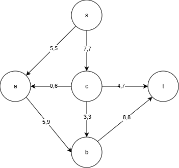
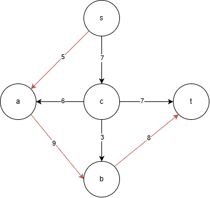
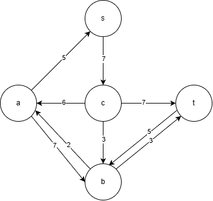
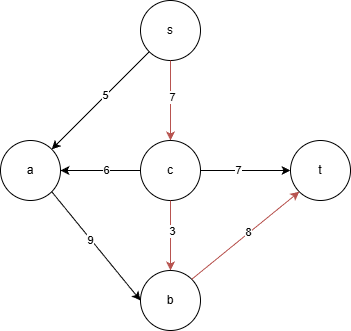
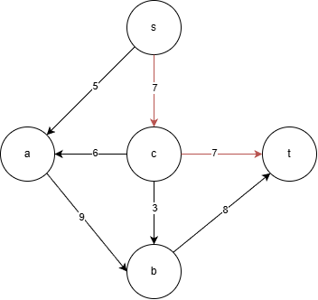
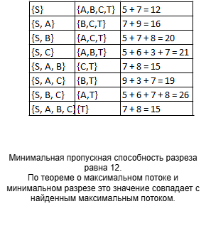
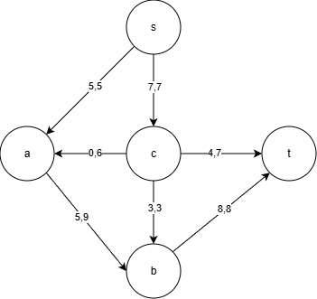

# Задача о максимальном потоке — Вариант 1  
### Команда: DES

## 1. Постановка задачи

Рассматривается сеть, состоящая из пяти вершин:

"S,A,B,C,T"

Источник — вершина \(s\), сток — вершина \(t\).  
Каждая дуга имеет фиксированную пропускную способность, определяющую максимальный возможный поток по ней.

Пропускные способности дуг заданы таблицей:

| Дуга | sc | sa | ca | cb | ab | ct | bt |
|------|----|----|----|----|----|----|----|
| \(c\) | 7 | 5 | 6 | 3 | 9 | 7 | 8 |

## Шаг 1: Построение исходной сети

Каждая дуга имеет фиксированную пропускную способность.  
Исходная сеть выглядит следующим образом:

## Шаг 2: Поиск увеличивающих путей в остаточной сети

Для нахождения максимального потока используется алгоритм Форда–Фалкерсона.  

## Увеличивающий путь 1

Найден путь:

**S → A → B → T**

Минимальная пропускная способность на пути равна **5**, поэтому поток увеличивается на 5.

После пропуска потока остаточная сеть изменяется:

**Корректировка остаточной сети:**  
- дуга S→A стала насыщенной, остаток равен 0;  
- появилась обратная дуга A→S с остатком 5;  
- дуга A→B уменьшила остаток до 4;  
- дуга B→T уменьшила остаток до 3;  
- появились обратные дуги B→A и T→B.

## Увеличивающий путь 2

Следующий найденный путь:

**S → C → B → T**

Минимальная пропускная способность на пути — **3**.

После пропуска потока остаточная сеть принимает вид:

**Корректировка остаточной сети:**  
- дуга C→B стала насыщенной;  
- появилась обратная дуга B→C с остатком 3;  
- дуга S→C уменьшила остаток до 4;  
- дуга B→T стала насыщенной, остаток 0;  
- обратная дуга T→B увеличилась до 8.

## Увеличивающий путь 3

Последний доступный путь:

**S → C → T**

Минимальная пропускная способность — **4**.

После пропуска потока остаточная сеть обновляется:

**Корректировка остаточной сети:**  
- дуга S→C стала насыщенной;  
- обратная дуга C→S увеличилась до 7;  
- дуга C→T уменьшила остаток до 3;  
- появилась обратная дуга T→C с остатком 4.

## Анализ разрезов

Чтобы убедиться, что поток действительно максимальный, рассмотрим пропускные способности разрезов сети.  
На изображении ниже приведена таблица всех основных разрезов:

Минимальная пропускная способность разреза равна **12**, что совпадает с найденным значением максимального потока.

## Итоговый поток

Итоговое распределение потоков по дугам представлено на следующем графе:

Суммарный поток, достигающий стока:

**12 единиц**

## Вывод

Максимальный поток в сети равен **12**.  
Он достигается последовательным использованием трёх увеличивающих путей.  
Анализ разрезов подтверждает корректность результата.

