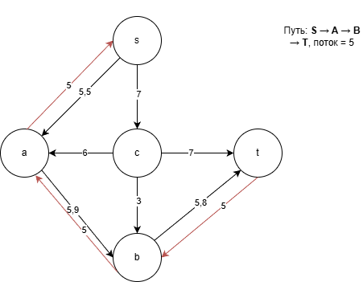
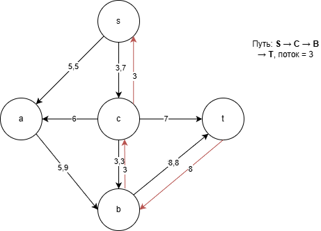
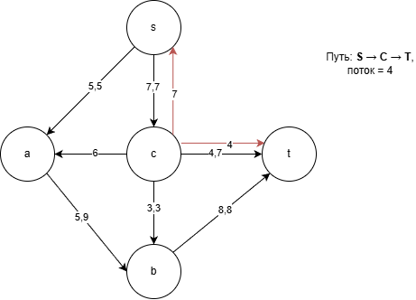
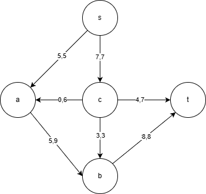

# Задача о максимальном потоке — Вариант 1  
### Команда: DES

## 1. Постановка задачи

Рассматривается сеть, состоящая из пяти вершин:

"S,A,B,C,T"

Источник — вершина \(s\), сток — вершина \(t\).  
Каждая дуга имеет фиксированную пропускную способность, определяющую максимальный возможный поток по ней.

Пропускные способности дуг заданы таблицей:

| Дуга | sc | sa | ca | cb | ab | ct | bt |
|------|----|----|----|----|----|----|----|
| \(c\) | 7 | 5 | 6 | 3 | 9 | 7 | 8 |

## 2. Исходная сеть

Ниже представлена исходная схема сети с указанными пропускными способностями:

## 3. Поиск увеличивающих путей

Метод Форда–Фалкерсона позволяет постепенно увеличивать поток, находя доступные пути от источника к стоку и пропуская по ним максимально возможный объём.

### 3.1. Увеличивающий путь 1  

Первым найденным маршрутом стал путь:

S→A→B→C→T

Наиболее «узким» местом на этом пути является дуга с пропускной способностью 5, поэтому именно такой объём потока удаётся провести.

Состояние сети после пропуска потока 5:

### 3.2. Увеличивающий путь 2  

Следующим доступным маршрутом оказался путь:

S→C→B→T

Минимальная пропускная способность на нём равна 3, что и определяет величину второго увеличения потока.

Состояние сети после пропуска потока 3:

### 3.3. Увеличивающий путь 3  

На третьем шаге остаётся ещё один возможный маршрут:

S→C→T

По нему можно передать 4 единицы потока. После этого все пути, по которым можно было бы увеличить поток, оказываются исчерпаны.

Состояние сети после пропуска потока 4:

## 4. Анализ разрезов

Для проверки корректности результата рассмотрим пропускные способности разрезов сети.  
На изображении ниже приведена таблица с основными разрезами:

Минимальная пропускная способность разреза равна **12**, что полностью совпадает с найденным максимальным потоком.  
Это подтверждает, что поток действительно является максимальным.

## 5. Итоговый поток

Ниже представлено итоговое распределение потоков по дугам:

Суммарный поток, достигающий стока, равен:12

Локальные значения потоков по дугам:

- поток из \(s\) в \(a\): 5 из 5 возможных  
- поток из \(s\) в \(c\): 7 из 7  
- поток из \(a\) в \(b\): 5 из 9  
- поток из \(c\) в \(b\): 3 из 3  
- поток из \(c\) в \(t\): 4 из 7  
- поток из \(b\) в \(t\): 8 из 8

## 6. Вывод

Максимальный поток в сети составляет:12

Он достигается последовательным использованием трёх увеличивающих путей.  
Анализ разрезов подтверждает корректность полученного результата.
