# Вариант 4 - DIVI

## Шаг 1: Построение исходной сети
Вершины:

S — источник
T — сток,
A,B,C — промежуточные вершины.

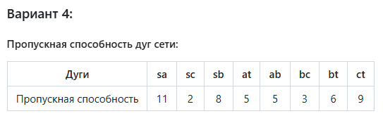

# Шаг 2: Поиск увеличивающих путей в остаточной сети
Используем алгоритм Форда-Фалкерсона:
1. Обнулить все потоки, остаточная сеть изначально совпадает с исходной сетью.
2. В остаточной сети найти любой увеличивающий путь из источника в сток. Если такого пути нет,    остановиться.
3. Пускать через найденный путь максимально возможный поток:
- На найденном пути в остаточной сети найти ребро с минимальной пропускной способностью.
- Для каждого ребра на найденном пути увеличить поток на минимальную пропускную способность, а в противоположном ему — уменьшить на минимальную пропускную способность.
4. Модифицировать остаточную сеть: для всех рёбер на найденном пути, а также для противоположных им рёбер, вычислить новую пропускную способность. Если она стала ненулевой, добавить ребро к остаточной сети, а если обнулилась, стереть его.
5. Вернуться на шаг 2.

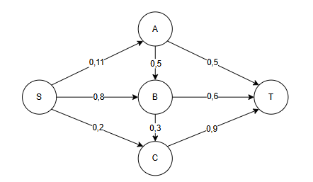
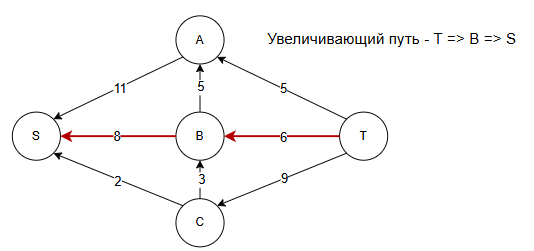

Корректировка остаточной сети
Локальный путь дуги B => T стал равен 6. Дуга насыщенная.
Локальный путь дуги S => В стал равен 6, резерв равен 2.

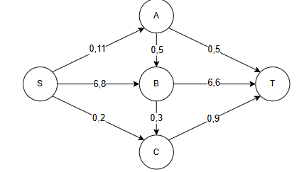
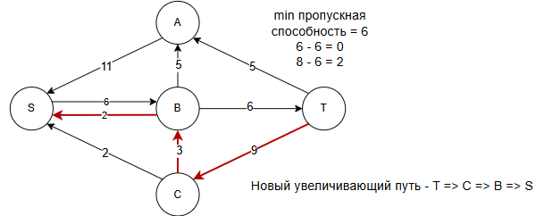

Корректировка остаточной сети 
Локальный путь дуги Т => C стал равен 2, резерв равен 7.
Локальный путь дуги С => В равен 2, резерв 1.
Локальный путь дуги B => S стал равен 8. Дуга насыщенная. 

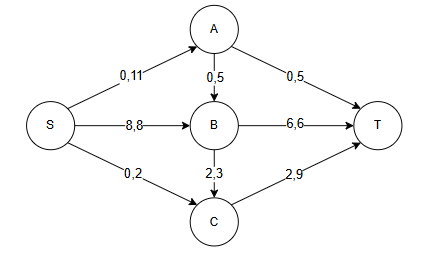
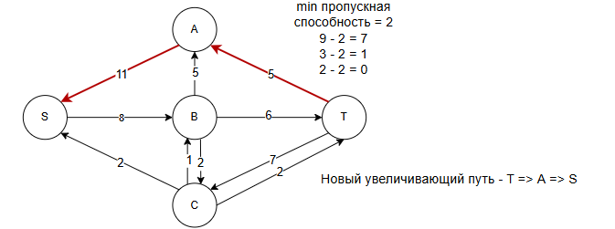

Корректировка остаточной сети
Локальный путь дуги T => A стал равен 5. Дуга насыщенная.
Локальный путь дуги A => S равен 5, резерв - 6.

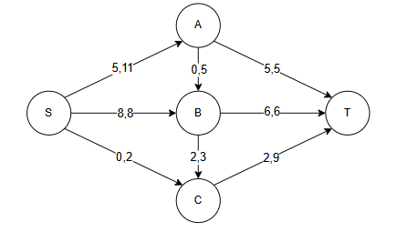
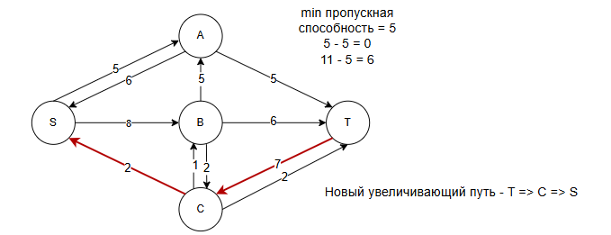

Корректировка остаточной сети
Локальный путь дуги T => C равен 4, резерв - 5.
Локальный путь дуги C => S равен 2. Дуга насыщенная.

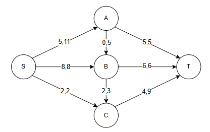
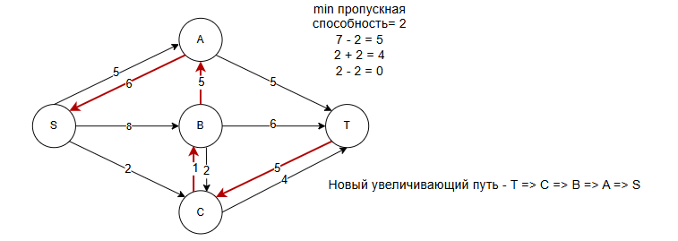

Корректировка остаточной сети
Локальный путь дуги T => C равен 5, резерв 4.
Локальный путь дуги C => B равен 3. Дуга насыщенная.
Локальный путь дуги B => A равен 1, резерв 4.
Локальный путь дуги A => S равен 6, резерв 5.

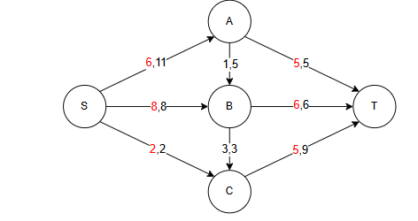
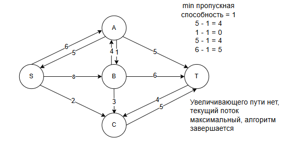
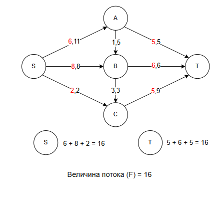

Ответ: Величина потока = 16