# Вариант 8 - Seeyahh
 
## Построение исходной сети
Вершины:
S — источник; 
T — сток; 
a, b, c, d — промежуточные вершины.

|          Дуги          | sa | sc | sd | ab | cb | dc | bt | ct | dt |
|:----------------------:|:--:|:--:|:--:|:--:|:--:|:--:|:--:|:--:|:--:|
| Пропускная способность | 6  | 7  | 8  | 6  | 5  | 4  | 9  | 5  | 6  |

---

# Решение

## Остаточная цепь:
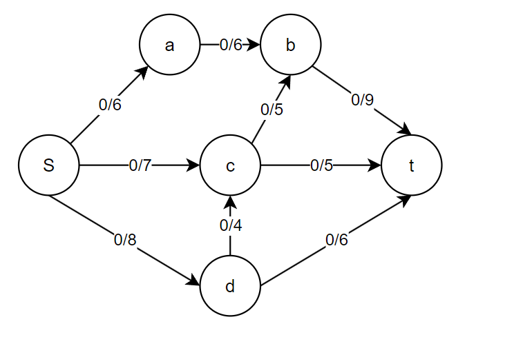

### Увеличивающий путь
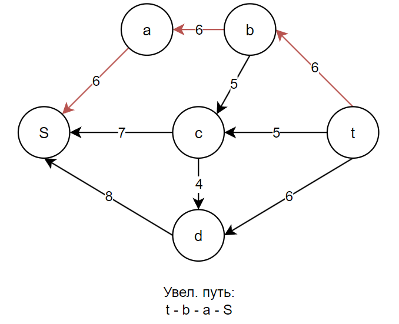

### Изменение остаточной сети:
#### min = 6, 
#### значит все дуги, участвующие в пути (S -> a -> b -> t) **+6**
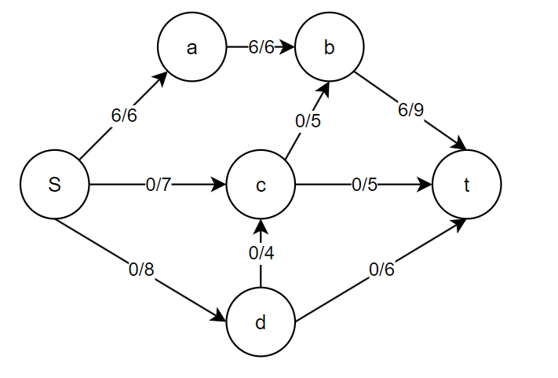

### Увеличивающий путь:
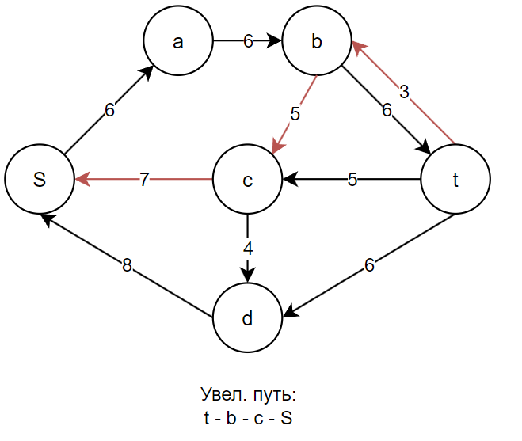

### Изменение остаточной сети:
#### min = 3,
#### значит все дуги, участвующие в пути (S -> c -> b -> t) **+3**
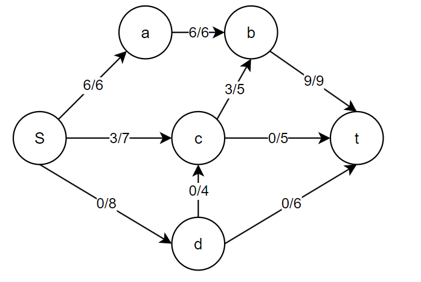

### Увеличивающий путь:
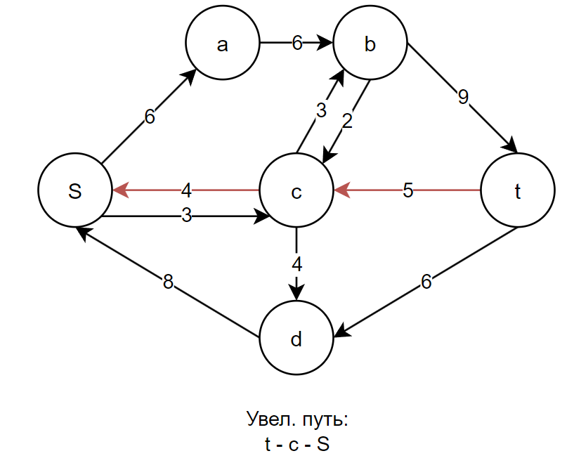

### Изменение остаточной сети:
#### min = 4,
#### значит все дуги, участвующие в пути (S -> c -> t) **+4**
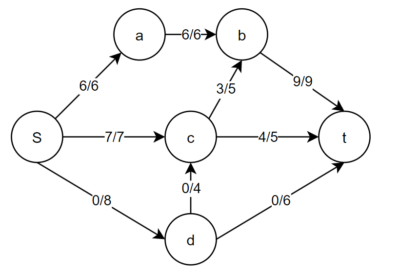

### Увеличивающий путь:
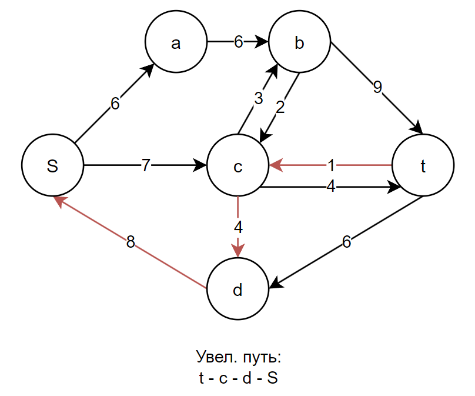

### Изменение остаточной сети:
#### min = 1, 
#### значит все дуги, участвующие в пути (S -> d -> c -> t) **+1**
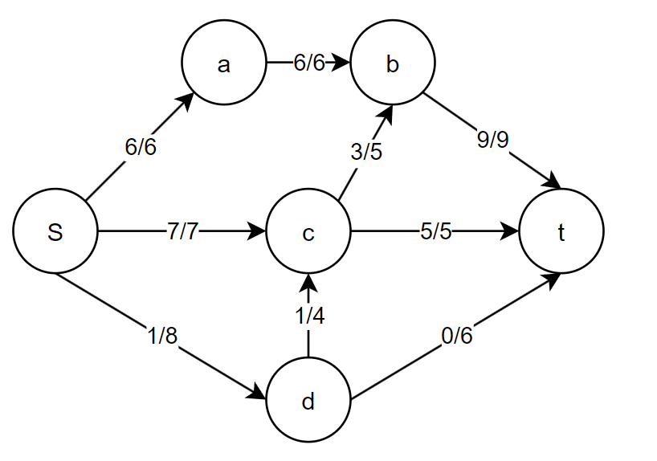

### Увеличивающий путь:
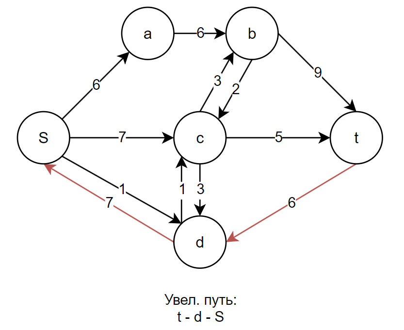

### Изменение остаточной сети:
#### min = 1, 
#### значит все дуги, участвующие в пути (S -> d -> t) **+6**
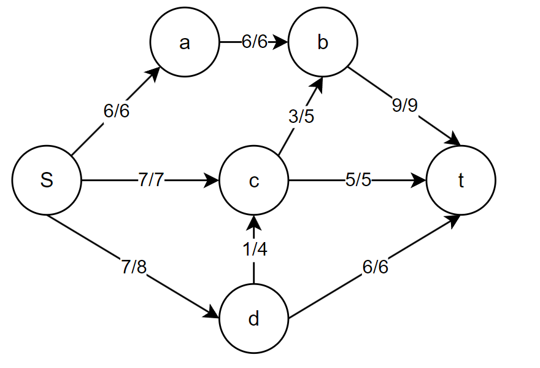

Как можно заметить, увеличивающих путей больше нет (окончательная схема путей ниже)
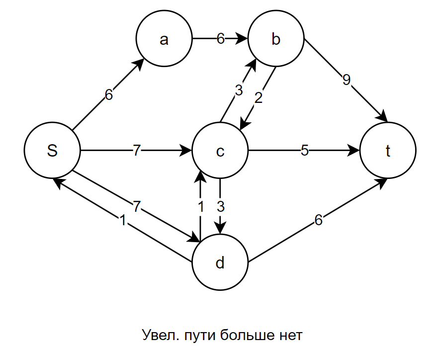

### Окончательная остаточная цепь:
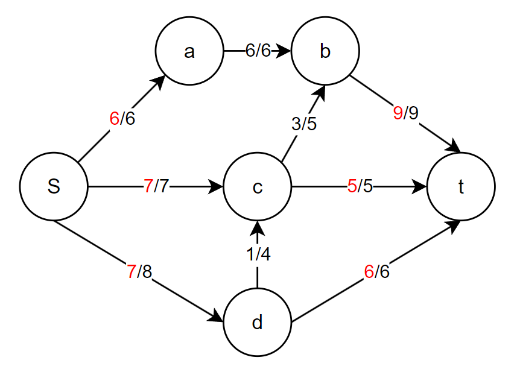
#### Поток, исходящий из S: **6+7+7=20**
#### Поток, входящий в t: **9+5+6=20**
#### F=20
#### **Глобальный закон сохранения собюдается**

## Анаиз резервов:

#### Необходимо сложить пропускные способности дуг, выходящих из 1 группы во 2
#### V1 - Vs
#### V2 - Vt
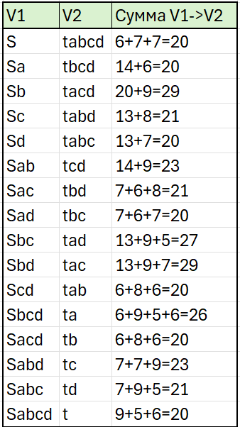

Максимальный возможный поток в сети не может превышать минимальную пропускную способность резервов сети. Из таблицы выше видно, что минимальная пропускная способность - 20.

# Ответ:
## Величина потока = 20
