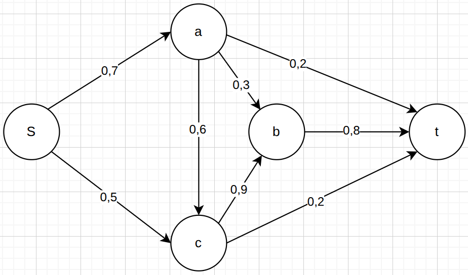
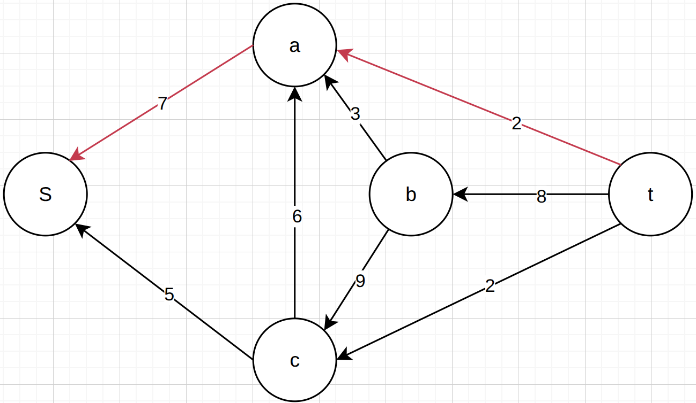
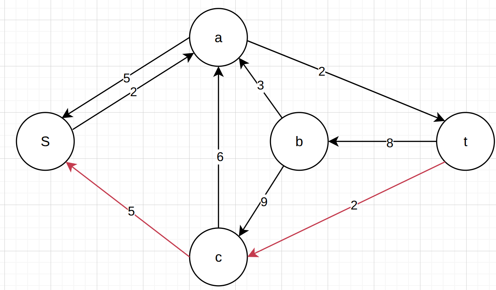
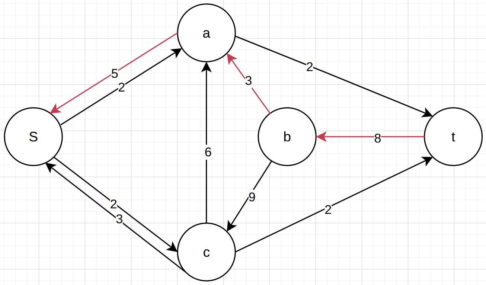
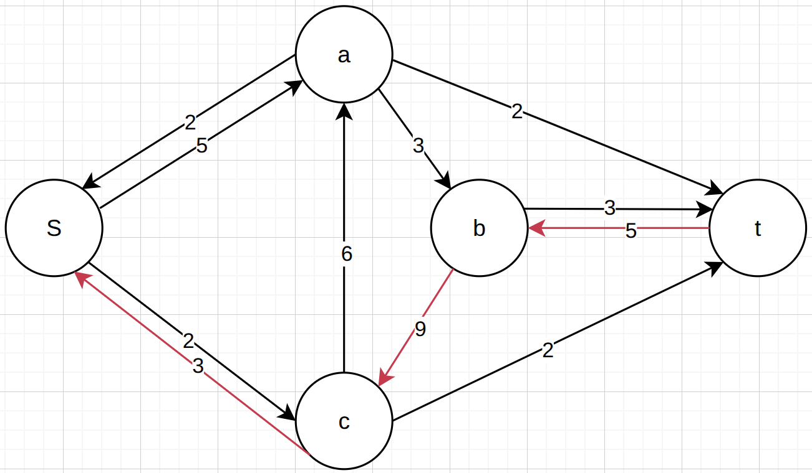
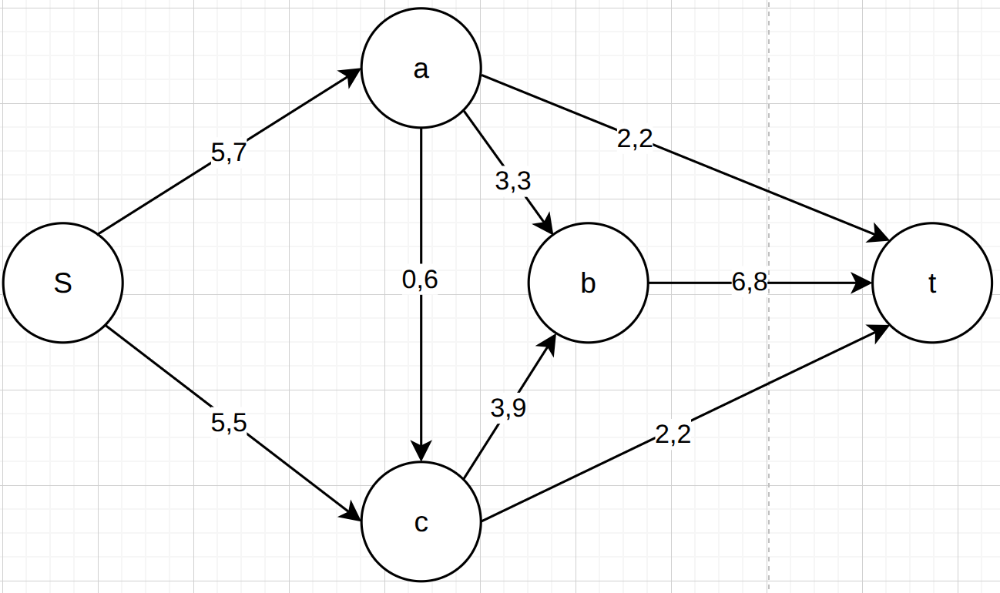
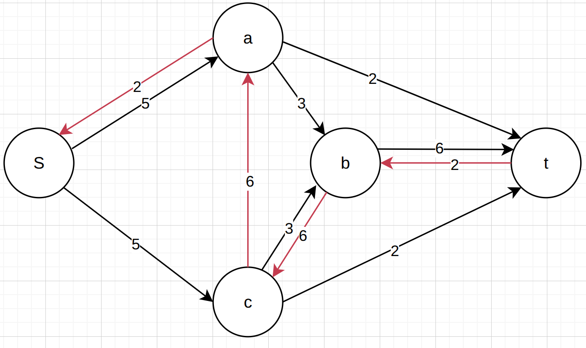
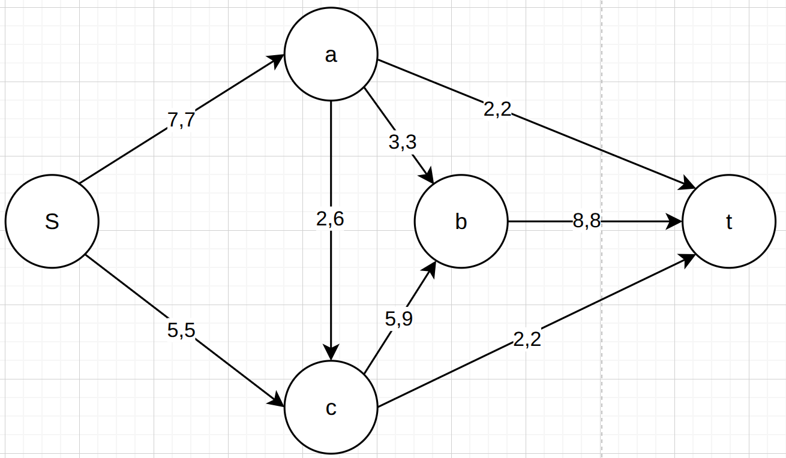
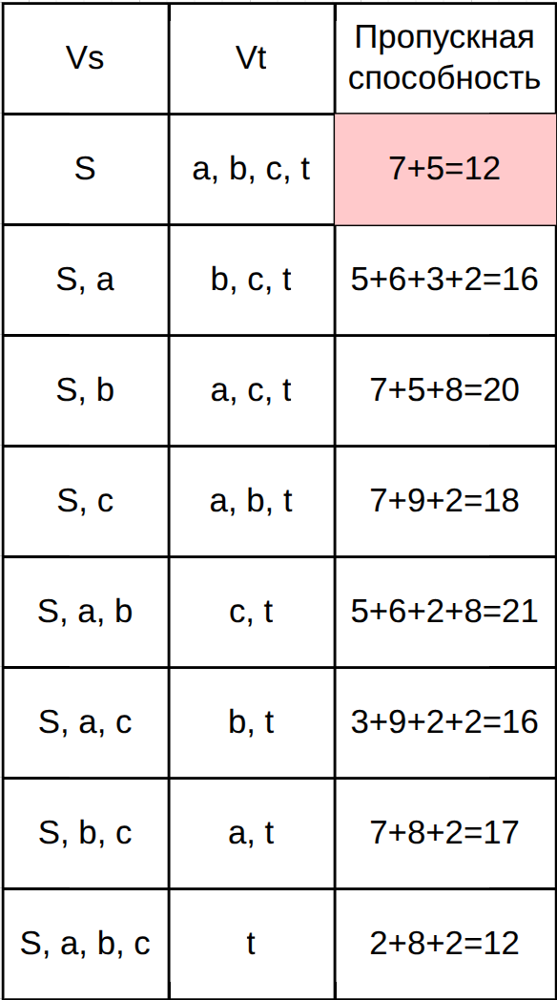

# Вариант 5 - TeamSpirit

## Шаг 1: Построение исходной сети

Источники - S;
Стоки - t;
Промежуточные вершины - a,b,c;

# Шаг 2: Поиск увеличивающих путей в остаточной сети

Для решение задачи воспоьзуемся алгоритмом Форда-Фалкерсона

1. Поток через все рёбра графа устанавливается в ноль. Строится остаточная сеть, которая изначально совпадает с исходной сетью;

2. В текущей остаточной сети ищется любой путь из источника (S) в сток (T), все рёбра которого имеют положительную остаточную пропускную способность. Если такого пути не существует, алгоритм завершается. Текущий поток является максимальным;

3. По найденному пути пропускается максимально возможный дополнительный поток:

    Сначала на всём пути ищется ребро с самой маленькой оставшейся пропускной способностью - это и есть тот самый лимит, больше которого по этому маршруту не протолкнуть;

    Потом вдоль всего пути для каждого ребра поток прибавляется на эту найденную величину, а для ребра, идущего в обратную сторону, вычитается на эту же величину.

4. Обновление остаточной сети:

    Для каждого ребра на пути и его обратной пары пересчитывается оставшаяся пропускная способность. Если после пересчёта способность положительная — ребро остаётся в сети (или добавляется, если его не было). Если способность стала нулевой, то ребро удаляется из сети.

5. Возвращаемся ко второму шагу.

## Этап 1
На обратной сети был выбран путь **taS**, минимальное значение 2.

Скорректируем остаточную сеть, 

Путь дуги S - a стал равен 2.

Путь дуги a - t стал равен 2, дуга насыщенная.

## Этап 2
На обратной сети был выбран путь **tcS**, минимальное значение - 2.

Скорректируем остаточную сеть, 

Путь дуги S - c стал равен 2.

Путь дуги c - t стал равен 2, дуга насыщенная.

## Этап 3
На обратной сети был выбран путь **tbaS**, минимальное значение - 3.

Скорректируем остаточную сеть, 

Путь дуги S - a стал равен 5.

Путь дуги a - b стал равен 3, дуга насыщенная.

Путь дуги b - t стал равен 3.

## Этап 4
На обратной сети был выбран путь **tbcS**, минимальное значение - 3

Скорректируем остаточную сеть, 

Путь дуги S - c стал равен 5, дуга насыщенная.

Путь дуги c - b стал равен 3.

Путь дуги b - t стал равен 6.

## Этап 5
На обратной сети был выбран путь **tbcaS**, минимальное значение - 2

Скорректируем остаточную сеть, 

Путь дуги S - a стал равен 7, дуга насыщенная.

Путь дуги a - c стал равен 2.

Путь дуги c - b стал равен 5.

Путь дуги b - t стал равен 8, дуга насыщенная.

# Анализ разрезов:

Пропускная способность разреза рассчитывается как сумма пропускных способностей всех дуг, направленных из множества вершин источника (Vs) в множество вершин стока (Vt).

Величина максимального потока в сети не может превышать минимальную пропускную способность среди всех возможных разрезов, разделяющих источник и сток. Как показывает таблица, минимальная пропускная способность разреза составляет 12, что и совпадает с результатом, полученным в ходе решения.

Ответ: Величина потока = 12