# Задание №10. Вариант №6
# Задача о максимальном потоке.

Для каждого варианта представлены условия задачи, в соответствии с которыми необходимо: 
1. Построить сеть с указанием пропускной способности дуг.
2. Построить остаточную сеть.
3. Определить максимальный поток методом поиска увеличивающих путей в остаточной сети (**строго** так, как было разобрано на занятиях).
4. Проверить величину максимального потока через поиск минимальной пропускной способности разрезов сети, то есть рассчитать пропускную способность всех разрезов сети.
5. Оформить решение задачи по шагам с подробными комментариями, таблицами и диаграммами.
6. В ответе указать максимальную величину потока и как это поток можно организовать, то есть изобразить сеть с указанием соответствующих локальных потоков.

## Решение задачи на поиск максимального потока в сети - вариант 6

Пропускная способность дуг сети указана в таблице.

|          Дуги          | sa | sc | at | ab | ad | cd | bd | bt | dt |
|:----------------------:|:--:|:--:|:--:|:--:|:--:|:--:|:--:|:--:|:--:|
| Пропускная способность |  9 |  9 | 3  | 9  | 6  | 11 | 6  | 6  | 12 |

### 1. Построим сеть с источником **s**, стоком **t** и указанными пропускными способностями дуг.

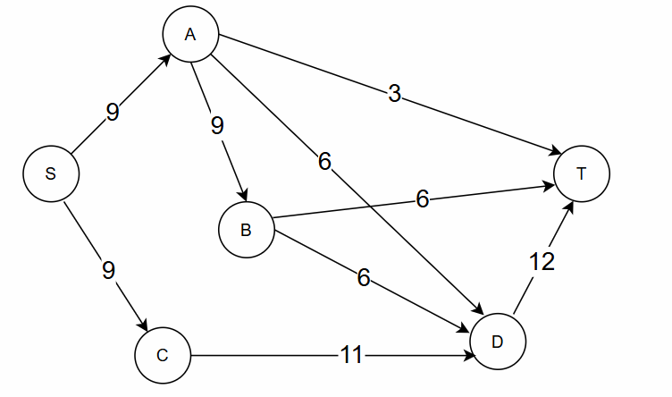

Построим остаточную сеть. Так как изначально поток в сети не задан, все дуги сети являются пустыми (локальный поток равен нулю), соответственно в остаточную сеть необходимо вынести обратную дугу с весом равным пропускной способности. 

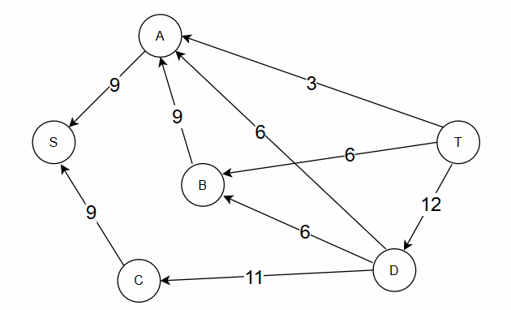

### 2. Проведем поиск увеличивающего пути в остаточной сети
В остаточной сети найден увеличивающий путь t -> a -> s. Минимальный вес дуг на этом пути равен 3.

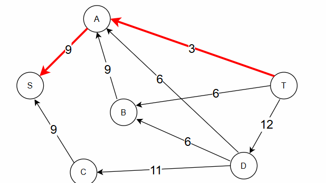

Уменьшим вес дуг на найденном пути, дуги для которых вес стал нулевым удалим из остаточной сети.

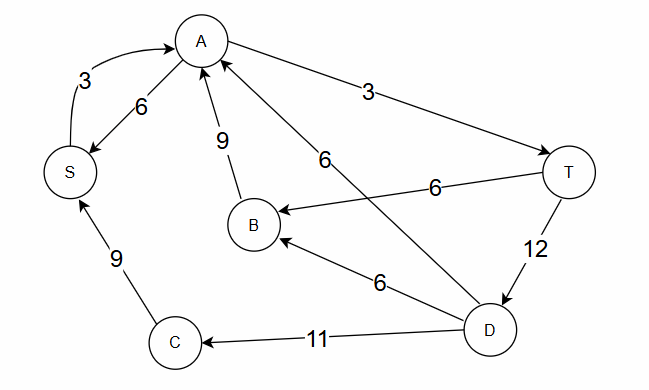

Скорректируем соответствующим образом локальные потоки в исходной сети. Первым числом будем указывать локальный поток, вторым пропускную способность дуги. 

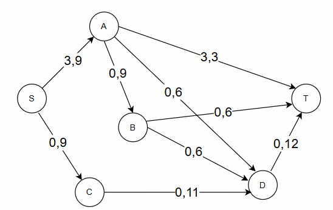

### 3. Продолжим поиск увеличивающего пути в остаточной сети

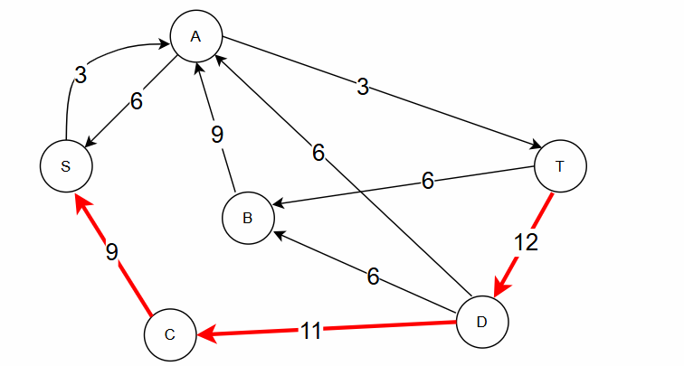

В остаточной сети найден увеличивающий путь t -> d -> c -> s. Минимальный вес дуг на этом пути равен 9.

Уменьшим вес дуг на найденном пути, дуги для которых вес стал нулевым удалим из остаточной сети.

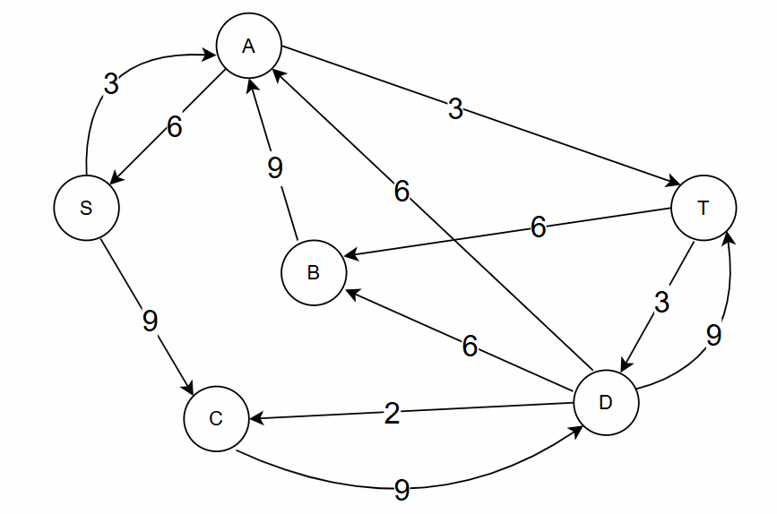

Скорректируем соответствующим образом локальные потоки в исходной сети.

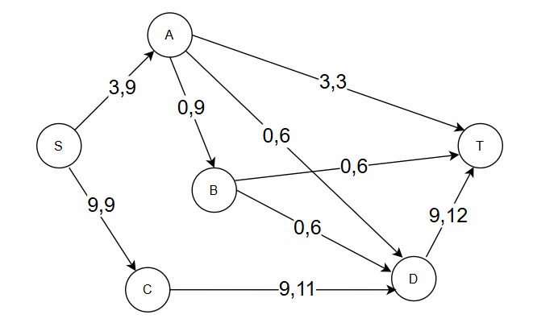

### 4. Продолжим поиск увеличивающего пути в остаточной сети

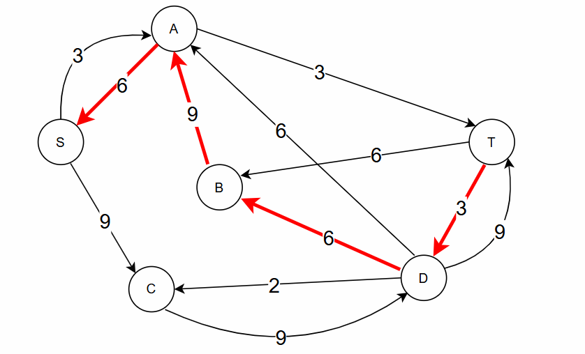

В остаточной сети найден увеличивающий путь t -> d -> b -> a -> s. Минимальный вес дуг на этом пути равен 3.

Уменьшим вес дуг на найденном пути, дуги для которых вес стал нулевым удалим из остаточной сети.

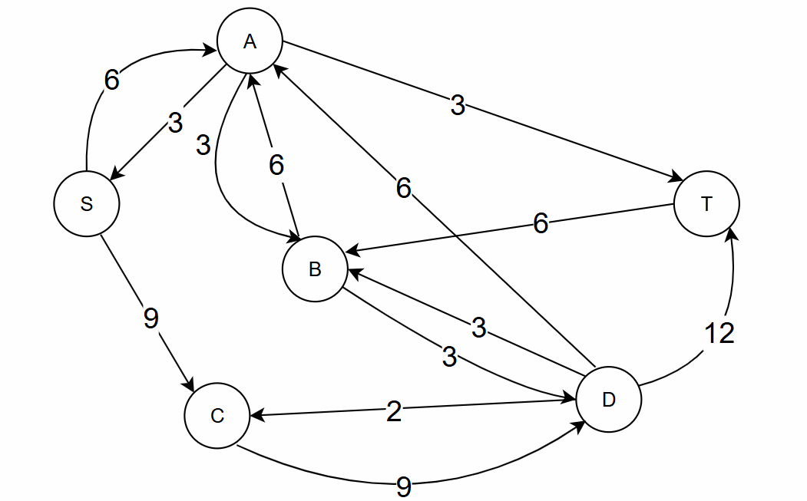

Скорректируем соответствующим образом локальные потоки в исходной сети.

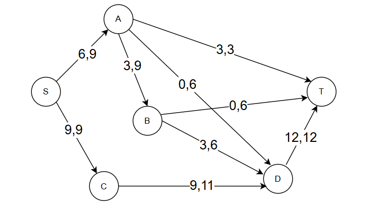

### 5. Продолжим поиск увеличивающего пути в остаточной сети
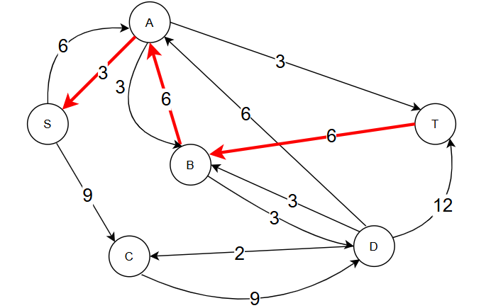

В остаточной сети найден увеличивающий путь t -> b -> a -> s. Минимальный вес дуг на этом пути равен 3.

Уменьшим вес дуг на найденном пути, дуги для которых вес стал нулевым удалим из остаточной сети.

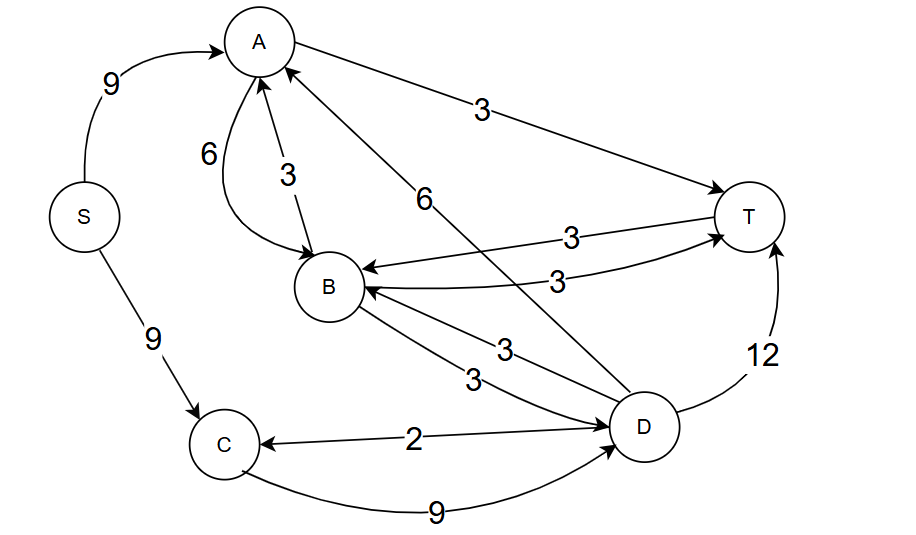

Скорректируем соответствующим образом локальные потоки в исходной сети.

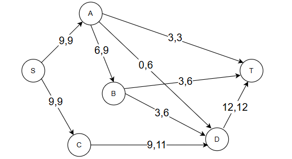

### 6. Продолжим поиск увеличивающего пути в остаточной сети
В остаточной сети не найдено увеличивающих путей, следовательно, алгоритм завершил работу и найденный поток величиной 18 является максимальным для данной сети.

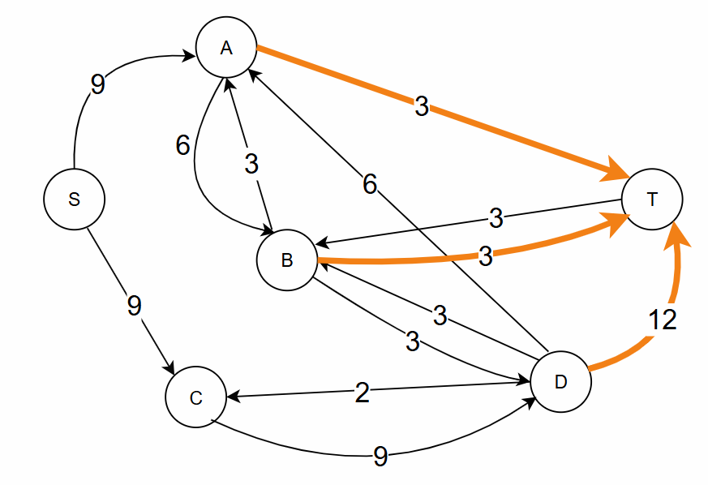

Проверим выполнение локального и глобального законов сохранения потока.

Локальный закон сохранения потока выполняется: для каждой внутренней вершины сети суммарный поток, входящий в нее, равен суммарному потоку, выходящему из нее.  

А: входящий поток 9, выходящий поток 6 + 3 = 9  
В: входящий поток 6, выходящий поток  3 + 3 = 6  
С: входящий поток 9, выходящий поток 9  
D: входящий поток 9 + 3 = 12, выходящий поток 12  

Глобальный закон сохранения потокка выполняется: суммарный поток, выходящий из s (9 + 9 = 18), равен суммарному потоку, входящему в t (3 + 3 + 12 = 18), равен потоку сети.

### 7. Проверим значение максимального потока перебором всех разрезов сети.
Разрез сети - разбиение множества вершин на два подмножества V1 и V2, где во множество V1 входит источник, а в V2 входит сток.

Пропускная способность разреза - сумма пропускной способности дуг, начинающихся в вершинах из множества V1 и оканчивающихся в вершинах из V2.

Для сети из _n_ вершин существует 2n - 2 различных разрезов, так как две вершины из множества (источник и сток) "зафиксированы" в V1 и V2, остальные вершины можно различными способами распределять между множествами V1 и V2.

Для сети из 6 вершин нужно найти 26 - 2 = 24 = 16 разрезов. 

| № | V1                   | V2 | Пропускная способность разреза |
|---|:--------------------------------|:--------------|:------------------------------:|
| 1 | s                    | a, b, c, d, t | 9 + 9 = 18 |
|   | **s + одна вершина из a, b, c, d** |               |                                |
| 2 | s, a                 | b, c, d, t | 9 + 9 + 6 + 3 = 27 |
| 3 | s, b                 | a, c, d, t | 9 + 9 + 6 + 6 = 30 |
| 4 | s, c                 | a, b, d, t | 9 + 11 = 20 |
| 5 | s, d                 | a, b, c, t | 9 + 9 + 12 = 30 |
|   | **s + две вершины из a, b, c, d** |               |                                |
| 6 | s, a, b              | c, d, t | 9 + 6 + 3 + 6 + 6 = 30 |
| 7 | s, a, c              | b, d, t | 9 + 6 + 3 + 11 = 29 |
| 8 | s, a, d              | b, c, t | 9 + 9 + 3 + 12 = 33 |
| 9 | s, b, c              | a, d, t | 9 + 6 + 6 + 11 = 32 |
| 10| s, b, d              | a, c, t | 9 + 9 + 6 + 12 = 36 |
| 11| s, c, d              | a, b, t | 9 + 12 = 21 |
|   | **s + три вершины из a, b, c, d** |               |                                |
| 12| s, a, b, c           | d, t | 6 + 3 + 6 + 6 + 11 = 32 |
| 13| s, a, b, d           | c, t | 9 + 3 + 6 + 12 = 30 |
| 14| s, a, c, d           | b, t | 9 + 3 + 12 = 24 |
| 15| s, b, c, d           | a, t | 9 + 6 + 12 = 27 |
|   | **s + все четыре вершины a, b, c, d** |               |                                |
| 16| s, a, b, c, d        | t | 3 + 6 + 12 = 21 |

Минимальная пропускная способность разреза равна 18 ( {s} / {a, b, c, d, t} ), что совпадает с найденной величиной максимального потока в сети.

### Ответ:
Максимальный поток в сети равен 18, он реализуется следующим локальными потоками:

