# Задание №10
# Задача о максимальном потоке.

## Постановка задачи
1. Дана сеть (взвешенный ориентированный граф) с источником s и стоком t.
2. Для каждой дуги определена ее пропускная способность.
3. Необходимо найти максимальный поток для указанной сети. 

## Решение задачи на поиск максимального потока в сети

Пропускная способность дуг сети указана в таблице.

|          Дуги          | sa | sc | ab | ac | at | bc | bt | ct |
|:----------------------:|:--:|:--:|:--:|:--:|:--:|----|----|----|
| Пропускная способность | 7  | 6 | 3  | 6  | 3  | 5  | 2  | 3  |

### 1. Построим сеть с источником **s**, стоком **t** и указанными пропускными способностями дуг.

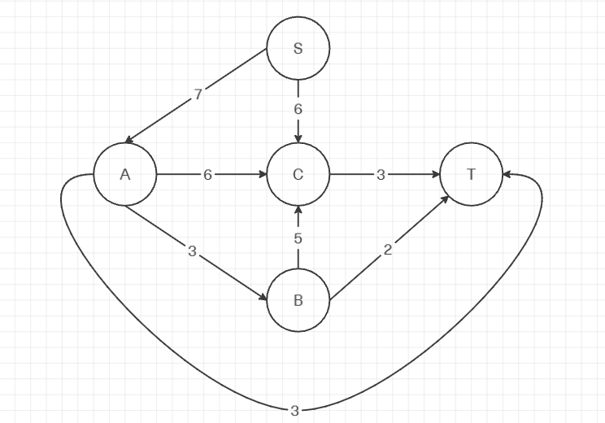

Построим остаточную сеть. Так как изначально поток в сети не задан, все дуги сети нулевые, соответственно в остаточную сеть необходимо вынести обратную дугу с весом равным пропускной способности. 

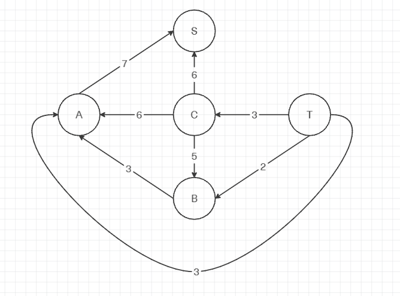

### 2. Проведем поиск увеличивающего пути в остаточной сети
В остаточной сети найден увеличивающий путь t -> a -> s. Минимальный вес дуг на этом пути равен 3.

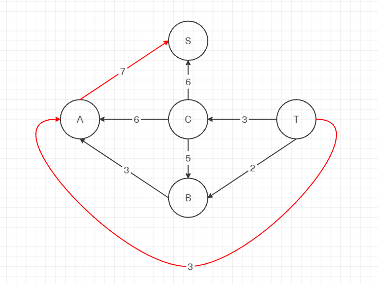

Уменьшим вес дуг и нулевые удаляем.

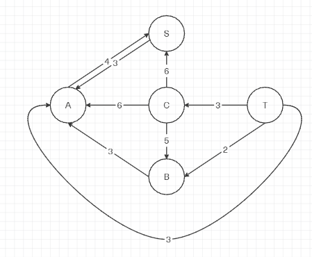

Скорректируем соответствующим образом локальные потоки в исходной сети. Первым числом будем указывать локальный поток, вторым пропускную способность дуги. 

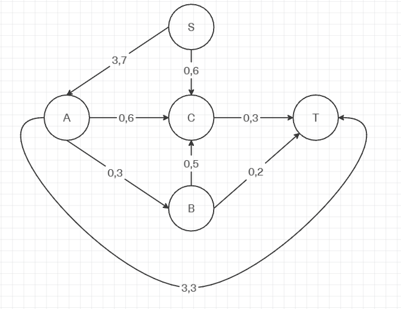

### 3. Продолжим поиск увеличивающего пути в остаточной сети

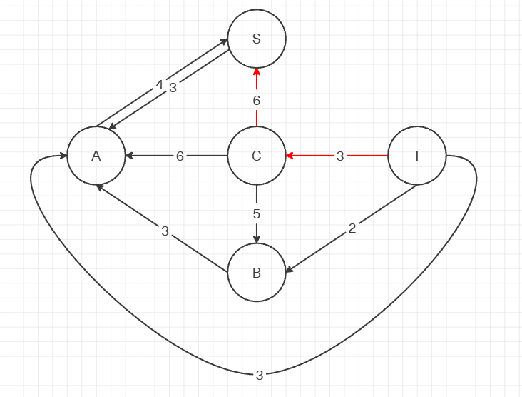

В остаточной сети найден увеличивающий путь t -> c -> s. Минимальный вес дуг на этом пути равен 3.

Уменьшим вес дуг и нулевые удаляем.

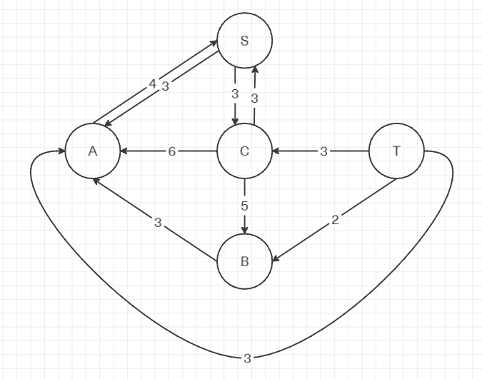

Скорректируем соответствующим образом локальные потоки в исходной сети.

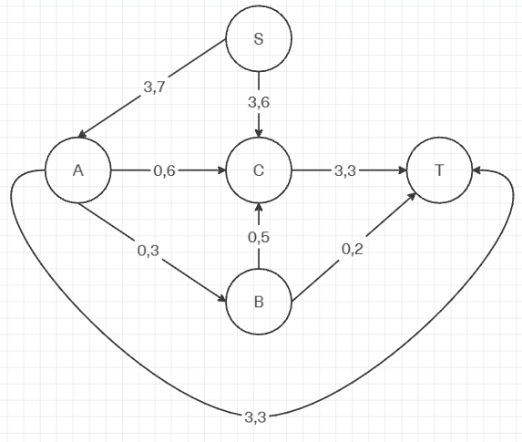

### 4. Продолжим поиск увеличивающего пути в остаточной сети

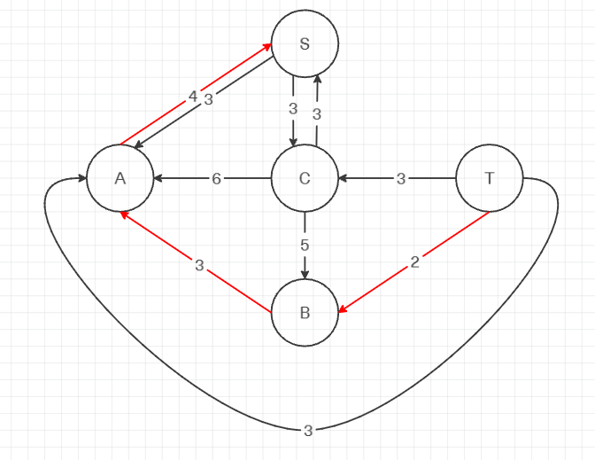

В остаточной сети найден увеличивающий путь t -> b -> a -> s. Минимальный вес дуг на этом пути равен 2.

Уменьшим вес дуг и нулевые удаляем.

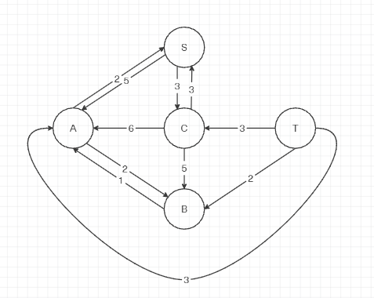

Скорректируем соответствующим образом локальные потоки в исходной сети.

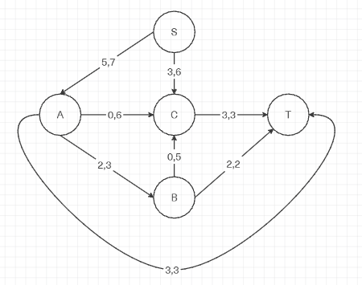

### 5. Продолжим поиск увеличивающего пути в остаточной сети
В остаточной сети не найдено увеличивающих путей, следовательно, алгоритм завершил работу. Из трех дуг (3,3,2) получаем максимальный поток величиной 8.

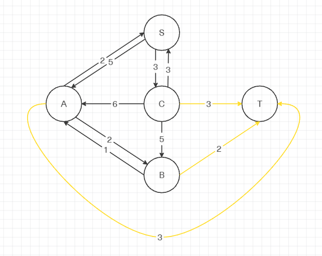

### 6. Проверим значение максимального потока перебором всех разрезов сети.
Далее реализуем разрез сети путем разбиения на множества V1 и V2, где во множество V1 входит источник, а в V2 входит сток, и считаем пропускную способность разреза.

Для сети из 5 вершин нужно найти 25 - 2 = 23 = 8 разрезов. 

| № | V1                   | V2 | Пропускная способность разреза |
|---|:--------------------------------|:--------------|:------------------------------:|
| 1 | s                               | a, b, c, t    |           6 + 7 = 13           |
|   | **s + одна вершина из a, b, c** |               |                                |
| 2 | s, a                            | b, c, t       |         6 + 3 + 6 + 3 = 18         |
| 3 | s, b                            | a, c, t       |         7 + 6 + 5 + 2 = 20         |
| 4 | s, c                            | a, b, t       |         7 + 3 = 10         |
|   | **s + пара вершин из a, b, c**  |               |                                |
| 5 | s, a, b                         | c, t          |         6 + 6 + 3 + 5 + 2 = 22         |
| 6 | s, a, c                         | b, t          |         3 + 3 + 3 = 9        |
| 7 | s, b, c                         | a, t          |         7 + 2 + 3 = 12         |
|   | **s + три вершины из a, b, c**  |               |                                |
| 8 | s, a, b, c                      | t             |           3 + 2 + 3 = 8           |

Минимальная пропускная способность разреза равна 8 ( {s, a, b, c} / {t} ), что совпадает с найденной величиной максимального потока в сети.

### Ответ:
Максимальный поток в сети равен 8, он реализуется следующим локальными потоками:

