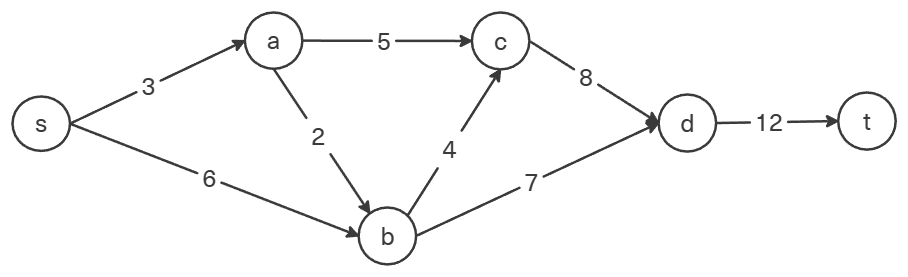
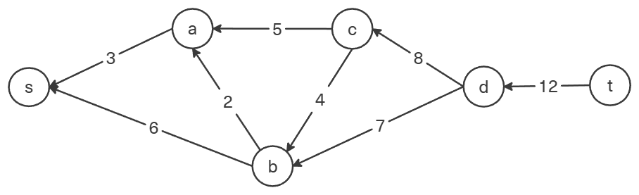
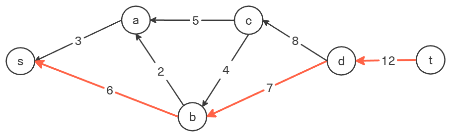
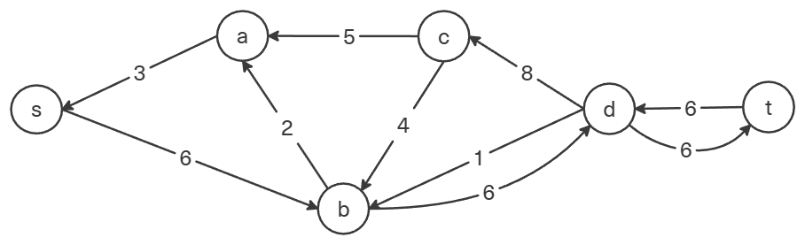
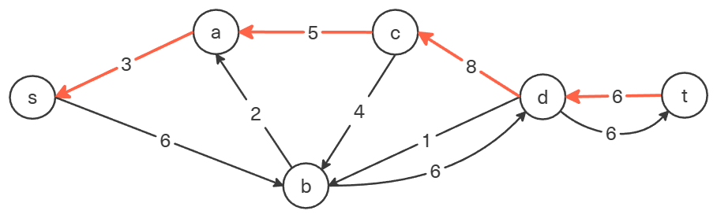
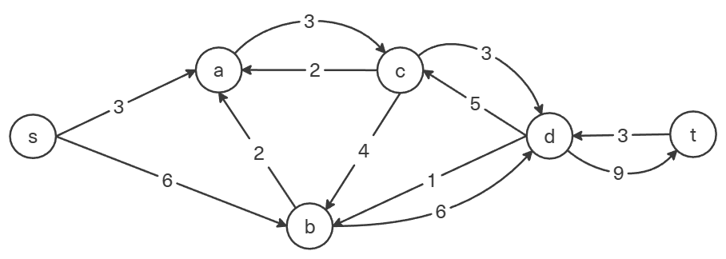
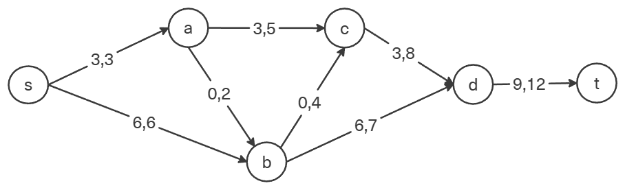
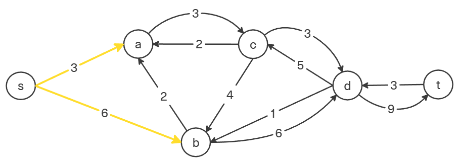
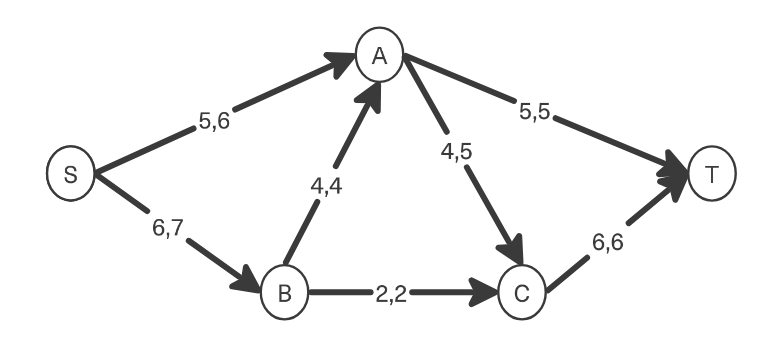

## Вариант 7:

### Пропускная способность дуг сети:

|          Дуги          | sa  | sb  | ac  | ab  | bc  | bd  | cd  | dt  |
| :--------------------: | :-: | :-: | :-: | :-: | :-: | :-: | :-: | :-: |
| Пропускная способность |  3  |  6  |  5  |  2  |  4  |  7  |  8  | 12  |

### 1. Построим сеть с источником **s**, стоком **t** и указанными пропускными способностями дуг.

Построим остаточную сеть. Так как изначально поток в сети не задан, локальный поток равен нулю, соответственно в остаточную сеть необходимо вынести обратную дугу с весом равным пропускной способности.

### 2. Проведем поиск увеличивающего пути в остаточной сети

В остаточной сети найден увеличивающий путь t -> d -> b -> s. Минимальный вес дуг на этом пути равен 6.

Уменьшим вес дуг на найденном пути, дуги для которых вес стал нулевым удалим из остаточной сети.

Скорректируем соответствующим образом локальные потоки в исходной сети. Первым числом будем указывать локальный поток, вторым пропускную способность дуги.

### 3. Продолжим поиск увеличивающего пути в остаточной сети

В остаточной сети найден увеличивающий путь t -> d -> c -> a -> s. Минимальный вес дуг на этом пути равен 3.

Уменьшим вес дуг на найденном пути, дуги для которых вес стал нулевым удалим из остаточной сети.

Скорректируем соответствующим образом локальные потоки в исходной сети.

### 4. Продолжим поиск увеличивающего пути в остаточной сети

В остаточной сети не найдено увеличивающих путей, следовательно, алгоритм завершил работу и найденный поток величиной 9 является максимальным для данной сети.

### 6. Проверим значение максимального потока перебором всех разрезов сети.

Разрез сети - разбиение множества вершин на два подмножества V1 и V2, где во множество V1 входит источник, а в V2 входит сток.

Пропускная способность разреза - сумма пропускной способности дуг, начинающихся в вершинах из множества V1 и оканчивающихся в вершинах из V2.

Для сети из _n_ вершин существует 2n - 2 различных разрезов, так как две вершины из множества (источник и сток) "зафиксированы" в V1 и V2, остальные вершины можно различными способами распределять между множествами V1 и V2.

Для сети из 5 вершин нужно найти 25 - 2 = 23 = 8 разрезов.

| №   | V1                   | V2 | Пропускная способность разреза |
| --- | :------------------------------ | :------------ | :----------------------------: |
| 1   | s                               | a, b, c, t    |           6 + 7 = 13           |
|     | **s + одна вершина из a, b, c** |               |                                |
| 2   | s, a                            | b, c, t       |         7 + 5 + 5 = 17         |
| 3   | s, b                            | a, c, t       |         6 + 4 + 2 = 12         |
| 4   | s, c                            | a, b, t       |         6 + 7 + 6 = 19         |
|     | **s + пара вершин из a, b, c**  |               |                                |
| 5   | s, a, b                         | c, t          |         5 + 5 + 2 = 12         |
| 6   | s, a, c                         | b, t          |         6 + 4 + 2 = 12         |
| 7   | s, b, c                         | a, t          |         7 + 5 + 6 = 18         |
|     | **s + три вершины из a, b, c**  |               |                                |
| 8   | s, a, b, c                      | t             |           5 + 6 = 11           |

Минимальная пропускная способность разреза равна 11 ( {s, a, b, c} / {t} ), что совпадает с найденной величиной максимального потока в сети.

### Ответ:

Максимальный поток в сети равен 11, он реализуется следующим локальными потоками:

