# Решение варианта №1 DIVI: Максимальный поток минимальной стоимости

## Дано:
Источник: S
Сток: T
Дуги, их пропускная способность

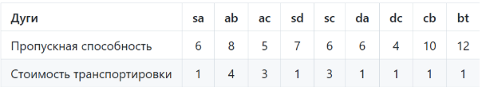

# Этап 1: Построение исходной сети
Строим ориентированный граф. У каждой дуги указана пара чисел локальный поток/пропускная способность

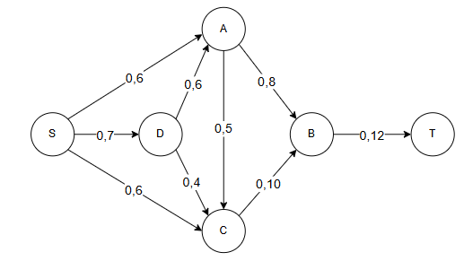

# Этап 2: Поиск увеличивающих путей (алгоритм Форда-Фалкерсона)
Итерация №1

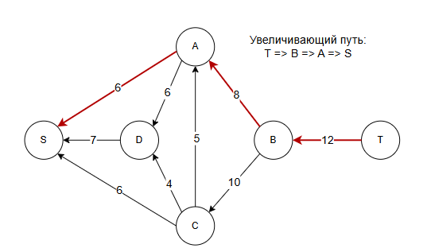

Корректировка остаточной сети
Локальный путь дуги B => T стал равен 6, резерв равен 6.
Локальный путь дуги А => В стал равен 6, резерв равен 2.
Локальный путь дуги S => A стал равен 6. Дуга насыщенная.

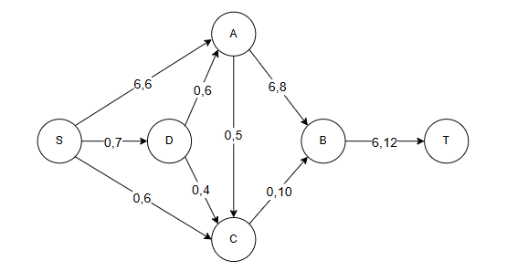

## Итерация №2
Продолжаем поиск увеличивающего пути в остаточной сети.

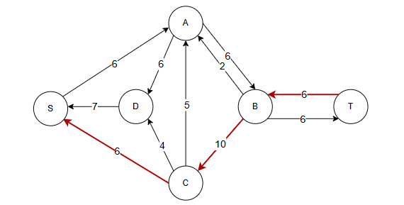

Новый увеличивающий путь: T => B => C => S
Минимальная пропускная способность = 6
6 - 6 = 0
8 - 6 = 2
12 - 6 = 6

Корректировка остаточной сети
Локальный путь дуги B => T стал равен 12. Дуга насыщенная.
Локальный путь дуги С => В стал равен 6, резерв равен 4.
Локальный путь дуги S => С стал равен 6. Дуга насыщенная.

6 + 0 + 6 = 12
12 = 12
F = 12
S = 6 + 24 + 0 + 0 + 18 + 0 + 0 + 6 + 12 = 66

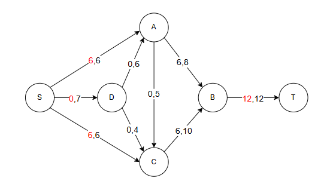

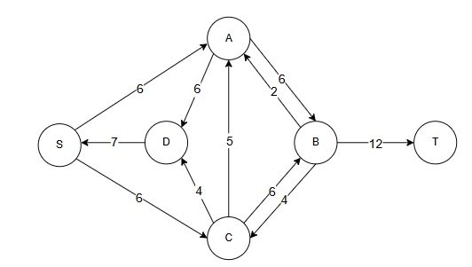

Увеличивающего пути нет. Текущий поток максимальный. Алгоритм завершается.
Поток F = 6 + 6 = 12
Текущая стоимость потока = 6 + 24 + 18 + 6 + 12 = 66

# Этап 3: Минимизация стоимости (поиск циклов отрицательной стоимости)
Для минимизации строим остаточную сеть со стоимостями.
Правила построения:

Для прямой дуги с остатком > 0: направление прямое, стоимость с +

Для обратной дуги (существующий поток): направление обратное, стоимость с -

Корректировка остаточной сети
Локальный путь дуги А=> В стал равен 2. Резерв - 6.
Локальный путь дуги С => В стал равен 10. Дуга насыщенная.
Локальный путь дуги D => С стал равен 4. Дуга насыщенная.
Локальный путь дуги S => D стал равен 4, резерв - 3.
Локальный путь дуги S => A стал равен 2, резерв - 4.

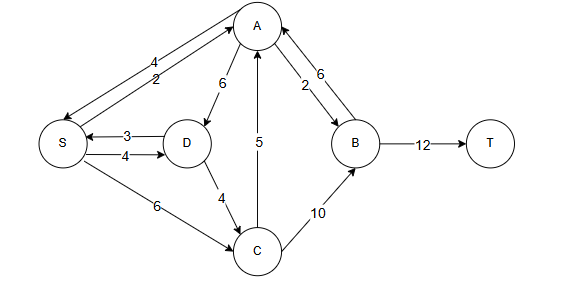
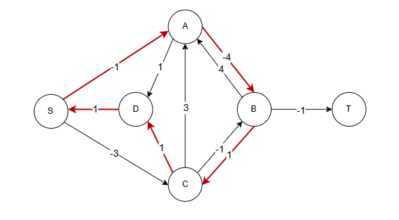

-4 + 1 + 1 + 1 - 1 = -2 ( Сумма отрицательная, подходит)
Минимальная пропускная способность дуг цикла = 4

## Поиск цикла отрицательной стоимости №2
Строим новую остаточную сеть после корректировки.
2 + 4 + 6 = 12
12 = 12
F = 12
S = 2 + 4 + 18 + 0 + 4 + 0 + 10 + 8 + 12 = 58

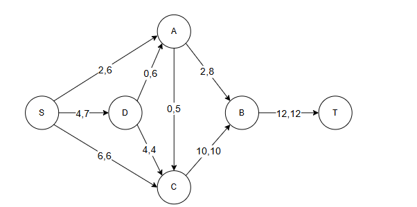
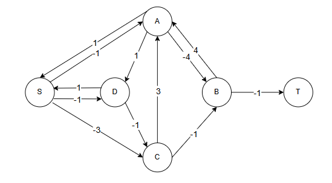

Циклов отрицательной стоимости нет

# Этап 4: Финальный результат

Максимальный поток: F = 12

Минимальная стоимость транспортировки: C = 58
