# Вариант №4 TeamSpirit: Максимальный поток минимальной стоимости

## Дано:
Источник: S, Сток: T, Вершины: A,B,C,D

| Дуги                      | sb | sa | sc | cd | ab | ac | bc | bd | dt |
|:--------------------------|:--:|:--:|:--:|:--:|:--:|:--:|:--:|:--:|:--:|
| Пропускная способность    | 6  | 6  | 6  | 10 | 6  | 5  | 5  | 8  | 15 |
| Стоимость транспортировки | 2  | 2  | 4  | 1  | 1  | 1  | 3  | 4  | 3  |

# Этап 1: Построение исходной сети

Для начала построим ореинтированный граф. У каждой дуги есть своя пропуская способность и стоимость. 

# Этап 2: Поиск максимального потока в сети без учёта стоимости

## Итерация №1

Возьмём увеличивающий путь t => d => b => s

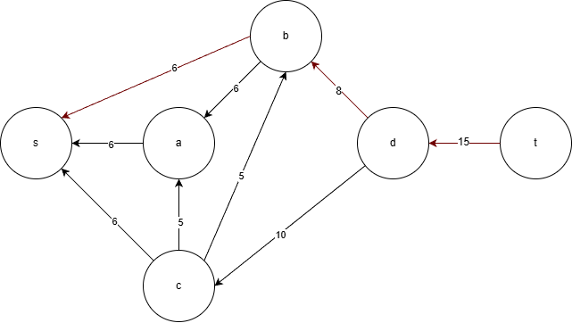

Минимальная пропускная способность равна 6.

Корректируем остаточную сеть

Локальный путь из s => b стал 6, дуга стала насыщенной.
Локальный путь из b => d стал 6, резерв стал равен 2.
Локальный путь дуги d => t стал 6, резерв стал равен 9.

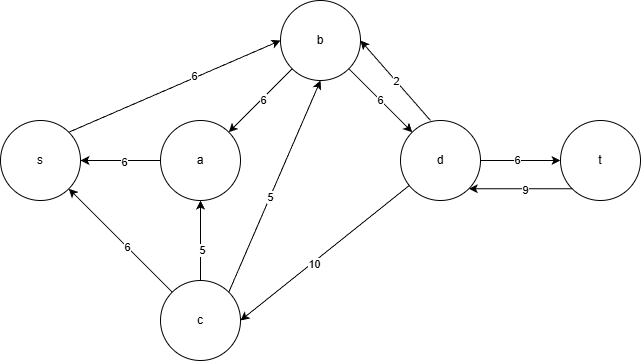

## Итерация №2

Продолжаем искать увеличивающие пути.

Нашли новый увеличивающий путь: t => d => c => s

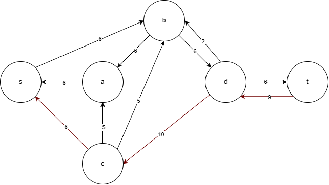

Минимальная пропускная способность равна 6.

Корректируем остаточную сеть

Локальный путь из s => с стал 6, дуга стала насыщенной.
Локальный путь из с => d стал 6, резерв стал равен 4.
Локальный путь дуги d => t стал равен 12, резерв стал равен 3.

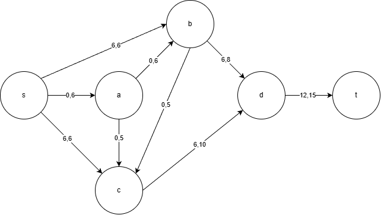
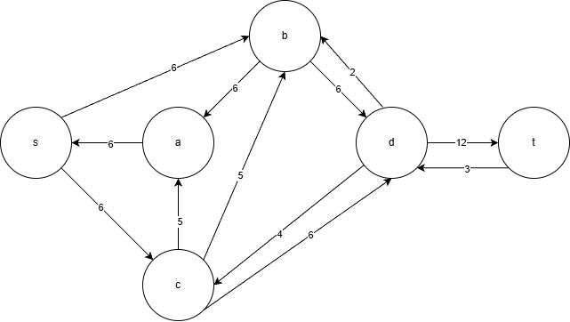

## Итерация №3

Продолжаем искать увеличивающие пути.

Нашли новый увеличивающий путь: t => d => c => a => s

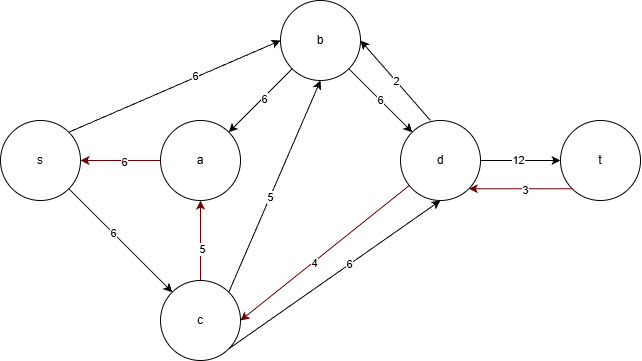

Локальный путь из s => a стал 3, резерв стал равен 3.
Локальный путь из a => c стал 3, резепв стал равен 2.
Локальный путь из c => d стал 9, резерв стал равен 1.
Локальный путь из d => t стал 15, дуга стала насыщенной.

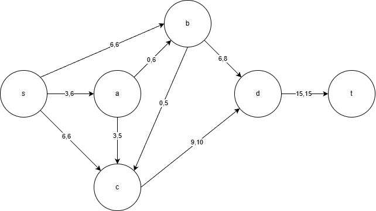
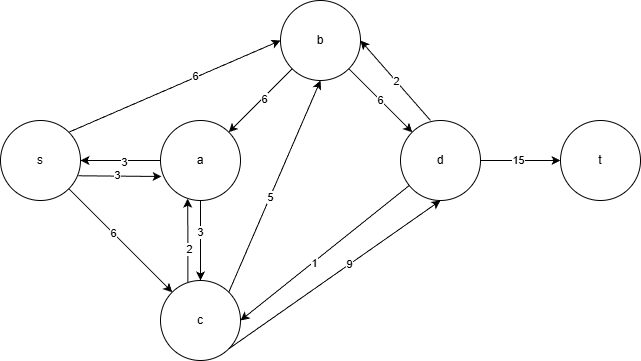

Увеличивающего пути нет. Текущий поток максимальный. Алгоритм завершается.
Поток F = 6 + 6 + 3 = 15

| Дуги                          | sb | sa | sc | cd | ab | ac | bc | bd | dt | Итого |
|:--------------------------    |:--:|:--:|:--:|:--:|:--:|:--:|:--:|:--:|:--:| :--:  |
| Пропускная способность        | 6  | 6  | 6  | 10 | 6  | 5  | 5  | 8  | 15 |       |
| Стоимость транспортировки     | 2  | 2  | 4  | 1  | 1  | 1  | 3  | 4  | 3  |       |
| Локальный поток               | 6  | 3  | 6  | 9  | 0  | 3  | 0  | 6  | 15 |       |
| Суммарная стоимость f(e)*c(e) | 12 | 6  | 24 | 9  | 0  | 3  | 0  | 24 | 45 |  123  |

Стоимость полученного потока составляет 123

# Этап 3: Поиск отрицательных циклов в сети для минимизации стоимости
Чтобы минимизировать стоимость необходимо построить остаточную сеть включив неё стоимость по 2 правилам

Для прямой дуги стоимость с отрицательным знаком "-"

Для обратной дуги стоимость с положительынм знаком "+"

Для каждой дуги остаточной сети укажем стоимость транспортировки единицы потока:

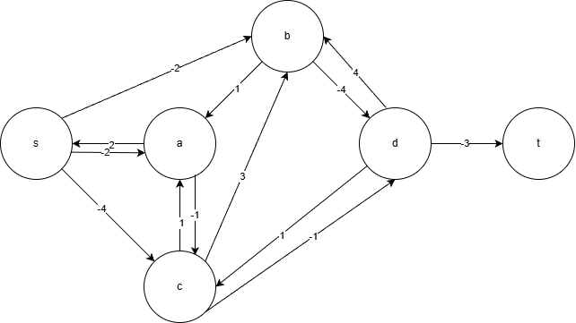

## Поиск цикла отрицательной стоимости №1

Найдем в остаточной сети цикл отрицательной стоимости.

Цикл найден: s => c => a => s

Сумма стоимостей: -4 + 1 + 2 = -1 < 0 - цикл подходит

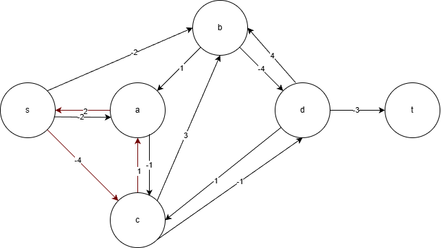

Найдем минимальный вес ребра в данном цикле, изображенном в остаточной сети с указанием величины потока.

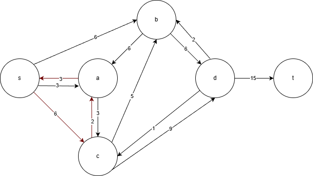

Минимальный вес ребра 2, это резерв ребра с => a

Удалим найденный цикл - уменьшим на 2 вес всех ребер, входящих в цикл.

Скорректируем остаточную сеть с указанием стоимости транспортировки единицы потока.

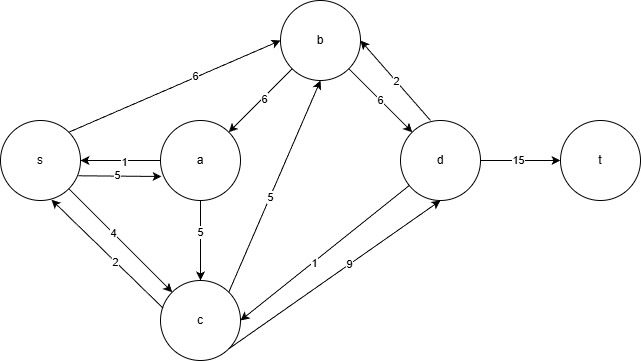

## Поиск цикла отрицательной стоимости №2

Найдем в остаточной сети цикл отрицательной стоимости.

Цикл найден: s => b => d => c => s

Сумма стоимостей: -2 - 4 + 1 + 4 = - 1 < 0 - цикл подходит

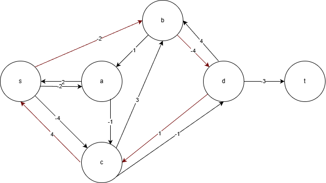

Найдем минимальный вес ребра в данном цикле, изображенном в остаточной сети с указанием величины потока.

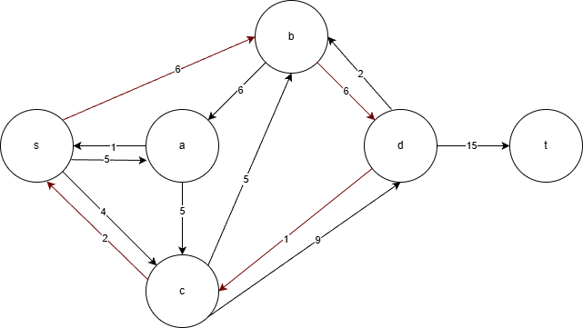

Минимальный вес ребра 1, это резерв ребра d => c

Удалим найденный цикл - уменьшим на 1 вес всех ребер, входящих в цикл.

Скорректируем остаточную сеть с указанием стоимости транспортировки единицы потока.

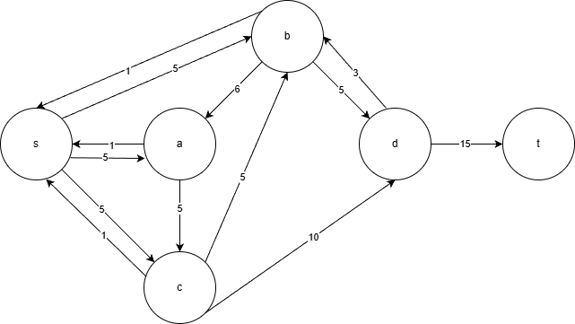

## Поиск цикла отрицательной стоимости №3

Найдем в остаточной сети цикл отрицательной стоимости.

В остаточной сети циклов отрицательной стоимости нет, значит, стоимость потока минимальная.

# Этап 4: Финальный результат

| Дуги                          | sb | sa | sc | cd | ab | ac | bc | bd | dt | Итого |
|:--------------------------    |:--:|:--:|:--:|:--:|:--:|:--:|:--:|:--:|:--:| :--:  |
| Пропускная способность        | 6  | 6  | 6  | 10 | 6  | 5  | 5  | 8  | 15 |       |
| Стоимость транспортировки     | 2  | 2  | 4  | 1  | 1  | 1  | 3  | 4  | 3  |       |
| Локальный поток               | 5  | 5  | 5  | 10 | 0  | 5  | 0  | 5  | 15 |       |
| Суммарная стоимость f(e)*c(e) | 10 | 10 | 20 | 10 | 0  | 5  | 0  | 20 | 45 |  120  |

Максимальный поток: F = 15

Минимальная стоимость транспортировки: C = 120  
