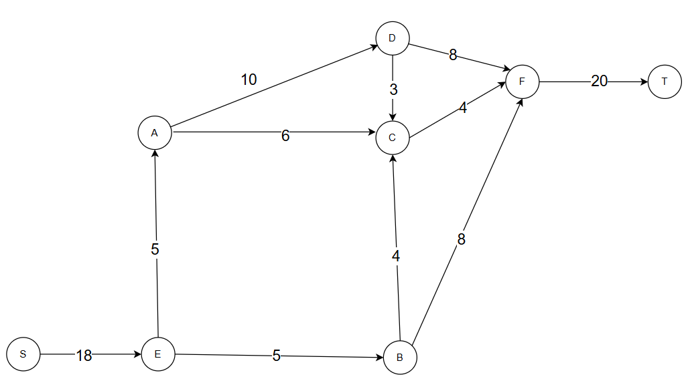
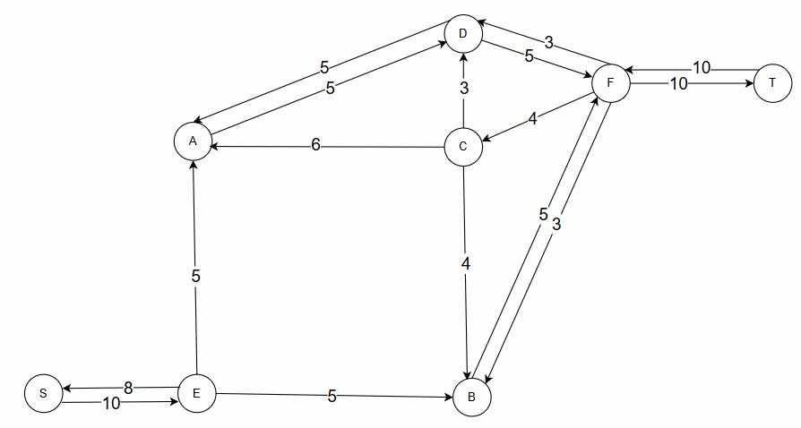
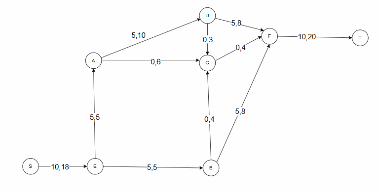
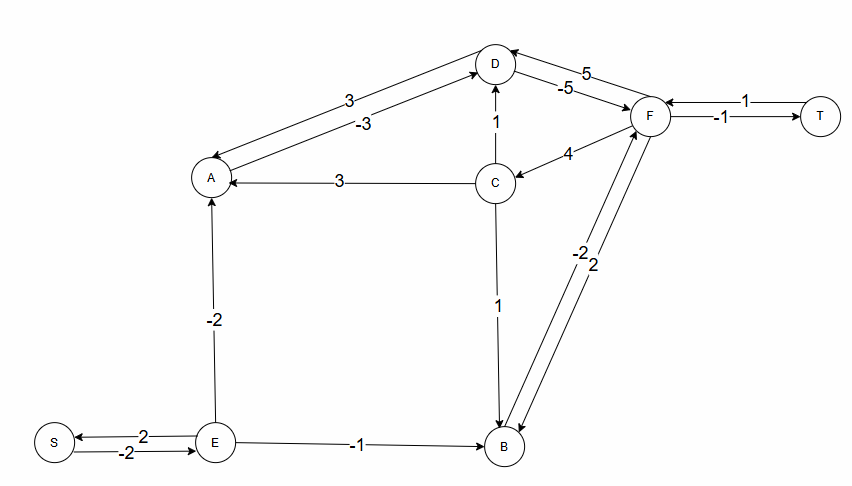
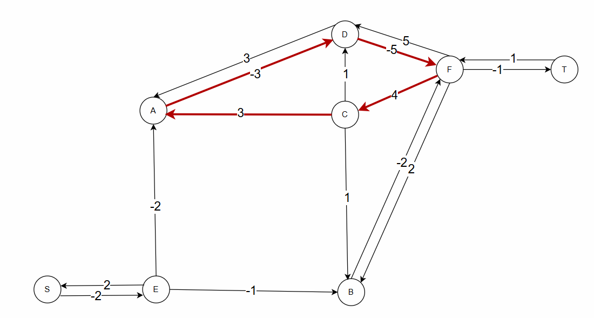
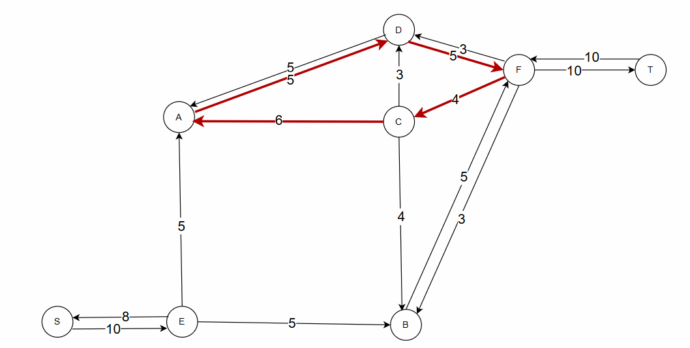
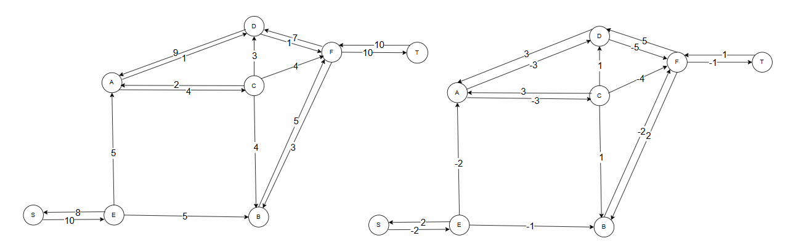
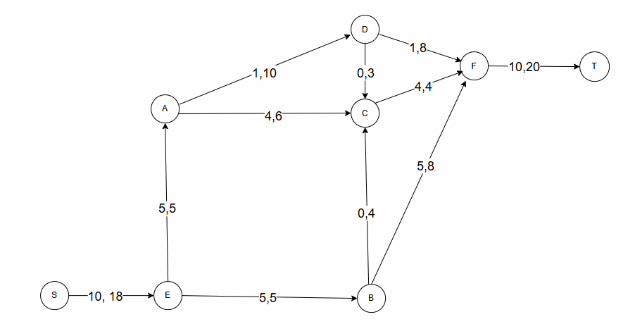

# Задание №11. Вариант №5
# Задача о максимальном потоке минимальной стоимости.

## Постановка задачи
1. Дана сеть (взвешенный ориентированный граф) с источником s и стоком t.
2. Для каждой дуги определена пропускная способность и стоимость транспортировки.
3. Необходимо найти для указанной сети максимальный поток минимальной стоимости. 

## Пример решения задачи на поиск максимального потока в сети

Пропускная способность дуг сети и стоимость транспортировки указана в таблице.

| Дуги                      | se | ea | ac | ad | eb | bc | dc | bf | cf | df | ft |
|:--------------------------|:--:|:--:|:--:|:--:|:--:|:--:|:--:|:--:|:--:|:--:|:--:|
| Пропускная способность    | 18 | 5  | 6  | 10 | 5  | 4  | 3  | 8  | 4  | 8  | 20 |
| Стоимость транспортировки | 2  | 2  | 3  | 3  | 1  | 1  | 1  | 2  | 4  | 5  |  1 |

### 1. Построим сеть с источником **s**, стоком **t** и указанными пропускными способностями дуг для поиска максимального потока.

Укажем начальный поток величиной 5 **s -> e -> a -> d -> f -> t**. 

Построим соответствующую остаточную сеть.

### 2. Проведем поиск увеличивающего пути в остаточной сети
В остаточной сети найден увеличивающий путь t -> f -> b -> e -> s. Минимальный вес дуг на этом пути равен 5.

Уменьшим вес дуг на найденном пути, дуги для которых вес стал нулевым удалим из остаточной сети.

### 3. Продолжим поиск увеличивающего пути в остаточной сети

В остаточной сети не найдено увеличивающих путей, следовательно, алгоритм завершил работу и найденный поток величиной 10 является максимальным для данной сети.

### 3. Рассчитаем стоимость полученного максимального потока.

| Дуги                                          | se | ea | ac | ad | eb | bc | dc | bf | cf | df | ft |Итого   |
|:----------------------------------------------|:--:|:--:|:--:|:--:|:--:|:--:|:--:|:--:|:--:|:--:|:--:|:------:|
| Пропускная способность                        | 18 | 5  | 6  | 10 | 5  | 4  | 3  | 8  | 4  | 8  | 20 |
| Локальный поток f(e)                          | 10 | 5  | 0  | 5  | 5  | 0  | 0  | 5  | 0  |  5 | 10 |
| Стоимость транспортировки единицы потока c(e) | 2  | 2  | 3  | 3  | 1  | 1  | 1  | 2  | 4  | 5  |  1 |
| Суммарная стоимость f(e)*c(e)                 | 20 |10  | 0  | 15 |5   | 0  | 0  | 10 | 0  | 25 |10  |  **95** 

Стоимость полученного потока составляет 95. 

### 4. Попробуем уменьшить стоимость потока для чего построим остаточную сеть.
Для каждого ребра остаточной сети укажем стоимость транспортировки единицы потока.

В остаточной сети найден ориентированный цикл отрицательной стоимости c -> a -> d -> f (3 - 3 - 5 + 4 = -1). 

Найдем минимальный вес ребра в указанном цикле, изображенном **в остаточной сети с указанием величины потока**.  

Минимальный вес ребра в цикле 4 - это неиспользованный резерв ребра c -> f.

Удалим найденный цикл - уменьшим на 4 вес всех ребер, входящих в цикл.

Скорректируем остаточную сеть с указанием стоимости транспортировки единицы потока.

### 5. Проведем повторный поиск цикла отрицательной стоимости в остаточной сети.

В остаточной сети отсутствуют циклы отрицательной стоимости, следовательно, стоимость потока минимальна.

### 6. Рассчитаем стоимость полученного максимального потока.

| Дуги                                          | se | ea | ac | ad | eb | bc | dc | bf | cf | df | ft |Итого   |
|:----------------------------------------------|:--:|:--:|:--:|:--:|:--:|:--:|:--:|:--:|:--:|:--:|:--:|:------:|
| Пропускная способность                        | 18 | 5  | 6  | 10 | 5  | 4  | 3  | 8  | 4  | 8  | 20 |
| Локальный поток f(e)                          | 10 | 5  | 4  | 1  | 5  | 0  | 0  | 5  | 4  |  1 | 10 |
| Стоимость транспортировки единицы потока c(e) | 2  | 2  | 3  | 3  | 1  | 1  | 1  | 2  | 4  | 5  |  1 |
| Суммарная стоимость f(e)*c(e)                 | 20 |10  | 12  | 3 |5   | 0  | 0  | 10 | 16 |  5 |10  |  **91** 

Стоимость полученного потока составляет 91. 

### Ответ:
Максимальный поток в сети равен 10, минимальная стоимость потока 91, она реализуется следующим локальными потоками:

