# Задание №11 вариант 2
# Задача о максимальном потоке минимальной стоимости.

## Решение задачи на поиск максимального потока в сети

Пропускная способность дуг сети и стоимость транспортировки указана в таблице.

| Дуги                      | sa | sb | ad | at | ba | bd | bc | dc | ct |
|:--------------------------|:--:|:--:|:--:|:--:|:--:|:--:|:--:|:--:|:--:|
| Пропускная способность    | 3  | 10 | 4  | 5  | 1  | 3  | 10 | 8  | 12 |
| Стоимость транспортировки | 1  | 1  | 1  | 3  | 2  | 3  | 5  | 1  | 1  |

### 1. Построим сеть с источником **s**, стоком **t** и указанными пропускными способностями дуг для поиска максимального потока.

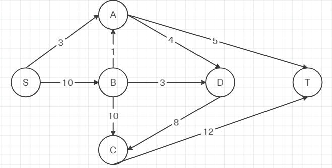

Укажем начальный поток величиной 3 **s -> a -> t**. 

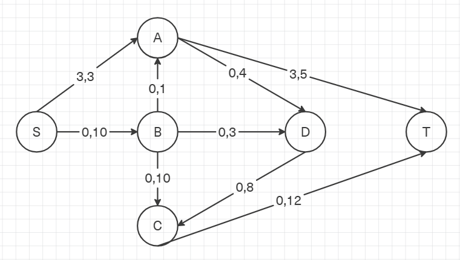

Построим соответствующую остаточную сеть.

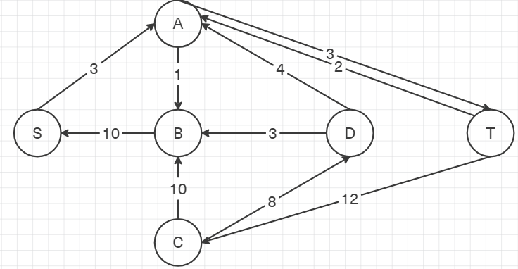

### 2. Проведем поиск увеличивающего пути в остаточной сети
В остаточной сети найден увеличивающий путь t -> с -> b -> s. Минимальный вес дуг на этом пути равен 10.

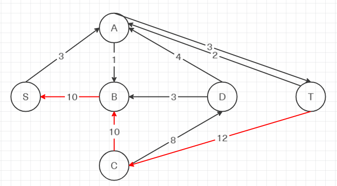

Уменьшим вес дуг на найденном пути, дуги для которых вес стал нулевым удалим из остаточной сети.

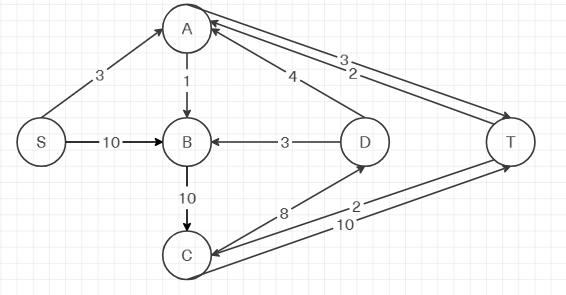

### 3. Продолжим поиск увеличивающего пути в остаточной сети

В остаточной сети не найдено увеличивающих путей, следовательно, алгоритм завершил работу и найденный поток величиной 13 является максимальным для данной сети.

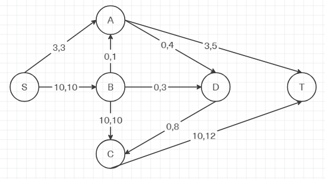

### 4. Рассчитаем стоимость полученного максимального потока.

| Дуги                                          | sa | sb | ad | at | ba | bd | bc | dc | ct | Итого |
|:----------------------------------------------|:--:|:--:|:--:|:--:|:--:|:--:|:--:|:--:|:--:|:-----:|
| Пропускная способность p(e)                   | 3  | 10 | 4  | 5  | 1  | 3  | 10 | 8  | 12 |       |
| Локальный поток f(e)                          | 3  | 10 | 0  | 3  | 0  | 0  | 10 | 0  | 10 |       |
| Стоимость транспортировки единицы потока c(e) | 1  | 1  | 1  | 3  | 2  | 3  | 5  | 1  | 1  |       |
| Суммарная стоимость f(e)·c(e)                 | 3  | 10 | 0  | 9  | 0  | 0  | 50 | 0  | 10 | 82 |

Стоимость полученного потока составляет 82. 

### 5. Попробуем уменьшить стоимость потока для чего построим остаточную сеть.
Для каждого ребра остаточной сети укажем стоимость транспортировки единицы потока.

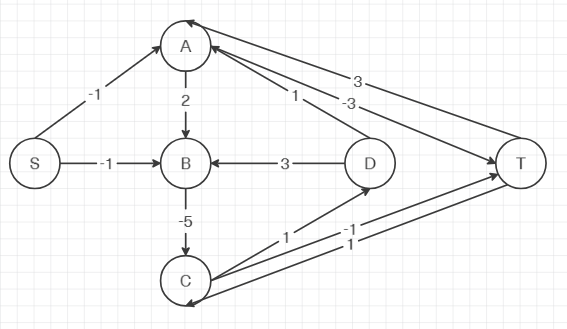

В остаточной сети найден ориентированный цикл отрицательной стоимости b -> d -> c -> b (3-5+1=-1). 

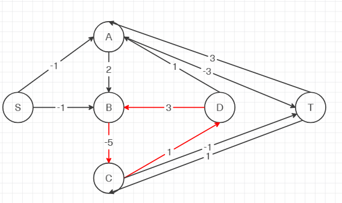

Найдем минимальный вес ребра в указанном цикле.  

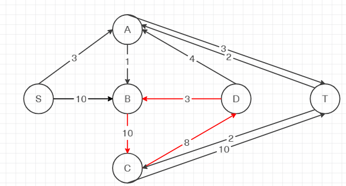

Минимальный вес ребра в цикле 3 - это неиспользованный резерв ребра b -> d.

Удалим найденный цикл - уменьшим на 3 вес всех ребер, входящих в цикл.

Скорректируем остаточную сеть с указанием стоимости транспортировки единицы потока.

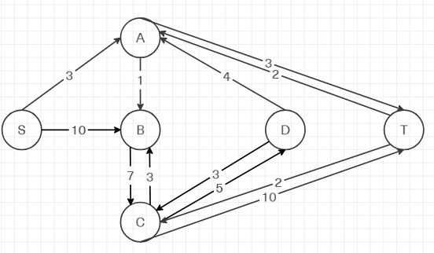
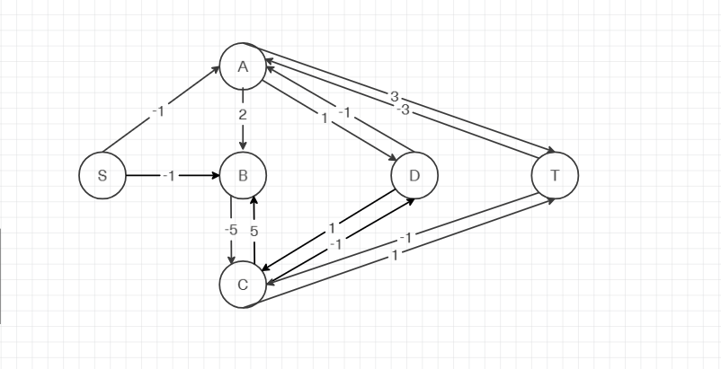
### 6. Проведем повторный поиск цикла отрицательной стоимости в остаточной сети.

В остаточной сети найден ориентированный цикл отрицательной стоимости b -> c -> d -> a -> b (-5-1-1+2). 

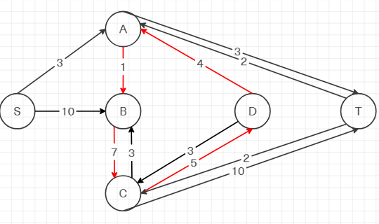

Найдем минимальный вес ребра в указанном цикле.  

Минимальный вес ребра в цикле 1 - это неиспользованный резерв ребра a -> b.

Удалим найденный цикл - уменьшим на 1 вес всех ребер, входящих в цикл.

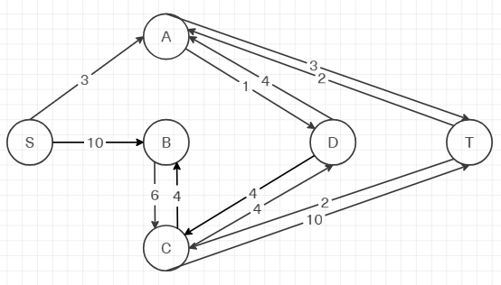
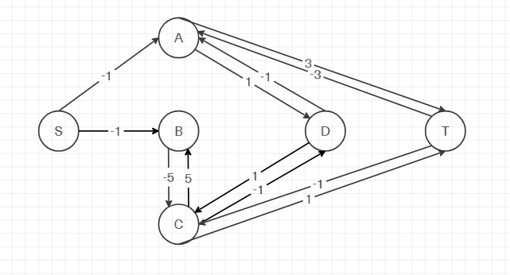

Скорректируем остаточную сеть с указанием стоимости транспортировки единицы потока.

### 7. Проведем повторный поиск цикла отрицательной стоимости в остаточной сети.

В остаточной сети отсутствуют циклы отрицательной стоимости, следовательно, стоимость потока минимальна.

### 8. Рассчитаем стоимость полученного максимального потока.

| Дуги                                          | sa | sb | ad | at | ba | bd | bc | dc | ct | Итого |
|:----------------------------------------------|:--:|:--:|:--:|:--:|:--:|:--:|:--:|:--:|:--:|:-----:|
| Пропускная способность p(e)                   | 3  | 10 | 4  | 5  | 1  | 3  | 10 | 8  | 12 |       |
| Локальный поток f(e)                          | 3  | 10 | 1  | 3  | 1  | 3  | 6  | 4  | 10 |       |
| Стоимость транспортировки единицы потока c(e) | 1  | 1  | 1  | 3  | 2  | 3  | 5  | 1  | 1  |       |
| Суммарная стоимость f(e)·c(e)                 | 3  | 10 | 1  | 9  | 2  | 9  | 30 | 4  | 10 | 78 |

Стоимость полученного потока составляет 78. 

### Ответ:
Максимальный поток в сети равен 13, минимальная стоимость потока 78, она реализуется следующим локальными потоками:

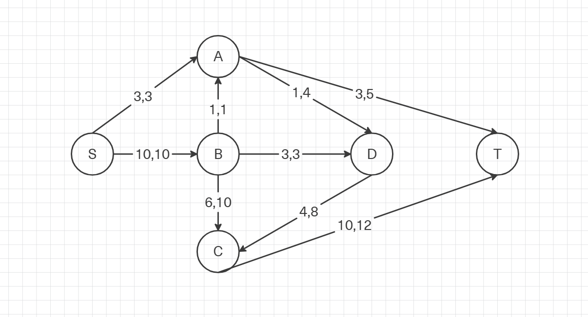
