## Решение задачи на поиск максимального потока в сети

Пропускная способность дуг сети и стоимость транспортировки указана в таблице.

| Дуги                      | sa  | sb  | ba  | sc  | ad  | bd  | cd  | dt  |
| :------------------------ | :-: | :-: | :-: | :-: | :-: | :-: | :-: | :-: |
| Пропускная способность    |  3  |  4  |  4  |  5  |  3  |  4  |  5  | 10  |
| Стоимость транспортировки |  4  |  3  |  2  |  1  |  1  |  3  |  2  |  2  |

### 1. Построим сеть с источником **s**, стоком **t** и указанными пропускными способностями дуг для поиска максимального потока.

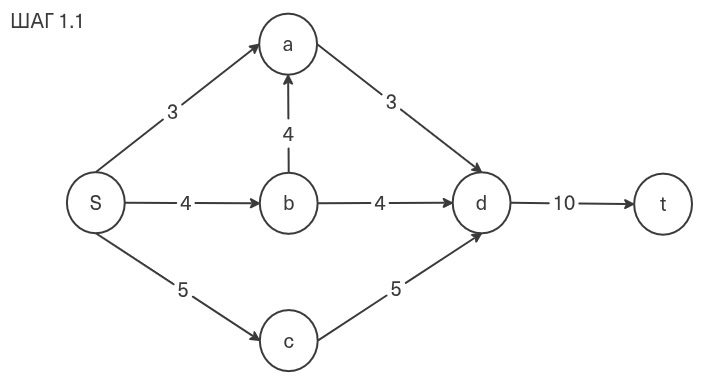

Укажем начальный поток величиной 3 s -> a -> d -> t.

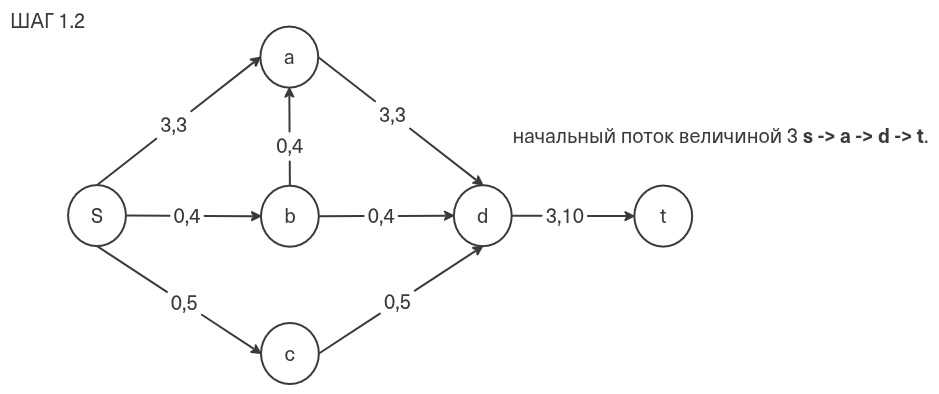

Остаточная сеть:

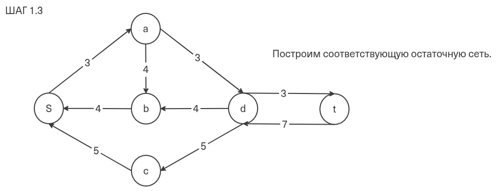

### 2. Проведем поиск увеличивающего пути в остаточной сети

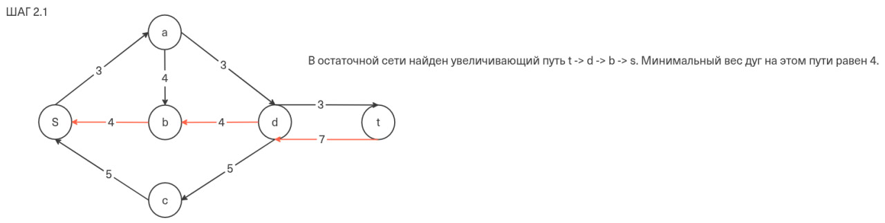

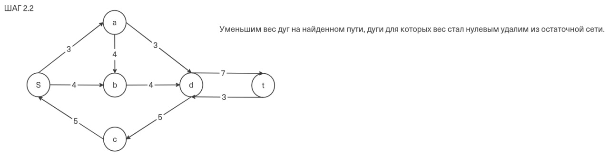

### 3. Продолжим поиск увеличивающего пути в остаточной сети

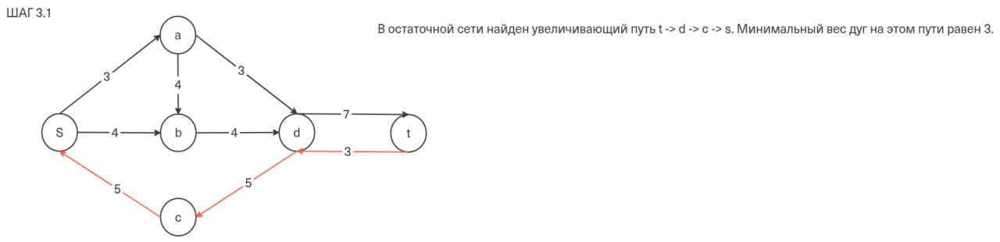

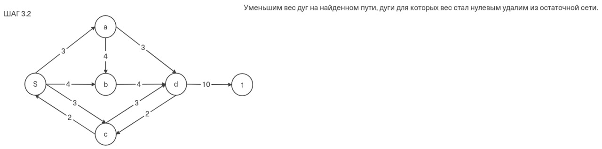

### 4. Продолжим поиск увеличивающего пути в остаточной сети

В остаточной сети не найдено увеличивающих путей, следовательно, алгоритм завершил работу и найденный поток величиной 10 является максимальным для данной сети.

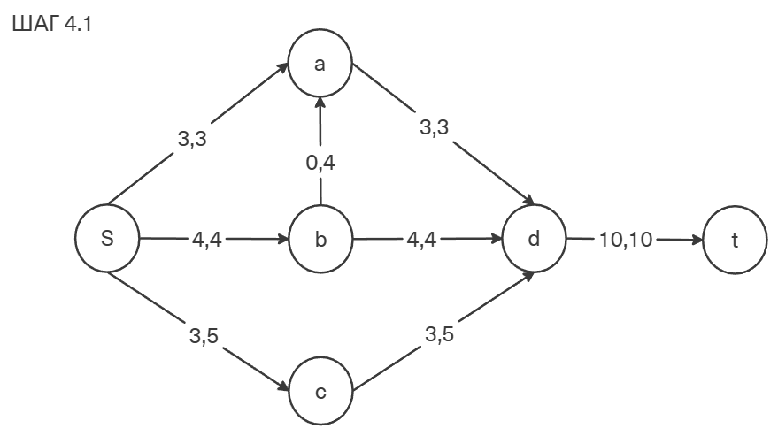

### 5. Рассчитаем стоимость полученного максимального потока.

| Дуги                                          | sa  | sb  | ba  | sc  | ad  | bd  | cd  | dt  | Итого  |
| :-------------------------------------------- | :-: | :-: | :-: | :-: | :-: | :-: | :-: | :-: | :----: |
| Пропускная способность p(e)                   |  3  |  4  |  4  |  5  |  3  |  4  |  5  | 10  |        |
| Локальный поток f(e)                          |  3  |  4  |  0  |  3  |  3  |  4  |  3  | 10  |        |
| Стоимость транспортировки единицы потока c(e) |  4  |  3  |  2  |  1  |  1  |  3  |  2  |  2  |        |
| Суммарная стоимость f(e)\*c(e)                | 12  | 12  |  0  |  3  |  3  | 12  |  6  | 20  | **68** |

Стоимость полученного потока составляет 68.

### 6. Попробуем уменьшить стоимость потока для чего построим остаточную сеть.

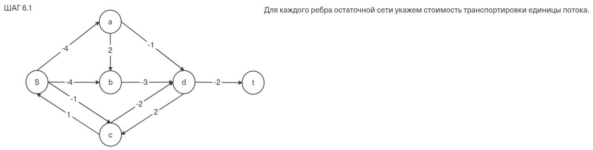

Ищем ориентрованный цикл отрицательной стоимости:

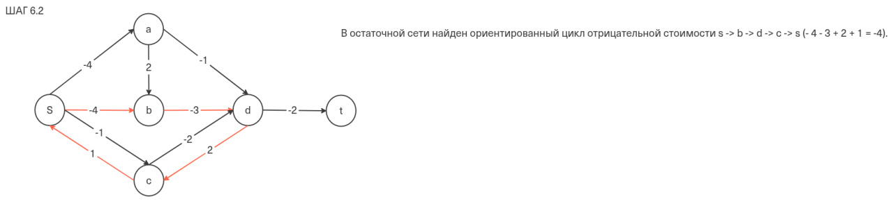

Найдем минимальный вес ребра в указанном цикле, изображенном **в остаточной сети с указанием величины потока**.

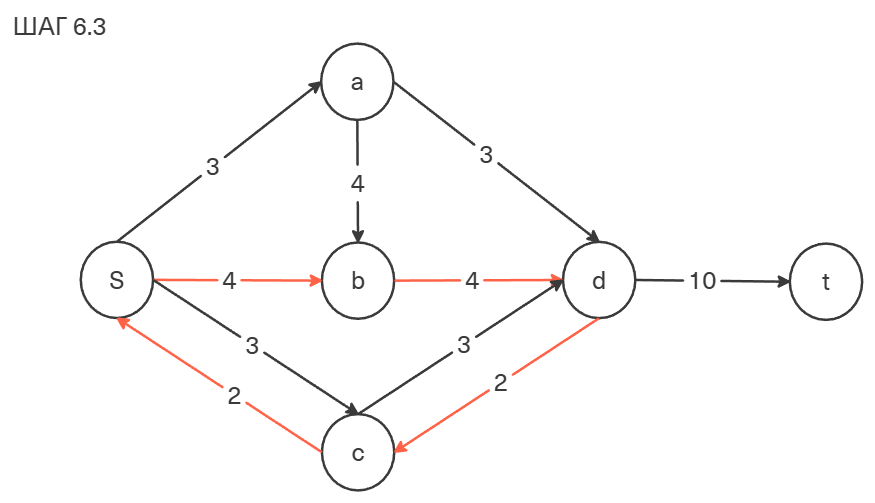

Минимальный вес ребра в цикле 2 - это неиспользованный резерв ребер c -> d и s -> c.

Удалим найденный цикл - уменьшим на 2 вес всех ребер, входящих в цикл.

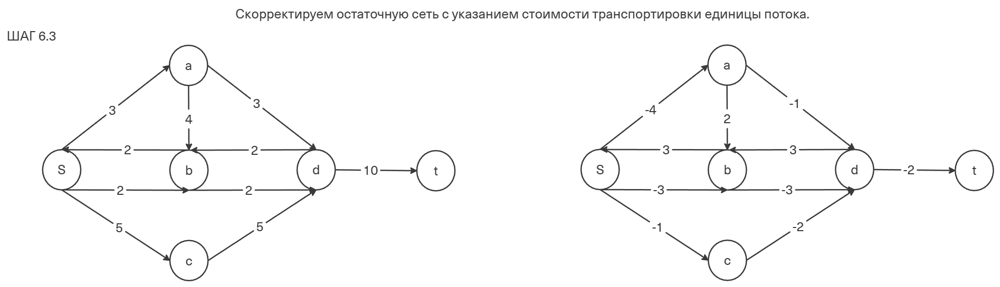

### 6. Проведем повторный поиск цикла отрицательной стоимости в остаточной сети.

В остаточной сети отсутствуют циклы отрицательной стоимости, следовательно, стоимость потока минимальна.

### 7. Рассчитаем стоимость полученного максимального потока.

| Дуги                                          | sa  | sb  | ba  | sc  | ad  | bd  | cd  | dt  | Итого  |
| :-------------------------------------------- | :-: | :-: | :-: | :-: | :-: | :-: | :-: | :-: | :----: |
| Пропускная способность p(e)                   |  3  |  4  |  4  |  5  |  3  |  4  |  5  | 10  |        |
| Локальный поток f(e)                          |  3  |  2  |  0  |  5  |  3  |  2  |  5  | 10  |        |
| Стоимость транспортировки единицы потока c(e) |  4  |  3  |  2  |  1  |  1  |  3  |  2  |  2  |        |
| Суммарная стоимость f(e)\*c(e)                | 12  |  6  |  0  |  5  |  3  |  6  | 10  | 20  | **62** |
