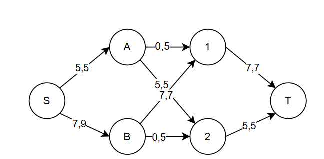
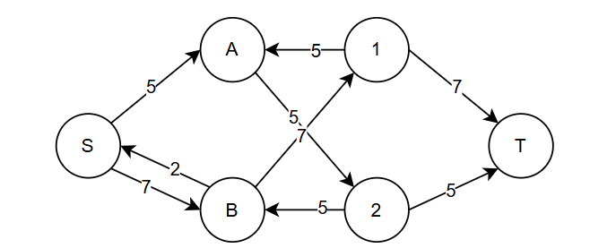
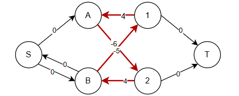
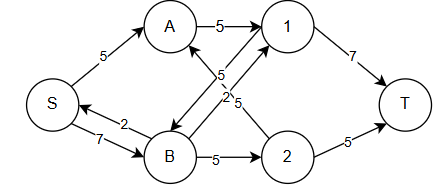
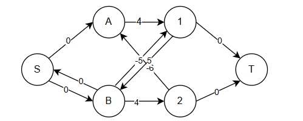
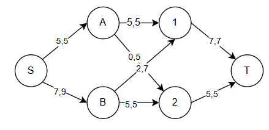

# Вариант 2: Решение транспортной задачи методом максимального потока минимальной стоимости
## 1. Анализ исходных данных и заданного плана перевозок
Дано:

Заводы (Поставщики):

Завод 1: производительность  = 5 ед.

Завод 2: производительность  = 9 ед.

*Общий объем предложения: 5 + 9 = 14 ед.*

Склады (Потребители):

Склад 1: вместимость  = 7 ед.

Склад 2: вместимость  = 5 ед.

*Общий объем спроса: 7 + 5 = 12 ед.*

## Требуется:

Найти стоимость перевозки с первого завода на второй склад 5 единиц товара, а со второго завода на первый склад 7 единиц товара;
Значит, распределение будет следующим образом:

Стоимость=(5⋅6)+(7⋅5)=30+35=65
Таким образом, стоимость перевозки по заданному плану составляет 65 ден. ед.

## 2. Построение сети для алгоритма "максимальный поток минимальной стоимости"
Чтобы применить алгоритм, мы строим ориентированный граф

1 число в квадратных скобках - стоимость
2 число в квадратных скобках - min из того, сколько можно провизвезти на заводе и сколько можно провезти на склад.

Составляем остаточную сеть:
Первое число на дуге - длкальный поток, второе число - пропускная способность.

Поиск увеличивающих путей (алгоритм Форда-Фалкерсона):
Увеличивающего пути нет. Текущий поток максимальный. Алгоритм завершается.
Поток F = 5 + 7 = 12

## 3. Поиск циклов отрицательной стоимости

Согласно алгоритму поиска максимального потока минимальной стоимости, мы должны теперь построить остаточную сеть и найти в ней циклы отрицательной стоимости.
Правила построения:

Для прямой дуги с остатком > 0: направление прямое, стоимость с +

Для обратной дуги (существующий поток): направление обратное, стоимость с -

Цикл отрицательной стоимости: B => 1 => A => 2 => B
-5 + 4 - 6 + 4 = - 3

Корректировка остаточной сети: 
Локальный путь дуги B => 1 стал 2, резерв 5
Локальный путь дуги A => 1 стал 5, дуга насыщенная
Локальный путь дуги B => 2 стал 5, дуга насыщенная
Локальный путь дуги А => 2 стал 0, резерв 5

## Поиск цикла отрицательной стоимости №2

Циклов отрицательной стоимости нет

# Этап 4: Финальный результат

Стоимость(S):
 5*4 + 2*5 + 5*4 = 50