# Вариант 2: Решение транспортной задачи методом максимального потока минимальной стоимости
## 1. Анализ исходных данных и заданного плана перевозок
Дано:

Заводы (Поставщики):

Завод 1: производительность  = 5 ед.

Завод 2: производительность  = 9 ед.

*Общий объем предложения: 5 + 9 = 14 ед.*

Склады (Потребители):

Склад 1: вместимость  = 7 ед.

Склад 2: вместимость  = 5 ед.

*Общий объем спроса: 7 + 5 = 12 ед.*

## Требуется:

Найти стоимость перевозки с первого завода на второй склад 5 единиц товара, а со второго завода на первый склад 7 единиц товара;
Значит, распределение будет следующим образом:

Стоимость=(5⋅6)+(7⋅5)=30+35=65
Таким образом, стоимость перевозки по заданному плану составляет 65 ден. ед.

## 2. Построение сети для алгоритма "максимальный поток минимальной стоимости"
Чтобы применить алгоритм, мы строим ориентированный граф

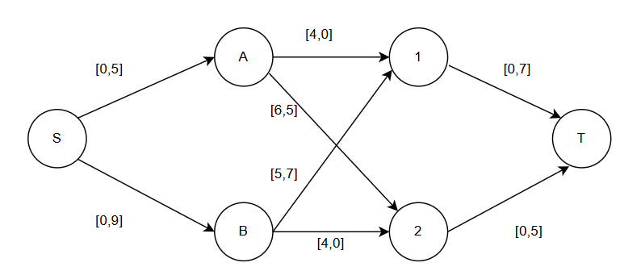

1 число в квадратных скобках - стоимость
2 число в квадратных скобках - min из того, сколько можно провизвезти на заводе и сколько можно провезти на склад.

Составляем остаточную сеть:
Первое число на дуге - длкальный поток, второе число - пропускная способность.

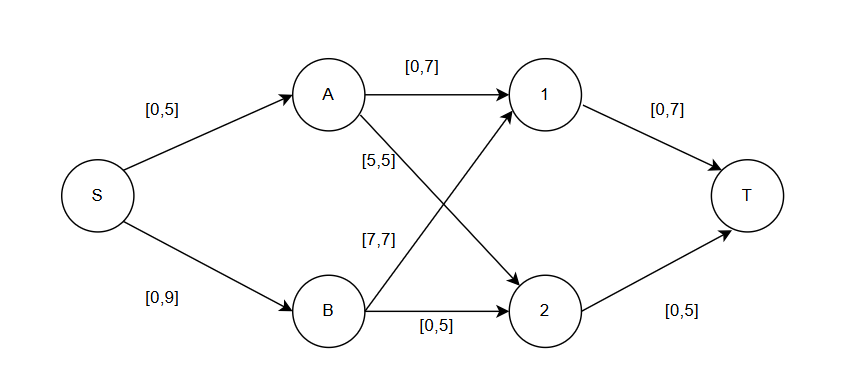

Поиск увеличивающих путей (алгоритм Форда-Фалкерсона)
Итерация №1

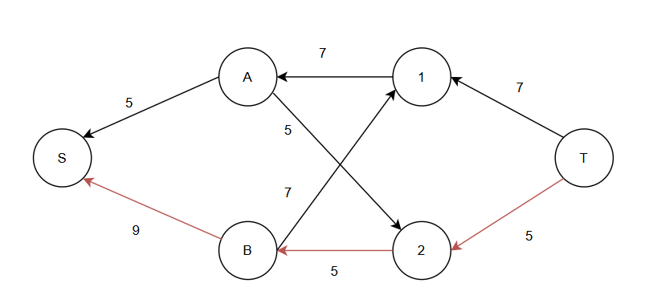

Увеличивающий путь: T-2-B-S

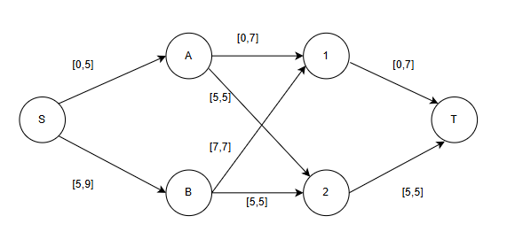

Корректировка остаточной сети
Локальный путь дуги S => B стал равен 5, резерв равен 4.
Локальный путь дуги B => 2 стал равен 5, Дуга насыщенная.
Локальный путь дуги 2 => T стал равен 5. Дуга насыщенная.

Итерация №2

Продолжаем поиск увеличивающего пути в остаточной сети.

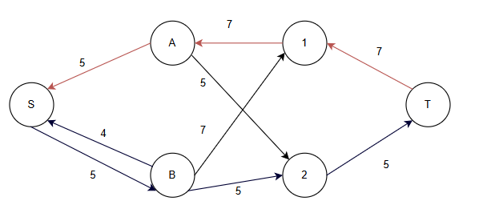

Увеличивающий путь: T-1-A-S

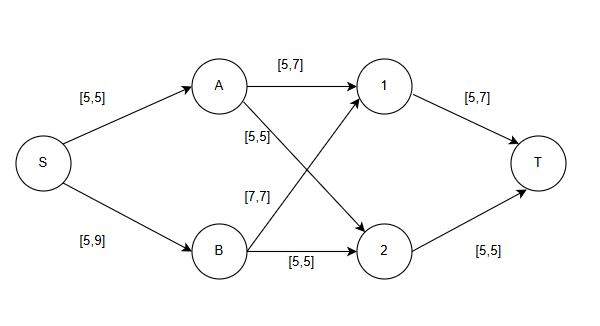

Корректировка остаточной сети
Локальный путь дуги S => A стал равен 5, Дуга насыщенная.
Локальный путь дуги A => 1 стал равен 5, резерв - 2.
Локальный путь дуги 1 => T стал равен 5. резерв - 2.

Итерация №2

Продолжаем поиск увеличивающего пути в остаточной сети.
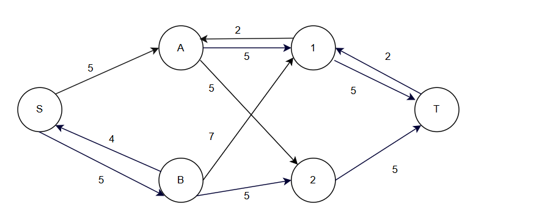

Увеличивающего пути нет. Текущий поток максимальный. Алгоритм завершается.
Поток F = 5 + 5 = 10

## 3. Поиск циклов отрицательной стоимости

Согласно алгоритму поиска максимального потока минимальной стоимости, мы должны теперь построить остаточную сеть и найти в ней циклы отрицательной стоимости.
Правила построения:

Для прямой дуги с остатком > 0: направление прямое, стоимость с +

Для обратной дуги (существующий поток): направление обратное, стоимость с -

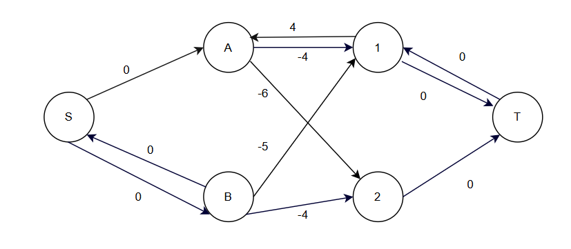

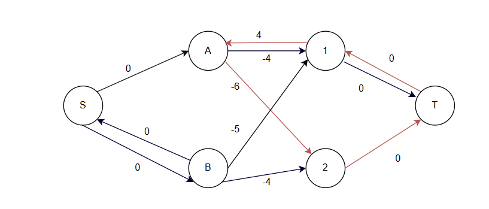

Цикл отрицательной стоимости - 2-T-1-A
Корректировка остаточной сети
Локальный путь дуги 2=> T стал равен 3. Резерв - 2.
Локальный путь дуги 1 => T стал равен 7 Дуга насыщенная.
Локальный путь дуги A => 1 стал равен 7. Дуга насыщенная.
Локальный путь дуги A => 2 стал равен 3, резерв - 2.

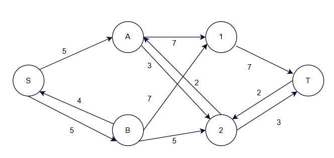

## Поиск цикла отрицательной стоимости №2
Строим новую остаточную сеть после корректировки.
5 + 5 = 10
10 = 10
F = 10
S = 7*4 + 3*6 + 7*5 + 5*4 = 28 + 18 + 35 + 20 = 
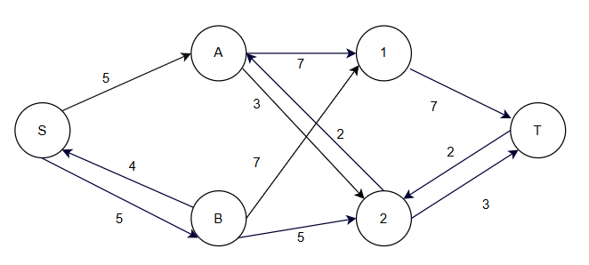
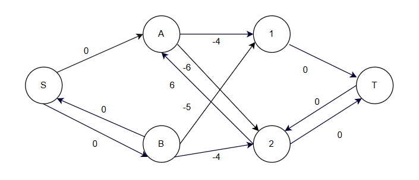
Циклов отрицательной стоимости нет