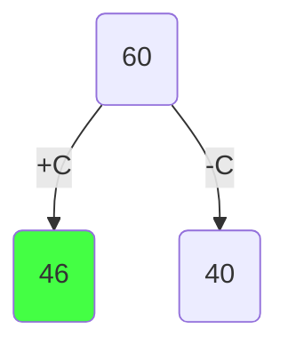
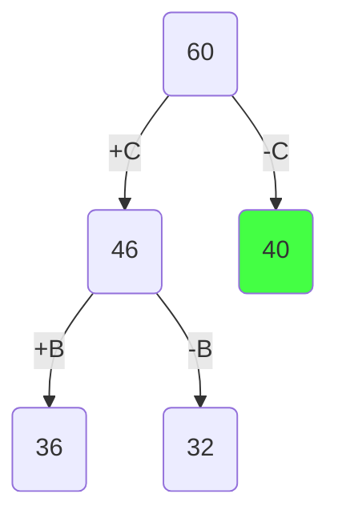
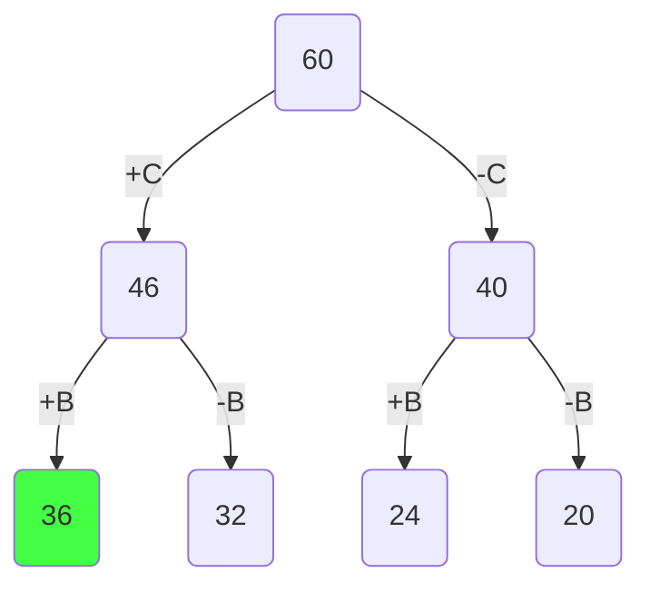
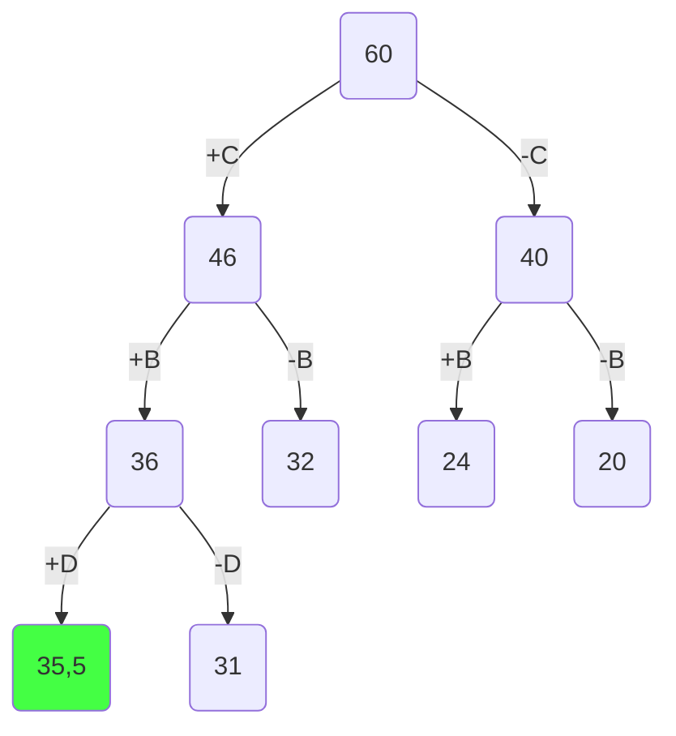
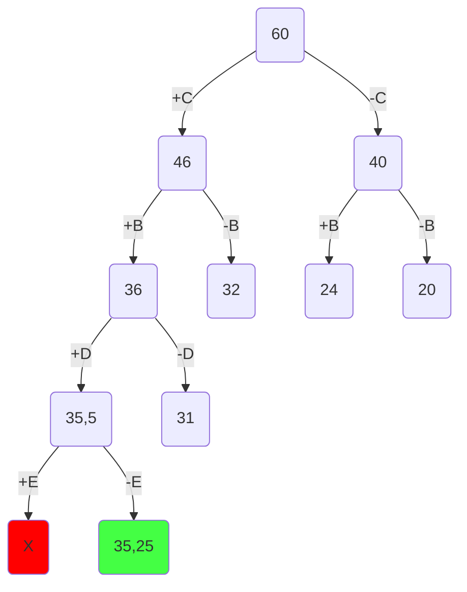
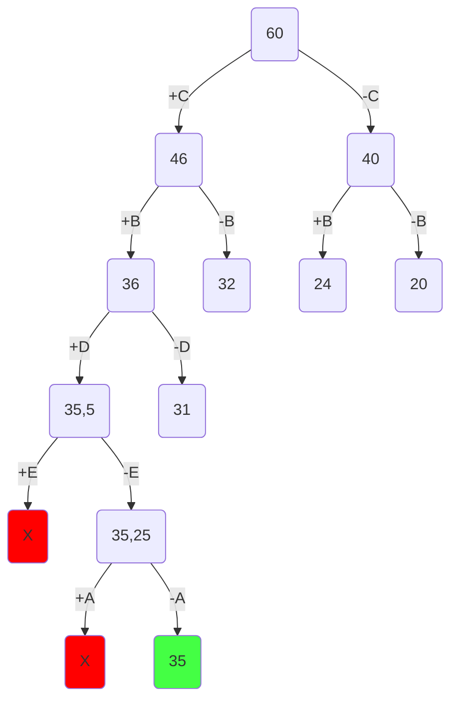

# Пример решения задачи о рюкзак

## Постановка задачи

Задача о рюкзаке (англ. Knapsack problem) — дано N предметов, ni предмет имеет массу wi > 0 и стоимость pi > 0. Необходимо выбрать из этих предметов такой набор, чтобы суммарная масса не превосходила заданной величины W (вместимость рюкзака), а суммарная стоимость была максимальна. 

## Условия задачи (Вариант 3)

| **Предметы**  | **A** | **B** | **C** | **D** | **E** |
| ------------- | ----- | ----- | ----- | ----- | ----- |
| **Стоимость** | 3     | 8     | 18    | 9     | 5     |
| **Вес**       | 12    | 4     | 6     | 9     | 10    |

Ограничение вместимости - 20 у.е.

## Шаг 1

Сортируем предметы по их ценности $(\frac {Стоимость}{вес})$  

| **Предметы**  | **C** | **B** | **D** | **E**         | **A**         |
| ------------- | ----- | ----- | ----- | ------------- | ------------- |
| **Стоимость** | 18    | 8     | 9     | 5             | 3             |
| **Вес**       | 6     | 4     | 9     | 10            | 12            |
| **Ценность**  | 3     | 2     | 1     | $\frac{1}{2}$ | $\frac{1}{4}$ |

## Шаг 2

Представим, что самого ценного предмета из тех, что еще не обработаны, у нас бесконечное количество и мы можем делить его на сколь угодно малые части. Тогда мы можем все оставшееся в рюкзаке место заполнить этим предметом. Тогда ценность будет

$$3 * 20 = 60$$

Это значение будет корнем нашего дерева, оно представляет оценку перспективности для задачи в целом.

## Шаг 3

Разобьем множество решений на два подмножества и начнем строить дерево. Левым потомком будет подмножество решений, в которых мы взяли самый ценный из оставшихся предметов, правым - где не взяли.

Оценка перспективности левого потомка =

$$18 + (20 - 6) * 2 = 46 $$

Оценка перспективности правого потомка =

$$20 * 2 = 40$$

Повторяем шаг 3 и продолжаем строить дерево из самой перспективной вершины.

Оценка перспективности левого потомка -

$$18 + 8 + (20 - 6 - 4) * 1 = 26 + 10 * 1 = 36 $$

Оценка перспективности правого потомка -

$$18 + (20 - 6) * 1 = 32$$

Заметим, что самая перспективная вершина оказалась на другой ветке. Продолжаем строить из вершины с оценкой 40.

Оценка перспективности левого потомка -

$$8 + (20 - 4) * 1 = 8 + 16 * 1 = 24 $$

Оценка перспективности правого потомка -

$$20 * 1 = 20$$

Самая перспективная вершина - 36.

Оценка перспективности левого потомка -

$$26 + 9 + (10 - 9) * \frac{1}{2} = 35 + 1 * \frac{1}{2} = 35,5 $$

Оценка перспективности правого потомка -

$$26 + 10 * \frac{1}{2} = 31$$

Самая перспективная вершина - 35,5.

Оценка перспективности левого потомка -

$$35 + 5 + (1 - 10) * \frac{1}{2} = 40 + -9 * \frac{1}{2} $$

Получили отрицательное значение, что значит предмет не поместится в рюкзак. Соответственно от этой вершины мы не будем продолжать поиск.

Оценка перспективности правого потомка -

$$35 + 1 * \frac{1}{4} = 35,25$$

Самая перспективная вершина - 35,25.

Оценка перспективности левого потомка -

$$35 + 3 + (1 - 12) * \frac{1}{4} = 38 + -11 * \frac{1}{4} $$

Снова получили отрицательное значение - не рассматриваем эту вершину

Оценка перспективности правого потомка = 35

Поскольку мы опустились до самого нижнего уровня (рассмотрели все предметы) и вершина на самом нижнем уровне является самой перспективной, то это и будет ответом.

Чтобы восстановить все положенные в рюкзак предметы пройдемся по ребрам, которые привели нас к ответу.

## Ответ

В рюкзак пойдут предметы C, B, D. Максимальная стоимость рюкзака: 18 + 8 + 9 = 35.