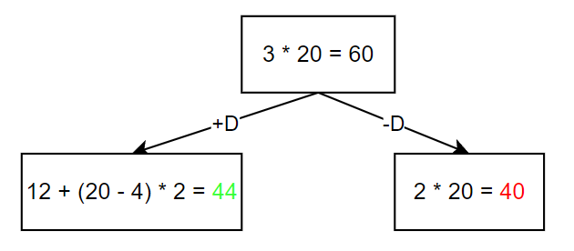
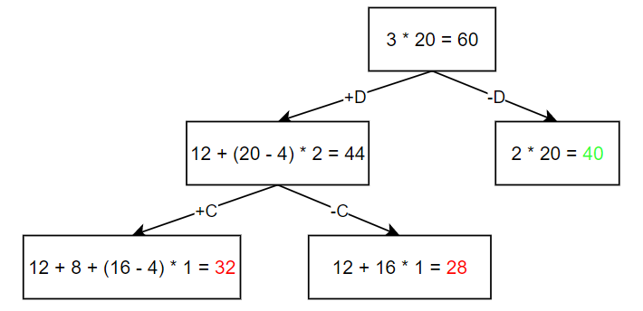
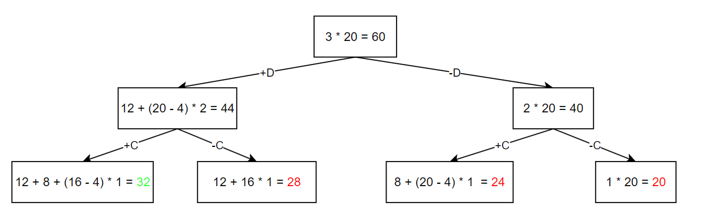
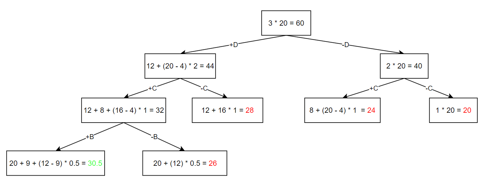
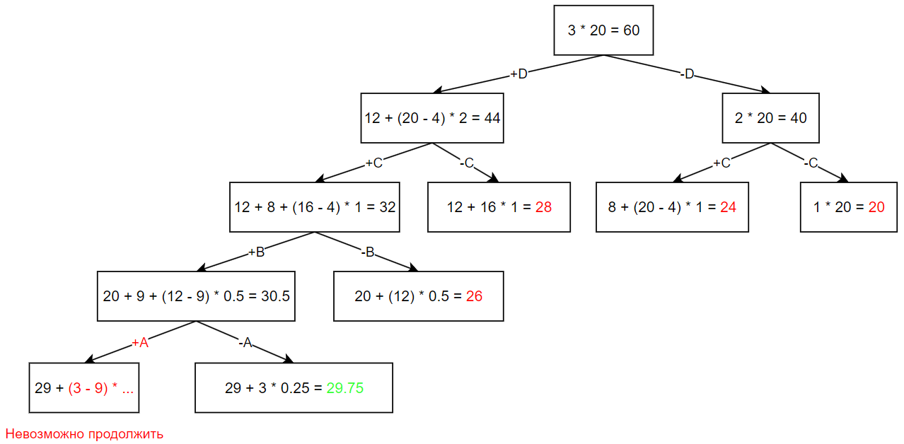
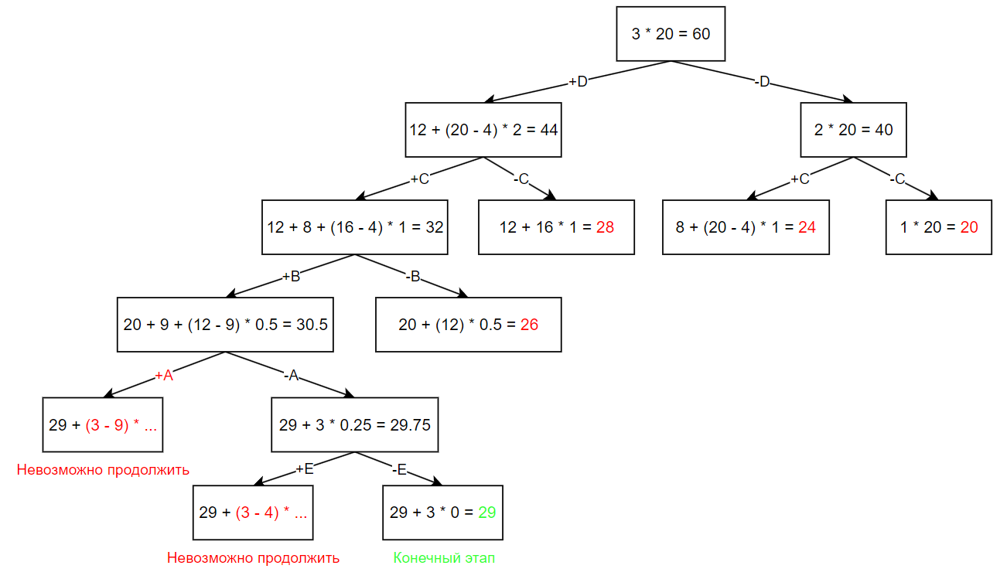

# Задание 12. Вариант 5
# Задача о рюкзаке. Метод ветвей и границ
## Команда Seeyahh

 Предметы   |  A  | B  | C | D  | E |
|:----------|:---:|:--:|:-:|:--:|:-:|
| Стоимость |  5  | 9  | 8 | 12 | 1 |
| Вес       | 10  | 9  | 4 | 4  | 4 |

Ограничение вместимости: 20

## Решение

Определим ценность каждого предмета (отношение стоимости объекта к его весу):

$$
C_{A} = \frac{5}{10} = 0.5
$$

$$ C_{B} = \frac{9}{9} = 1$$
$$ C_{C} = \frac{8}{4} = 2$$
$$ C_{D} = \frac{12}{4} = 3$$
$$ C_{E} = \frac{1}{4} = 0.25$$

Сортировка ценности предметов по убыванию:
$$ D > C > B > A > E $$

Видоизменим таблицу для удобства (отсортируем предметы в ней по ценности):

 Предметы   |  D  |  C | B | A  | E |
|:----------|:---:|:--:|:-:|:--:|:-:|
| Стоимость |  12 | 8  | 9 | 5  | 1 |
| Вес       |  4  | 4  | 9 | 10 | 4 |
| Ценность  |  3  | 2  | 1 | 0.5 | 0.25 |

Оценка сверху (если бы предметы были в бесконечном количестве и бексонечно делимые):
$$ макс. ценность * макс. вместимость $$
$$ 3 * 20 = 60 $$

Рассмотрим случаи, если мы берем и не берем предмет D

Оценка выше и равна 44, если мы берем предмет D, поэтому движемся далее по ветке (+D).

Рассмотрим случаи, если мы берем и не берем предмет C.

Оценка выше, если мы берем предмет С, однако на уровне выше есть оценка, превышающая получившуюся, равная 40, поэтому переходим к ветке (-D).

Рассмотрим случаи, если мы берем и не берем предмет C.

Навысшая оценка (32) на данном этапе в случае, когда мы идем по ветке (+D)->(+C), переходим к ней

Рассмотрим случаи, если мы берем и не берем предмет B.

Наибольшая оценка на данном этапе составляет 30.5 в случае, когда мы берем предмет B, т.е. движемся по ветке (+D)->(+C)->(+B).

Рассмотрим случаи, если мы берем и не берем предмет A.

Оказалось, что в случае, когда мы берем предмет A, максимальная емкость превышается. Это значит, что мы не можем пойти по ветке (+A). 

Наибольшая оценка, равная 29.75, получается в случае, когда мы продолжаем движение по ранее выбранной ветке и отказываемяс от предмета A, т.е. идем по ветке (+D)->(+C)->(+B)->(-A).

Рассмотрим случаи, если мы берем и не берем предмет E.

Оказалось, что в случае, когда мы берем предмет E, максимальная емкость превышается. Это значит, что мы не можем пойти по ветке (+E). 

Наибольшая оценка, равная 29, получается в случае, когда мы продолжаем движение по ранее выбранной ветке и отказываемяс от предмета E, т.е. идем по ветке (+D)->(+C)->(+B)->(-A)->(-E).

В данном случае оказалось, что мы не можем продолжать данную ветку, поскольку предметы закончились.

Так как итоговое значение выбранной ветки (29) больше, чем любое из концевых значений других веток, то нет смысла подниматься на уровни выше и рассматривать заведомо менее выгодные варианты.

*Алгоритм заканчивается на данном этапе.*

**Наибольшая стоимость предметов, которые можно поместить в рюкзак — 29.**

Итоговая ветка:  **(+D)->(+C)->(+B)->(-A)->(-E)**

Выбранные предметы: **D, C, B**

Итоговый вес: **4 + 4 + 9 = 17**

Свободное место в рюкзаке: **20 - 17 = 3**

## Ответ
Максимально возможная стоимость предметов в рюкзаке:
$$ 29 $$

Набор предметов, обеспечивающих максимальную стоимость:
$$ B, C, D $$

Общий вес предметов в рюкзаке:
$$ 17 $$

Свободное место в рюкзаке:
$$ 3 $$
