# Транспортная задача. Решение с использованием алгоритма поиска максимального потока минимальной стоимости.
Для выполнения задания необходимо:
1. Решить поставленную задачу с использованием алгоритма поиска максимального потока минимальной стоимости.
2. Оформить решение задачи по шагам с подробными комментариями и диаграммами.
3. В ответе указать:
   - объем товаров, перевозимых от каждого поставщика к каждому потребителю,
   - общую стоимость транспортировки.

Для того, чтобы использовать алгоритм поиска максимального потока минимальной стоимости нужно выполнить следующие шаги:

1. Представление поставщиков и потребителей в виде вершин графа.
2. Добавление вспомогательного источника и стока для моделирования поставок и спроса.
3. Определение пропускных способностей рёбер как ограничений на перевозки.
4. Использование стоимости перевозки $C_{ij}$ как весов рёбер.

Вариант 1.

Три завода имеют производительность 6, 2 и 5, а два складских помещения имеют вместимость 8 и 5. Матрица затрат на перевозку одной единицы товара (строки – это заводы, столбцы – это склады) имеет вид:

$$
 \begin{pmatrix}    
  20 & 30 \\ 
  10 & 8 \\ 
  12 & 11 \\ 
 \end{pmatrix}    
$$

Требуется распределить весь товар, производимый заводами,  по складам с минимально возможной стоимостью перевозки, используя алгоритм поиска максимального потока минимальной стоимости.

### 1. Представление поставщиков и потребителей в виде вершин графа.

Представив исходные данные в виде графа получим следующее:

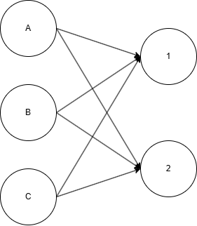

### 2. Добавление вспомогательных источника и стока для моделирования поставок и спроса.

После добавления в построенный граф источника и стока, он выглядит так:

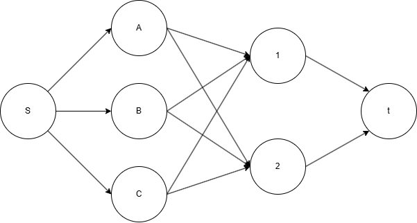

### 3. Определение пропускных способностей ребер как ограничений на перевозки.

На каждое ребро текущего графа добавляем его пропускную способность

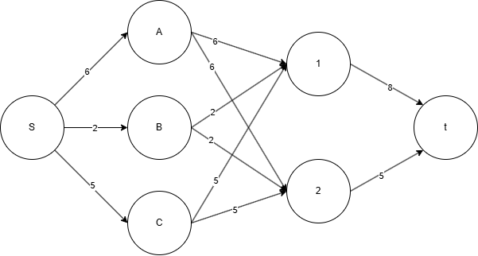

### 4. Использование стоимости перевозки как весов ребер.

На каждое ребро графа добавляем стоимость перевозки. Теперь значения на ребре соответствуют следующему формату: стоимость перевозки, пропускная способность. 

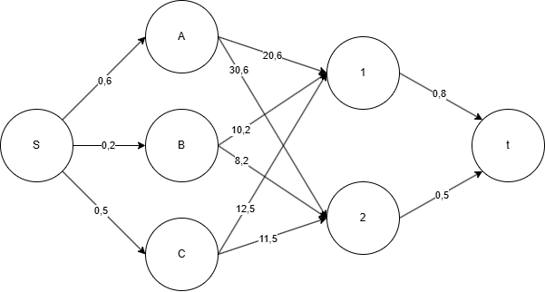

Переходим к алгоритму поиска максимального потока минимальной стоимости, поскольку все шаги для этого выполнены.

### 5. Поиск максимального потока.

Для поиска максимального потока построим сеть, в которой на каждом ребре первое значение локальный поток, второе - пропускная способность.

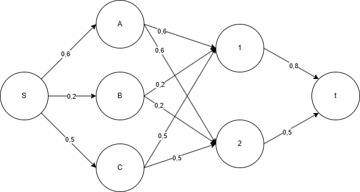

Далее построим остаточную сеть, чтобы найти увеличивающийся путь. 

Выбран путь t-1-A-S, минимальный вес ребра в нем - 6.

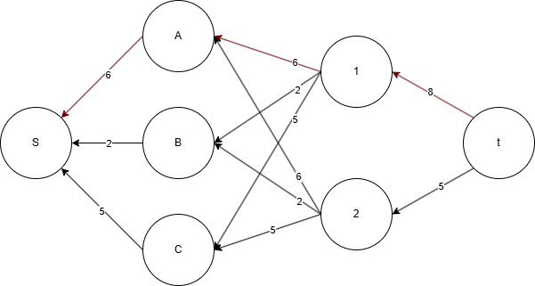

Скорректируем исходную сеть. 

Локальный поток дуг S-A, A-1, 1-t стал равен 6. 

Остаток дуги 1-t равен 2, дуги S-A, A-1 насыщенные.

В соответствии с этим скорректируем остаточную сеть. 

В ней найдем увеличивающийся путь t-2-C-S. 

Минимальный вес ребра в нем - 5.

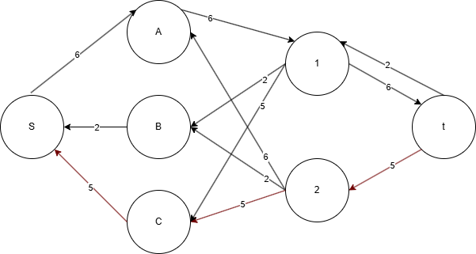

Скорректируем исходную сеть. 

Локальный поток дуг S-C, C-2, 2-t стал равен 5. 

Все эти дуги стали насыщенными.

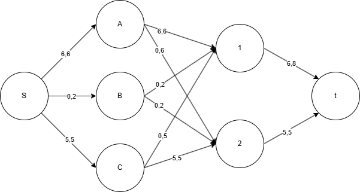

В соответствии с этим скорректируем остаточную сеть. 

В ней найдем увеличивающийся путь t-1-B-S. 

Минимальный вес ребра в нем - 2.

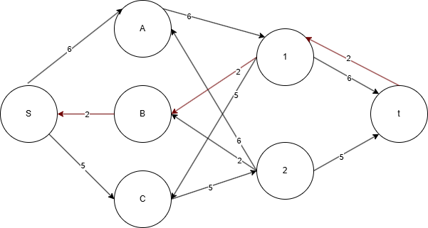

Скорректируем исходную сеть. 

Локальный поток дуг S-B, B-1 стал равен 2. Локальный поток дуги 1-t стал равен 8.

Все эти дуги стали насыщенными.

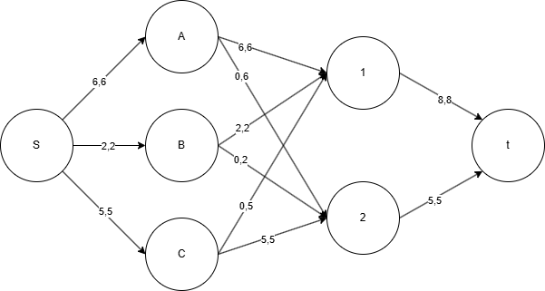

Скорректируем остаточную сеть. Увеличивающих путей в ней больше нет. Максимальный поток найден.

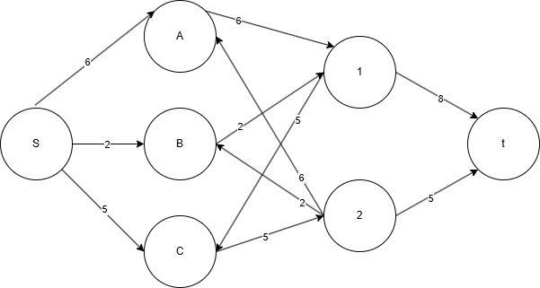

### 6. Уменьшение стоимости потока.

Найдем текущую стоимость потока: $6*20 + 2*10 + 5*11 = 195$

Для уменьшения стоимости потока необходимо построить остаточную сеть, на ребрах которой будут написаны их стоимости.

В этой сети найдем цикл отрицательной стоимости C-2-B-1-C. Проверим сумму ребер:

$-11 + 8 - 10 + 12 = -1 < 0$

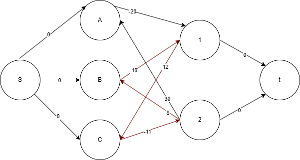

Найдем минимальный вес ребра в данном цикле, изображенном в остаточной сети с указанием величины потока.

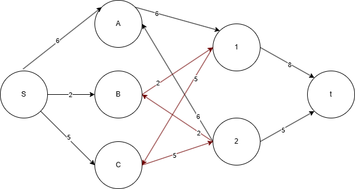

Минимальный вес равен 2. Вычитаем этот вес из всех ребер, входящих в цикл.

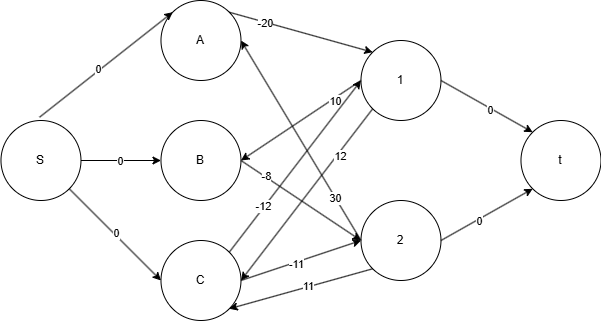

Скорректируем остаточную сеть стоимостей. 

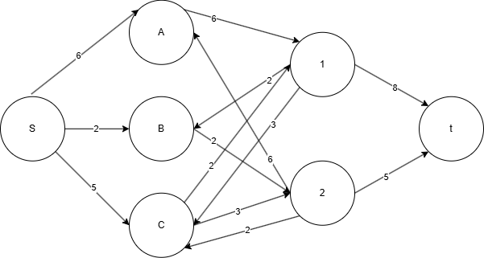

В ней нет циклов отрицательной стоимости. Значит, текущий поток является максимальным потоком минимальной стоимости

Скорректируем исходную сеть

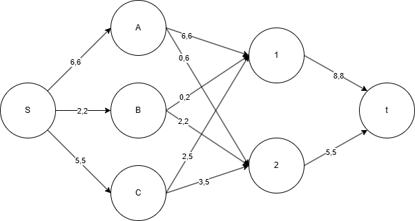

Рассчитаем стоимость потока. 

6x20 + 2x12 + 2x8 + 3x11 = 193

Ответ: 

От поставщика A к потребителю 1 - 6 ед.

От поставщика B к потребителю 2 - 2 ед.

От поставщика C к потребителю 1 - 2 ед.

От поставщика C к потребителю 2 - 3 ед.

Стоимость транспортировки - 193 у.е.