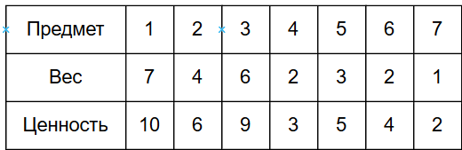
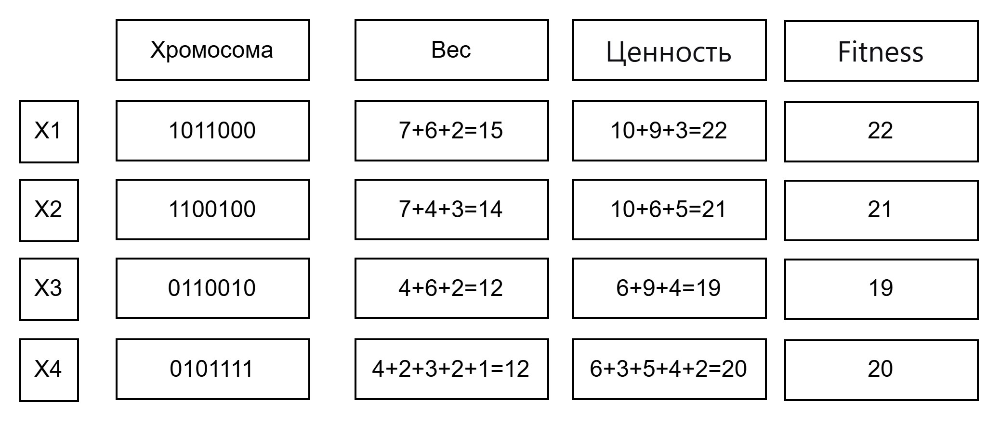
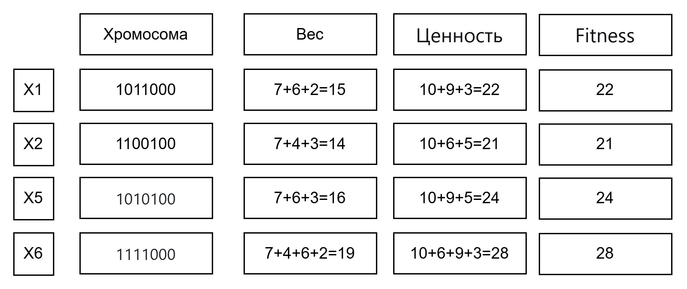
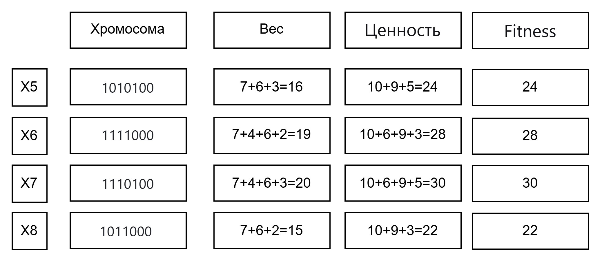
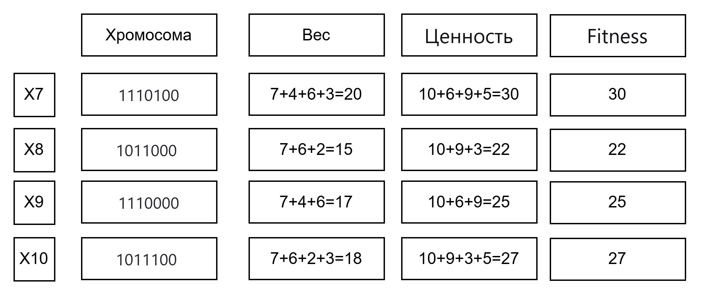

DIVI-V1
# 1. Условия задачи (Вариант 1)
Необходимо собрать рюкзак. Максимальная грузоподъемность рюкзака составляет 20 кг.

Есть 7 предметов, которые можно взять с собой. Каждый предмет имеет свою ценность и вес.

Цель: Найти такой набор предметов, который не превышает лимит веса (20 кг) и дает максимальную суммарную ценность.

# 2. Правила действий

Представление особи (хромосомы): Бинарная строка длиной 7. Каждый бит (ген) соответствует предмету из таблицы.

1 — предмет кладем в рюкзак.

0 — предмет не кладем.

Функция приспособленности (Fitness-функция): Это целевая функция, которую мы максимизируем.

Если общий вес <= 20 кг: Ценность = сумма ценностей выбранных предметов.

Если общий вес > 20 кг (недопустимый рюкзак): Ценность = 0. Мы используем 0, чтобы такие особи гарантированно отсеивались при селекции.

Селекция (Отбор): Из популяции выбираем сильнейших (2 лучшие особи из 4). Только они будут родителями.

Скрещивание: Одноточечное. Выбирается случайная точка разрыва. Потомок получает гены первого родителя до точки, и гены второго родителя после точки. Так как родителей двое, создаём двух потомков (меняя родителей местами).

Мутация: Будем применять её с небольшой вероятностью для поддержания разнообразия и для исключения клонов.

Правило: Каждый ген у новорожденного потомка может инвертироваться (0→1, 1→0).

Формирование нового поколения:

Мы берем 2 лучших родителя из старого поколения и переходим с ними в новое поколение (гарантируем, что лучший результат не ухудшится).

Остальные места (2 места, т.к. популяция = 4) заполняются 2 детьми, полученными в результате скрещивания и мутации.

При одинаковой ценности выбирается особь через минимальный вес (если ценность одинакова, выбираем того, кто легче — остаётся больше места), если вес одинаковый, то первого по порядку появления.

## 3. Начальная популяция (Поколение начальное)
Сгенерируем случайным образом 4 особи.

## 4. Поколение 1
Селекция: Сортируем: X1(22), X2(21), X3(20), X4(19)
Родители: X1 (1011000) и X2 (1100100)

Скрещивание (точка после 3-го гена):

X1: 101 | 1000

X2: 110 | 0100

Ребёнок 1: 1010100  = вес 16, ценность 24
Ребёнок 2: 1101000  = вес 13, ценность 19

Мутация:

Ребёнок 1 (1010100): без мутаций → 1010100 (ценность 24)

Ребёнок 2 (1101000): мутировал 3-й ген: 1111000  = вес 19, ценность 28
Новое поколение:

## 5. Поколение 2
Селекция: X6(28), X5(24), X1(22), X2(21)
Родители: X6 (1111000) и X5 (1010100)

Скрещивание (точка после 2-го гена):

X6: 11 | 11000

X5: 10 | 10100

Ребёнок 3: 1110100  = вес 7+4+6+3=20, ценность 10+6+9+5=30
Ребёнок 4: 1011000  = вес 7+6+2=15, ценность 10+9+3=22

Мутация:

Ребёнок 3 (1110100): без мутаций → 1110100 (ценность 30)

Ребёнок 4 (1011000): без мутации → 1011000 (ценность 22)

Новое поколение:

## 6. Поколение 3
Селекция: X7(30), X6(28), X5(24), X8(22)

Родители: X7 (1110100) и X6 (1111000)

Скрещивание (точка после 4-го гена):

X7: 1110 | 100

X6: 1111 | 000

Ребёнок 5: 1110000  = вес 17 ценность 25
Ребёнок 6: 1111100 = вес 22 ценность 33

Мутация:

Ребёнок 5 (1110000): без мутаций: 1110100 (ценность 25)

Ребёнок 6 (1111100): мутировал 2-й ген: 1011100 вес 18 ценность 27

Новое поколение:

## 7. Результат
После 3 поколений лучшая особь — X7 (1110100).

Максимальная стоимость: 30

Набор предметов: Палатка (№1)(№2)(№3)(№5)

Общий вес: 20 кг 

Свободное место: 0 кг

Полученное решение отличается от точного решения на 1. Максимальная стоимость 31. Набор предметов №1, №2, №3, №6 и №7.
