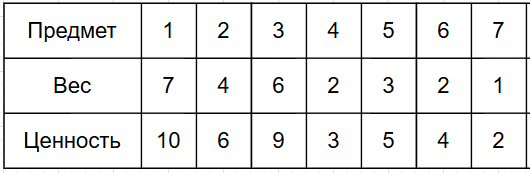
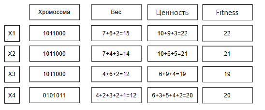
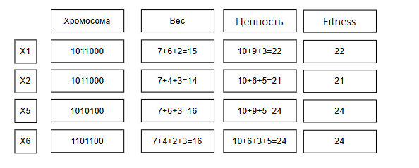
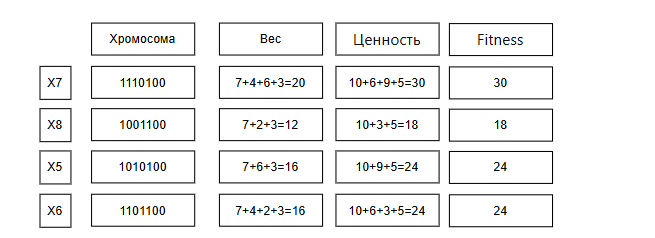
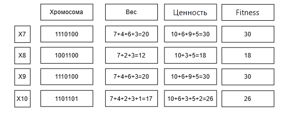

DIVI-V1
# 1. Условия задачи (Вариант 1)
Необходимо собрать рюкзак. Максимальная грузоподъемность рюкзака составляет 20 кг.

Есть 7 предметов, которые можно взять с собой. Каждый предмет имеет свою ценность и вес.

Цель: Найти такой набор предметов, который не превышает лимит веса (20 кг) и дает максимальную суммарную ценность.

# 2. Правила действий

Представление особи (хромосомы): Бинарная строка длиной 7. Каждый бит (ген) соответствует предмету из таблицы.

1 — предмет кладем в рюкзак.

0 — предмет не кладем.

Функция приспособленности (Fitness-функция): Это целевая функция, которую мы максимизируем.

Если общий вес <= 20 кг: Ценность = сумма ценностей выбранных предметов.

Если общий вес > 20 кг (недопустимый рюкзак): Ценность = 0. Мы используем 0, чтобы такие особи гарантированно отсеивались при селекции.

Селекция (Отбор): Будем использовать отбор усечением. Из популяции выбираем сильнейших (2 лучшие особи из 4). Только они будут родителями.

Скрещивание: Одноточечное. Выбирается случайная точка разрыва. Потомок получает гены первого родителя до точки, и гены второго родителя после точки. Так как родителей двое, создаём двух потомков (меняя родителей местами).

Мутация: Будем применять её с небольшой вероятностью для поддержания разнообразия.

Правило: С вероятностью 10% (примерно 1 ген на 10) каждый ген у новорожденного потомка может инвертироваться (0→1, 1→0). Это значит, что в 7-генной хромосоме мутирует в среднем 0-1 ген.

Формирование нового поколения:

Мы берем 2 лучших родителя из старого поколения и переходим с ними в новое поколение (гарантируем, что лучший результат не ухудшится).

Остальные места (2 места, т.к. популяция = 4) заполняются 2 детьми, полученными в результате скрещивания и мутации.

При одинаковой ценности выбирается особь через минимальный вес (если ценность одинакова, выбираем того, кто легче — остаётся больше места), если вес одинаковый, то первого по порядку появления.

## 3. Начальная популяция (Поколение 1)
Сгенерируем случайным образом 4 особи.

## 4. Поколение 1
Селекция: Сортируем: X1(22), X2(21), X3(20), X4(19)
Родители: X1 (1011000) и X2 (1100100)

Скрещивание (точка после 3-го гена):

X1: 101 | 1000

X2: 110 | 0100

Ребёнок 1: 1010100  = вес 16, ценность 24
Ребёнок 2: 1101000  = вес 13, ценность 19

Мутация:

Ребёнок 1 (1010100): без мутаций → 1010100 (ценность 24)

Ребёнок 2 (1101000): мутировал 5-й ген: 1101100  = вес 16, ценность 24
Новое поколение:

## 5. Поколение 2
Селекция: X6(24), X5(24), X1(22), X2(21)
Родители: X6 (1101100) и X5 (1010100)

Скрещивание (точка после 2-го гена):

X6: 11 | 01100

X5: 10 | 10100

Ребёнок 3: 1110100  = вес 7+4+6+3=20, ценность 10+6+9+5=30
Ребёнок 4: 1001100  = вес 7+3+2=12, ценность 10+5+4=19

Мутация:

Ребёнок 3 (1110100): без мутаций → 1110100 (30 баллов)

Ребёнок 4 (1001100): без мутаций → 1001100 (19 баллов)

Новое поколение:

## 6. Поколение 3
Селекция: X7(30), X5(24), X6(24), X8(18)
X5 И X6 имеют одинаковую ценность и вес, поэтому выбираем первого по порядку - X5
Родители: X7 (1110100) и X6 (1101100)

Скрещивание (точка после 4-го гена):

X7: 11101 | 00

X6: 11011 | 00

Ребёнок 5: 1110100 (копия X7) = 30 баллов
Ребёнок 6: 1101100 (копия X6) = 25 баллов

Мутация:

Ребёнок 5 (1110100): без мутаций: 1110100 (30)

Ребёнок 6 (1101100): мутировал последний ген: 1101101  = вес 16+1=17, ценность 25+2=27

Новое поколение:

Снова два ребенка имеют одинаковую ценность и одинаковый вес, поэтому берем первого по порядку - X7

## 7. Результат
После 3 поколений лучшая особь — X7 (1110100).

Максимальная стоимость: 30

Набор предметов: Палатка (№1)(№2)(№3)(№5)

Общий вес: 20 кг 

Свободное место: 0 кг

