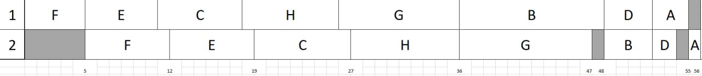

# Задание №4. Вариант №1
**Выполнили:** Валеева Карина, Дудырева Маргарита, Иванова Милена. Команда DIVI

## 4.1 Задача о распределении инвестиций между проектами
Решаем методом динамического программирования

## Дано: Матрица прибыли

| $\$$ | A | B | C | D |
| :---: | :---: | :---: | :---: | :---: |
| **10** | 4 | 7 | 5 | 6 |
| **20** | 9 | 8 | 7 | 10 |
| **30** | 12 | 13 | 10 | 11 |
| **40** | 14 | 16 | 15 | 13 |
| **50** | 19 | 18 | 20 | 19 |

---

## 2. Расчёт максимальной прибыли 

### Шаг 2.1. Проекты A и B 

#### 1) Инвестиции = 10
| A | B | Прибыль: $P_A + P_B$ |
| :---: | :---: | :---: |
| 1 | 0 | $4$ |
| 0 | **1** | $7$ |
$$\mathbf{MAX\ прибыль_{AB}(10) = 7}$$

#### 2) Инвестиции = 20
| A | B | Прибыль: $P_A + P_B$ |
| :---: | :---: | :---: |
| 2 | 0 | $9$ |
| 1 | **1** | $4 + 7 = \mathbf{11}$ |
| 0 | 2 | $8$ |
$$\mathbf{MAX\ прибыль_{AB}(20) = 11}$$

#### 3) Инвестиции = 30
| A | B | Прибыль: $P_A + P_B$ |
| :---: | :---: | :---: |
| 3 | 0 | $12$ |
| **2** | 1 | $9 + 7 = \mathbf{16}$ |
| 1 | 2 | $4 + 8 = 12$ |
| 0 | 3 | $13$ |
$$\mathbf{MAX\ прибыль_{AB}(30) = 16}$$

#### 4) Инвестиции = 40
| A | B | Прибыль: $P_A + P_B$ |
| :---: | :---: | :---: |
| 4 | 0 | $14$ |
| **3** | 1 | $12 + 7 = \mathbf{19}$ |
| 2 | 2 | $9 + 8 = 17$ |
| 1 | 3 | $4 + 13 = 17$ |
| 0 | 4 | $16$ |
$$\mathbf{MAX\ прибыль_{AB}(40) = 19}$$

#### 5) Инвестиции = 50
| A | B | Прибыль: $P_A + P_B$ |
| :---: | :---: | :---: |
| 5 | 0 | $19$ |
| 4 | 1 | $14 + 7 = 21$ |
| 3 | 2 | $12 + 8 = 20$ |
| **2** | 3 | $9 + 13 = \mathbf{22}$ |
| 1 | 4 | $4 + 16 = 20$ |
| 0 | 5 | $18$ |
$$\mathbf{MAX\ прибыль_{AB}(50) = 22}$$

---
### Шаг 2.2. Проекты A, B и C

#### 1) Инвестиции = 10
| AB | C | Прибыль: $P_{AB} + P_C$ |
| :---: | :---: | :---: |
| **1** | 0 | $7$ |
| 0 | 1 | $5$ |
$$\mathbf{MAX\ прибыль_{ABC}(10) = 7}$$

#### 2) Инвестиции = 20
| AB | C | Прибыль: $P_{AB} + P_C$ |
| :---: | :---: | :---: |
| 2 | 0 | $11$ |
| **1** | 1 | $7 + 5 = \mathbf{12}$ |
| 0 | 2 | $7$ |
$$\mathbf{MAX\ прибыль_{ABC}(20) = 12}$$

#### 3) Инвестиции = 30
| AB | C | Прибыль: $P_{AB} + P_C$ |
| :---: | :---: | :---: |
| **3** | 0 | $16$ |
| **2** | 1 | $11 + 5 = \mathbf{16}$ |
| 1 | 2 | $7 + 7 = 14$ |
| 0 | 3 | $10$ |
$$\mathbf{MAX\ прибыль_{ABC}(30) = 16}$$

#### 4) Инвестиции = 40
| AB | C | Прибыль: $P_{AB} + P_C$ |
| :---: | :---: | :---: |
| 4 | 0 | $19$ |
| **3** | 1 | $16 + 5 = \mathbf{21}$ |
| 2 | 2 | $11 + 7 = 18$ |
| 1 | 3 | $7 + 10 = 17$ |
| 0 | 4 | $15$ |
$$\mathbf{MAX\ прибыль_{ABC}(40) = 21}$$

#### 5) Инвестиции = 50
| AB | C | Прибыль: $P_{AB} + P_C$ |
| :---: | :---: | :---: |
| 5 | 0 | $22$ |
| **4** | 1 | $19 + 5 = \mathbf{24}$ |
| 3 | 2 | $16 + 7 = 23$ |
| 2 | 3 | $11 + 10 = 21$ |
| 1 | 4 | $7 + 15 = 22$ |
| 0 | 5 | $20$ |
$$\mathbf{MAX\ прибыль_{ABC}(50) = 24}$$

---

### Шаг 2.3. Проекты A, B, C и D 

#### 1) Инвестиции = 50
| ABC | D | Прибыль: $P_{ABC} + P_D$ |
| :---: | :---: | :---: |
| 5 | 0 | $24$ |
| **4** | 1 | $21 + 6 = \mathbf{27}$ |
| 3 | 2 | $16 + 10 = 26$ |
| 2 | 3 | $12 + 11 = 23$ |
| 1 | 4 | $7 + 13 = 20$ |
| 0 | 5 | $19$ |
$$\mathbf{MAX\ прибыль_{ABCD}(50) = 27}$$

---

## 3. Финальная таблица

| у.е. | AB | ABC | ABCD |
| :---: | :---: | :---: | :---: |
| **10** | 7 (0/1) | 7 (1/0) | - |
| **20** | 11 (1/1) | 12 (1/1) | - |
| **30** | 16 (2/1) | 16 (3/0) | - |
| **40** | 19 (3/1) | 21 (3/1) | - |
| **50** | 22 (2/3) | 24 (4/1) | 27 (4/1) |

В методе динамического программирования для задачи распределения инвестиций между несколькими проектами мы последовательно накапливаем результат, добавляя проекты по одному. На каждом шаге мы рассчитываем максимальную прибыль для всех возможных сумм инвестиций для уже рассмотренных проектов. Это необходимо для того, чтобы на следующем шаге использовать эти результаты.

Однако в финальном шаге (когда добавляется последний проект) нас интересует только целевой объём инвестиций (в этой задаче — 50 у.е.)*

---

## 4. Определение оптимального распределения

| Шаг | Текущая сумма | Проект | Инвестиция (у.е.) | Остаток |
| :---: | :---: | :---: | :---: | :---: |
| 1 | 50 | D | **10** | 40 |
| 2 | 40 | C | **10** | 30 |
| 3 | 30 | B | **10** | 20 |
| 4 | 20 | A | **20** | 0 |

## Ответ:

* **Максимальная сумма прибыли от инвестиций:** $\mathbf{27}$ у.е.
* **Оптимальное распределение инвестиций:**
    * **Проект A:** 20 у.е.
    * **Проект B:** 10 у.е.
    * **Проект C:** 10 у.е.
    * **Проект D:** 10 у.е.

## 4.2 Конвейерная задача
Решаем задачу по алгоритму Джонсона

## Дано:

| Задание | aᵢ (Работник A) | bᵢ (Работник B) |
|---------|----------------|-----------------|
| A       | 3              | 1               |
| B       | 12             | 4               |
| C       | 7              | 8               |
| D       | 4              | 2               |
| E       | 6              | 7               |
| F       | 5              | 7               |
| G       | 10             | 11              |
| H       | 8              | 9               |

## 1. Разделение на группы

**Группа 1 (aᵢ ≤ bᵢ):** задания, где время на первом этапе ≤ времени на втором этапе

Проверяем каждое задание:
- Задание A: 3 ≤ 1? ❌ НЕТ
- Задание B: 12 ≤ 4? ❌ НЕТ
- Задание C: 7 ≤ 8? ✅ ДА
- Задание D: 4 ≤ 2? ❌ НЕТ
- Задание E: 6 ≤ 7? ✅ ДА
- Задание F: 5 ≤ 7? ✅ ДА
- Задание G: 10 ≤ 11? ✅ ДА
- Задание H: 8 ≤ 9? ✅ ДА

**Группа 1:** задания C, E, F, G, H

**Группа 2 (aᵢ > bᵢ):** оставшиеся 

**Группа 2: задания A, B, D**

## 2. Сортировка групп

**Группа 1:** сортируем по возрастанию aᵢ

Исходно: C(7,8), E(6,7), F(5,7), G(10,11), H(8,9)

После сортировки: F(5,7), E(6,7), C(7,8), H(8,9), G(10,11)

Порядок: F → E → C → H → G

**Группа 2:** сортируем по убыванию bᵢ

Исходно: A(3,1), B(12,4), D(4,2)

После сортировки: B(12,4), D(4,2), A(3,1)

Порядок: B → D → A

## 3. Формирование итогового порядка

Выполняем сначала Группу 1, затем Группу 2:

**Итоговый порядок:** F → E → C → H → G → B → D → A

## 4. Построение расписания

### Работник A (первый этап):
- F: время 0-5
- E: время 5-11
- C: время 11-18
- H: время 18-26
- G: время 26-36
- B: время 36-48
- D: время 48-52
- A: время 52-55

### Работник B (второй этап):
- F: начинаем в 5, заканчиваем в 12 (5+7)
- E: начинаем в max(12, 11)=12, заканчиваем в 19 (12+7)
- C: начинаем в max(19, 18)=19, заканчиваем в 27 (19+8)
- H: начинаем в max(27, 26)=27, заканчиваем в 36 (27+9)
- G: начинаем в max(36, 36)=36, заканчиваем в 47 (36+11)
- B: начинаем в max(47, 48)=48, заканчиваем в 52 (48+4)
- D: начинаем в max(52, 52)=52, заканчиваем в 54 (52+2)
- A: начинаем в max(54, 55)=55, заканчиваем в 56 (55+1)

## 5. Расчет длительности

Работник A заканчивает в: 55
Работник B заканчивает в: 56

**Общая длительность расписания: 56 единиц времени**

## 6. Диаграмма Ганта

## Ответ

**Оптимальное расписание:** F → E → C → H → G → B → D → A  

**Минимальная длительность:** 56 единиц времени

