## Вариант 7:
### Задача о распределении инвестиций между проектами

| $   | A  | B  | C  | D  | E  |
|-----|----|----|----|----|----|
| 100 | 8  | 6  | 6  | 5  | 4  |
| 200 | 11 | 8  | 9  | 7  | 8  |
| 300 | 16 | 12 | 13 | 15 | 14 |
| 400 | 17 | 15 | 17 | 18 | 19 |
| 500 | 20 | 19 | 19 | 21 | 20 |
| 600 | 25 | 24 | 24 | 23 | 22 |

Решаем задачу динамическим программированием: последовательно добавляем проекты и для каждой общей суммы инвестиций выбираем максимальную прибыль.

#### Будем заполнять поэтапно эту таблицу:

| $   | A : B | AB : C | ABC : D | ABCD : E |
| --- | ----- | ------ | ------- | -------- |
| 100 |       |        |         |          |
| 200 |       |        |         |          |
| 300 |       |        |         |          |
| 400 |       |        |         |          |
| 500 |       |        |         |          |
| 600 |       |        |         |          |

#### 1. Считаем максимальную прибыль между проектами A и B

1). Инвестиции в 100$:

|  A  |  B  | A + B |
| :-: | :-: | :---: |
|  0  |  1  |  $6$  |
|  1  |  0  |  **$8$**  |

> Далее во всех местах вычисление происходит путем сложения двух чисел: проекта1 с заданным индексом и проекта2 (или рапределенную к данному этапу прибыль) с заданным индексом. 

2). Инвестиции в 200$:

|  A  |  B  |    A + B    |
| :-: | :-: | :---------: |
|  0  |  2  |    $8$     |
|  1  |  1  | **$14$** |
|  2  |  0  |     $11$     |

3). Инвестиции в 300$:

|  A  |  B  |     A + B     |
| :-: | :-: | :-----------: |
|  0  |  3  |     $12$      |
|  1  |  2  | $16$          |
|  2  |  1  | **$17$**          |
|  3  |  0  |      $16$     |

4). Инвестиции в 400$:

|  A  |  B  |     A + B     |
| :-: | :-: | :-----------: |
|  0  |  4  |     $15$      |
|  1  |  3  | $20$ |
|  2  |  2  | $19$ |
|  3  |  1  |**$22$**  |
|  4  |  0  |     $17$      |

5). Инвестиции в 500$:

|  A  |  B  |     A + B     |
| :-: | :-: | :-----------: |
|  0  |  5  |     $19$      |
|  1  |  4  | $23$ |
|  2  |  3  | $23$ |
|  3  |  2  | **$24$** |
|  4  |  1  | $23$ |
|  5  |  0  |     $20$      |

6). Инвестиции в 600$:

|  A  |  B  |     A + B     |
| :-: | :-: | :-----------: |
|  0  |  6  |     $24$      |
|  1  |  5  | $27$ |
|  2  |  4  | $26$ |
|  3  |  3  | **$28$** |
|  4  |  2  | $23$ |
|  5  |  1  |     $26$      |
|  6  |  0  |     $25$      |

#### Заносим данные в таблицу:

| $   | A : B      | AB : C | ABC : D | ABCD : E |
| --- | ---------- | ------ | ------- | -------- |
| 100 | $8 (1/0)$  |        |         |          |
| 200 | $14 (1/1)$ |        |         |          |
| 300 | $17 (2/1)$ |        |         |          |
| 400 | $22 (3/1)$ |        |         |          |
| 500 | $24 (3/2)$ |        |         |          |
| 600 | $28 (3/3)$ |        |         |          |

#### 2. Считаем максимальную прибыль между проектами AB и C

1). Инвестиции в 100$:

| AB  |  C  | AB + C |
| :-: | :-: | :----: |
|  0  |  1  |  $6$   |
|  1  |  0  |  **$8$**  |

2). Инвестиции в 200$:

| AB  |  C  |   AB + C    |
| :-: | :-: | :---------: |
|  0  |  2  |     $9$     |
|  1  |  1  | $14$ |
|  2  |  0  |    **$14$**     |

3). Инвестиции в 300$:

| AB  |  C  |    AB + C     |
| :-: | :-: | :-----------: |
|  0  |  3  |     $13$      |
|  1  |  2  | $17$  |
|  2  |  1  | **$20$** |
|  3  |  0  |     $17$      |

4). Инвестиции в 400$:

| AB  |  C  |    AB + C     |
| :-: | :-: | :-----------: |
|  0  |  4  |     $17$      |
|  1  |  3  | $21$ |
|  2  |  2  | $23$ |
|  3  |  1  | **$23$** |
|  4  |  0  |     $22$      |

5). Инвестиции в 500$:

| AB  |  C  |     AB + C     |
| :-: | :-: | :------------: |
|  0  |  5  |      $19$      |
|  1  |  4  | $25$  |
|  2  |  3  | $27$ |
|  3  |  2  | $26$  |
|  4  |  1  | **$28$**  |
|  5  |  0  |      $24$      |

6). Инвестиции в 600$:

| AB  |  C  |     AB + C     |
| :-: | :-: | :------------: |
|  0  |  6  |      $24$      |
|  1  |  5  | $27$  |
|  2  |  4  | $31$ |
|  3  |  3  | $30$  |
|  4  |  2  | **$31$**  |
|  5  |  1  |      $30$      |
|  6  |  0  |      $28$      |

#### Заносим данные в таблицу:

| $   | A : B      | AB : C     | ABC : D | ABCD : E |
| --- | ---------- | ---------- | ------- | -------- |
| 100 | $8 (1/0)$  | $8 (1/0)$  |         |          |
| 200 | $14 (1/1)$ | $14 (2/0)$ |         |          |
| 300 | $17 (2/1)$ | $20 (2/1)$ |         |          |
| 400 | $22 (3/1)$ | $23 (3/1)$ |         |          |
| 500 | $24 (3/2)$ | $28 (4/1)$ |         |          |
| 600 | $28 (3/3)$ | $31 (4/2)$ |         |          |

#### 3. Считаем максимальную прибыль между проектами ABC и D

1). Инвестиции в 100$:

| ABC |  D  | ABC + D |
| :-: | :-: | :-----: |
|  0  |  1  |   $5$   |
|  1  |  0  |   **$8$**   |

2). Инвестиции в 200$:

| ABC |  D  |   ABC + D    |
| :-: | :-: | :----------: |
|  0  |  2  |     $7$      |
|  1  |  1  | $13$ |
|  2  |  0  |     **$14$**     |

3). Инвестиции в 300$:

| ABC |  D  |    ABC + D    |
| :-: | :-: | :-----------: |
|  0  |  3  |     $15$      |
|  1  |  2  | $15$  |
|  2  |  1  | $19$ |
|  3  |  0  |     **$20$**      |

4). Инвестиции в 400$:

| ABC |  D  |    ABC + D    |
| :-: | :-: | :-----------: |
|  0  |  4  |     $18$      |
|  1  |  3  | $23$ |
|  2  |  2  | $21$ |
|  3  |  1  | **$25$** |
|  4  |  0  |     $23$      |

5). Инвестиции в 500$:

| ABC |  D  |    ABC + D     |
| :-: | :-: | :------------: |
|  0  |  5  |      $21$      |
|  1  |  4  | $26$  |
|  2  |  3  | **$29$** |
|  3  |  2  | $27$  |
|  4  |  1  | $28$  |
|  5  |  0  |      $28$      |

6). Инвестиции в 600$:

| AB  |  C  |     AB + C     |
| :-: | :-: | :------------: |
|  0  |  6  |      $23$      |
|  1  |  5  | $29$  |
|  2  |  4  | $32$ |
|  3  |  3  | **$35$**  |
|  4  |  2  | $30$  |
|  5  |  1  |      $33$      |
|  6  |  0  |      $31$      |

#### Заносим данные в таблицу:

| $   | A : B      | AB : C     | ABC : D | ABCD : E |
| --- | ---------- | ---------- | ------- | -------- |
| 100 | $8 (1/0)$  | $8 (1/0)$  |$8 (1/0)|          |
| 200 | $14 (1/1)$ | $14 (2/0)$ |$14 (2/0)$|          |
| 300 | $17 (2/1)$ | $20 (2/1)$ |$20 (3/0)$|          |
| 400 | $22 (3/1)$ | $23 (3/1)$ |$25 (3/1)$|          |
| 500 | $24 (3/2)$ | $28 (4/1)$ |$29 (2/3)$|          |
| 600 | $28 (3/3)$ | $31 (4/2)$ |$35 (3/3)$|          |

#### 4. Считаем максимальную прибыль между проектами ABC и D

1). Инвестиции в 100$:

| ABCD |  E  | ABCD + E |
| :-: | :-: | :-----: |
|  0  |  1  |   $4$   |
|  1  |  0  |   **$8$**   |

2). Инвестиции в 200$:

| ABCD |  E  | ABCD + E |
| :-: | :-: | :----------: |
|  0  |  2  |     $8$      |
|  1  |  1  | $12$ |
|  2  |  0  |     **$14$**     |

3). Инвестиции в 300$:

| ABCD |  E  | ABCD + E |
| :-: | :-: | :-----------: |
|  0  |  3  |     $14$      |
|  1  |  2  | $16$  |
|  2  |  1  | $18$ |
|  3  |  0  |     **$20$**      |

4). Инвестиции в 400$:

| ABCD |  E  | ABCD + E |
| :-: | :-: | :-----------: |
|  0  |  4  |     $19$      |
|  1  |  3  | $22$ |
|  2  |  2  | $22$ |
|  3  |  1  | $24$ |
|  4  |  0  |     **$25$**      |

5). Инвестиции в 500$:

| ABCD |  E  | ABCD + E |
| :-: | :-: | :------------: |
|  0  |  5  |      $20$      |
|  1  |  4  | $27$  |
|  2  |  3  | $28$ |
|  3  |  2  | $28$  |
|  4  |  1  | $29$  |
|  5  |  0  |      **$29$**      |

6). Инвестиции в 600$:

| ABCD |  E  | ABCD + E |
| :-: | :-: | :------------: |
|  0  |  6  |      $22$      |
|  1  |  5  | $28$  |
|  2  |  4  | $33$ |
|  3  |  3  | $34$  |
|  4  |  2  | $33$  |
|  5  |  1  |      $33$      |
|  6  |  0  |      **$35$**      |

#### Заносим данные в таблицу:

| $   | A : B      | AB : C     | ABC : D | ABCD : E |
| --- | ---------- | ---------- | ------- | -------- |
| 100 | $8 (1/0)$  | $8 (1/0)$  |$8 (1/0)|$8 (1/0)$|
| 200 | $14 (1/1)$ | $14 (2/0)$ |$14 (2/0)$|$14 (2/0)$|
| 300 | $17 (2/1)$ | $20 (2/1)$ |$20 (3/0)$|$20 (3/0)$|
| 400 | $22 (3/1)$ | $23 (3/1)$ |$25 (3/1)$|$25 (4/0)$|
| 500 | $24 (3/2)$ | $28 (4/1)$ |$29 (2/3)$|$29 (5/0)$|
| 600 | $28 (3/3)$ | $31 (4/2)$ |$35 (3/3)$|$35 (6/0)$|

#### 5. Считаем максимальную прибыль между проектами ABCD и E

#### Заносим финальные данные в таблицу и считаем распределение вложений по проектам

| $   | A : B      | AB : C     | ABC : D | ABCD : E |
| --- | ---------- | ---------- | ------- | -------- |
| 100 | $8 (1/0)$  | $8 (1/0)$  |$8 (1/0)|$8 (1/0)$|
| 200 | $14 (1/1)$ | $14 (2/0)$ |$14 (2/0)$|$14 (2/0)$|
| 300 | $17 (2/1)$ | $20 (2/1)$ |$20 (3/0)$|$20 (3/0)$|
| 400 | $22 (3/1)$ | $23 (3/1)$ |$25 (3/1)$|$25 (4/0)$|
| 500 | $24 (3/2)$ | $28 (4/1)$ |$29 (2/3)$|$29 (5/0)$|
| 600 | $28 (3/3)$ | $31 (4/2)$ |**$35 (3/3)$**|$35 (6/0)$|

600$ ABCDE = 600$ ABCD + **0$ E**

600$ ABCD = 300$ ABC + **300$ D**

300$ ABC = 200$ AB + **100$ C**

200$ AB = **100$ A** + **100$ B**

### Ответ: Максимально возможная прибыль от вложения 600$ в 5 проектов равна 35. Добиться такой прибыли можно вложив в: A - 100$, B - 100$, C - 100$, D - 300$, E - 0$

---

### Конвейерная задача
Имеется 9 независимых заданий. Длительность заданий (по этапам): 
(7, 4), (2, 4), (2, 1), (2, 3), (9, 10), (4, 3), (9, 9), (1, 3), (4, 1)

_Для удобства поименуем задачи:_
| | A | B | C | D | E | F | G | H | I |
|:---:|:---:|:---:|:---:|:---:|:---:|:---:|:---:|:---:|:---:|
| 1 этап | 7 | 2 | 2 | 2 | 9 | 4 | 9 | 1 | 4 |
| 2 этап | 4 | 4 | 1 | 3 | 10 | 3 | 9 | 3 | 1 |

Для решения используем алгоритм Джонсона

#### 1. Разбиваем задания на две группы

_1 группа: задания, в которых первый этап короче второго_\
_2 группа: задания, в которых второй этап короче первого_

| 1 группа | 2 группа |
| :------: | :------: |
|    B     |    A     |
|    D     |    C     |
|    E     |    F     |
|    G     |    I     |
|    H     |          |

#### 2. Сортируем задания

_1 группа: по возрастанию длительности первого этапа_\
_2 группа: по убыванию длительности второго этапы_

| 1 группа | 2 группа |
| :------: | :------: |
|    H     |    A     |
|    D     |    F     |
|    B     |    I     |
|    G     |    C     |
|    E     |          |

#### 3. Оптимальный порядок выполнения задач

**H - D - B - G - E - A - F - I - C**

#### 4. Строим диаграмму Ганта

_Правило: сначала для каждого задания выполняется I этап, потом II этап._

```mermaid
gantt
    title Диаграмма Ганта — порядок H → D → B → G → E → A → F → I → C
    dateFormat HH:mm
    axisFormat %H:%M

    section Этап 1
    H :h1, 00:00, 1h
    D :d1, after h1, 2h
    B :b1, after d1, 2h
    G :g1, after b1, 9h
    E :e1, after g1, 9h
    A :a1, after e1, 7h
    F :f1, after a1, 4h
    I :i1, after f1, 4h
    C :c1, after i1, 2h

    section Этап 2
    H :h2, after h1, 3h
    D :d2, after d1 h2, 3h
    B :b2, after b1 d2, 4h
    G :g2, after g1 b2, 9h
    E :e2, after e1 g2, 10h
    A :a2, after a1 e2, 4h
    F :f2, after f1 a2, 3h
    I :i2, after i1 f2, 1h
    C :c2, after c1 i2, 1h

```

### Ответ: минимальная длительность расписания составляет 42, само расписание представлено выше в виде диаграммы Ганта.
