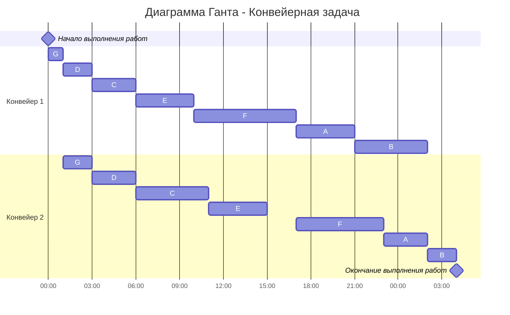

# Задание №4

## 4.1 Задача о распределении инвестиций между проектами

Условия задачи представляются в виде прямоугольной матрицы, где столбцы соответствуют проектам, а строки части инвестиций, направляемых в проекты, объем инвестиций указывается в первом столбце. В ячейках таблицы представлены суммы прибыли от вложения некоторой части средств в определенный проект.

Для решения задачи требуется рассчитать максимально возможную сумму прибыли от вложения всех средств в проекты и распределение этой суммы между проектами.

**Решение должно содержать номер варианта и подробное пошаговое описание.**

## 4.2 Оптимальное расписание. Конвейерная задача

Необходимо построить расписание, выполняемое в кратчайшие сроки двумя исполнителями: 
1. Применить алгоритм Джонсона, в решении отобразить ход выполнения алгоритма с подробными комментариями.
2. В ответе указать длительность полученного расписания.
3. В ответе вывести полученное расписание **в виде диаграммы Ганта**. Диаграмму Ганта можно оформить с помощью плагина Mermaid, образцы оформления диаграмм представлены в данном файле, в описании алгоритмов.

**Решение должно содержать номер варианта и подробное пошаговое описание.**

## Условия задач
Условия задачи расположены в файле `Задание 4/Варианты условий.md` в ветке main репозитория для ручных задач.
Решение задачи нужно оформить в формате Markdown в отдельном файле с названием <название_команды>.md, который добавить в каталог `Задание 4` данного репозитория.

## Для выполнения задания необходимо:

1. Обновить ветку main в локальном репозитории (git pull).
2. От ветки main создать ветвь с названием `<название*команды>-task-4`, заменив `<название*команды>` на название команды, решившей задание.
3. В созданной ветке в каталог `Задание 4` добавить файл с решением задачи с названием `<название_команды>.md`.
4. Зафиксировать изменения на ветке (git commit).
5. Отравить ветку с изменениями в репозиторий на Github (git push).
6. Создать на Github запрос на слияние (pull request), указав в качестве base ветки `main`, в качестве compare ветки `<название_команды>-task-4`.

## Информация по Markdown разметке:

Для создания таблиц в формате Markdown можно использовать следующую конструкцию:

```
| col_1 | col_2 | col_3 |
|:------|:-----:|:-----:|
| a1    | a2    | a3    |
| b1    | b2    | b3    |
| с1    | с2    | с3    |
```

Полезная информация для оформления решений:
- [Руководство по оформлению Markdown файлов](https://gist.github.com/Jekins/2bf2d0638163f1294637)
- [Система верстки LaTeX, которую можно использовать для математических формул](https://grammarware.net/text/syutkin/MathInLaTeX.pdf)
- [Рисуем диаграммы Mermaid.js в README-файлах GitHub](https://habr.com/ru/articles/652867/)

## Конвейерная задача
### Постановка конвейерной задачи:
1. Количество заданий произвольно;
2. Каждое задание состоит из двух последовательных этапов, длительность которых произвольна;
3. Задания независимы;
4. Запрещены прерывания при выполнении заданий;
5. Количество работников строго 2;
6. Первый работник выполняет только первый этап каждого задания, второй работник — только второй этап каждого задания;
7. Производительность работников, размеры оплаты из труда и т.д. не учитываются;
8. Требуется построить расписание выполнения всех заданий в кратчайшие сроки.

### Алгоритм Джонсона
Пусть а<sub>i</sub> и b<sub>i</sub>, — это длительности первого и второго 
этапов i-го задания. 

Разобьём список всех заданий на две группы. В первую группу попадают задания, у которых а<sub>i</sub> <= b<sub>i</sub>. Во вторую группу - все остальные задания. 

Задания из первой группы отсортируем в порядке возрастания величин а<sub>i</sub>. Задания из второй группы отсортируем в порядке убывания величин b<sub>i</sub>.

Согласно алгоритму Джонсона, расписание получается кратчайшим, если сначала выполнить все задания из первой группы в отсортированном порядке, а затем — все задания из второй группы также в отсортированном порядке.


