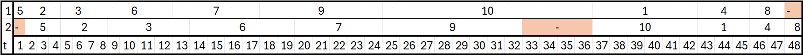

# Задание №4. Вариант №3  
**Выполнили:** Окулов Матвей, Игонин Алексей. 

**Команда:** Команда Seeyahh 

## 4.1 Задача о распределении инвестиций между проектами  
Решаем методом динамического программирования

## Дано: Матрица прибыли

| $\$$ | A | B | C | D |
| :---: | :---: | :---: | :---: | :---: |
| **100** | 5 | 3 | 5 | 4 |
| **200** | 8 | 9 | 11 | 8 |
| **300** | 18 | 10 | 17 | 14 |
| **400** | 21 | 19 | 20 | 19 |
| **500** | 25 | 22 | 21 | 26 |

---

## 2. Расчёт максимальной прибыли  

### Шаг 2.1. Проекты A и B  

#### 1) Инвестиции = 100
| A | B | Прибыль: $P_A + P_B$ |
| :---: | :---: | :---: |
| **1** | **0** | $5$ |
| **0** | **1** | $3$ |
$$\mathbf{MAX\ прибыль_{AB}(100) = 5}$$

#### 2) Инвестиции = 200
| A | B | Прибыль: $P_A + P_B$ |
| :---: | :---: | :---: |
| **2** | **0** | $8$ |
| **1** | **1** | $5 + 3 = 8$ |
| **0** | **2** | $9$ |
$$\mathbf{MAX\ прибыль_{AB}(200) = 9}$$

#### 3) Инвестиции = 300
| A | B | Прибыль: $P_A + P_B$ |
| :---: | :---: | :---: |
| **3** | **0** | $18$ |
| **2** | **1** | $8 + 3 = 11$ |
| **1** | **2** | $5 + 9 = 14$ |
| **0** | **3** | $10$ |
$$\mathbf{MAX\ прибыль_{AB}(300) = 18}$$

#### 4) Инвестиции = 400
| A | B | Прибыль: $P_A + P_B$ |
| :---: | :---: | :---: |
| **4** | **0** | $21$ |
| **3** | **1** | $18 + 3 = 21$ |
| **2** | **2** | $8 + 9 = 17$ |
| **1** | **3** | $5 + 10 = 15$ |
| **0** | **4** | $19$ |
$$\mathbf{MAX\ прибыль_{AB}(400) = 21}$$

#### 5) Инвестиции = 500
| A | B | Прибыль: $P_A + P_B$ |
| :---: | :---: | :---: |
| **5** | **0** | $25$ |
| **4** | **1** | $21 + 3 = 24$ |
| **3** | **2** | $18 + 9 = 27$ |
| **2** | **3** | $8 + 10 = 18$ |
| **1** | **4** | $5 + 19 = 24$ |
| **0** | **5** | $22$ |
$$\mathbf{MAX\ прибыль_{AB}(500) = 27}$$

---

### Шаг 2.2. Проекты A, B и C  

#### 1) Инвестиции = 500
| AB | C | Прибыль: $P_{AB} + P_C$ |
| :---: | :---: | :---: |
| **5** | **0** | $27$ |
| **4** | **1** | $21 + 5 = 26$ |
| **3** | **2** | $18 + 11 = 29$ |
| **2** | **3** | $9 + 17 = 26$ |
| **1** | **4** | $5 + 20 = 25$ |
| **0** | **5** | $21$ |
$$\mathbf{MAX\ прибыль_{ABC}(500) = 29}$$

---

### Шаг 2.3. Проекты A, B, C и D  

#### 1) Инвестиции = 500
| ABC | D | Прибыль: $P_{ABC} + P_D$ |
| :---: | :---: | :---: |
| **5** | **0** | $29$ |
| **4** | **1** | |
| **3** | **2** | |
| **2** | **3** | |
| **1** | **4** | |
| **0** | **5** | $26$ |
$$\mathbf{MAX\ прибыль_{ABCD}(500) = 29}$$

---

## 3. Финальная таблица

| у.е. | AB | ABC | ABCD |
| :---: | :---: | :---: | :---: |
| **100** | 5 | 5 | - |
| **200** | 9 | 11 | - |
| **300** | 18 | 18 | - |
| **400** | 21 | 21 | - |
| **500** | 27 | 29 | 29 |

---

## 4. Определение оптимального распределения

| Шаг | Текущая сумма | Проект | Инвестиция (у.е.) |
| :---: | :---: | :---: | :---: |
| 1 | 500 | D | **0** |
| 2 | 500 | C | **200** |
| 3 | 300 | B | **0**  |
| 4 | 300 | A | **300** |

## Ответ:

* **Максимальная сумма прибыли от инвестиций:** $\mathbf{29}$ у.е.
* **Оптимальное распределение инвестиций:**
    * **Проект A:** 300 у.е.
    * **Проект B:** 0 у.е.
    * **Проект C:** 200 у.е.
    * **Проект D:** 0 у.е.

---

## 4.2 Конвейерная задача  
Решаем задачу по алгоритму Джонсона

## Дано:

| Задание | aᵢ (Работник A) | bᵢ (Работник B) |
|---------|----------------|-----------------|
| 1 | 6 | 3 |
| 2 | 3 | 4 |
| 3 | 3 | 5 |
| 4 | 3 | 2 |
| 5 | 1 | 3 |
| 6 | 5 | 6 |
| 7 | 5 | 5 |
| 8 | 2 | 1 |
| 9 | 7 | 8 |
| 10 | 12 | 6 |

## 1. Разделение на группы

**Группа 1 (aᵢ ≤ bᵢ):**  
2, 3, 5, 6, 7, 9  

**Группа 2 (aᵢ > bᵢ):**  
1, 4, 8, 10  

## 2. Сортировка групп

**Группа 1 (по возрастанию aᵢ):**  
5 → 2 → 3 → 6 → 7 → 9  

**Группа 2 (по убыванию bᵢ):**  
10 → 1 → 4 → 8  

## 3. Формирование итогового порядка

**Итоговый порядок:**  
5 → 2 → 3 → 6 → 7 → 9 → 10 → 1 → 4 → 8  

## 4. Построение расписания

### Работник A:
- 5: 0–1  
- 2: 1–4  
- 3: 4–7  
- 6: 7–12  
- 7: 12–17  
- 9: 17–24  
- 10: 24–36  
- 1: 36–42  
- 4: 42–45  
- 8: 45–47  

### Работник B:
- 5: 1–4  
- 2: 4–8  
- 3: 8–13  
- 6: 13–19  
- 7: 19–24  
- 9: 24–32  
- 10: 36–42  
- 1: 42–45  
- 4: 45–47  
- 8: 47–48  

## 5. Расчет длительности

Работник A заканчивает в: 47  
Работник B заканчивает в: 48  

**Общая длительность расписания: 48 единиц времени**

## Ответ

**Оптимальное расписание:**  
5 → 2 → 3 → 6 → 7 → 9 → 10 → 1 → 4 → 8  

**Минимальная длительность:** **48**