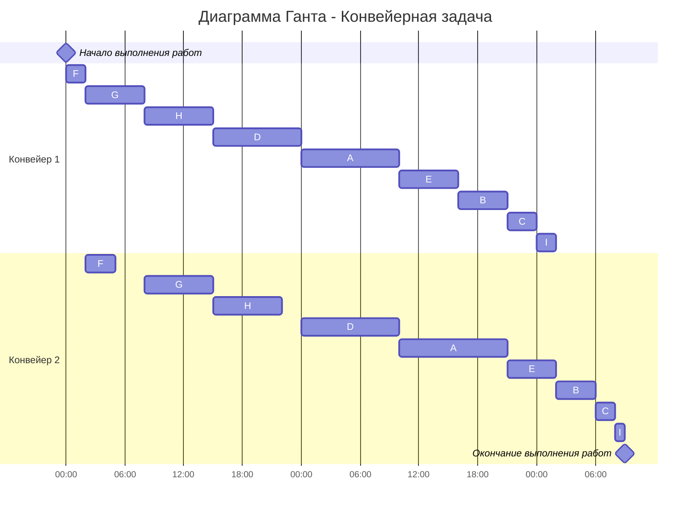

# Задача о распределении инвестиций между проектами

## Вариант 8:

| $   | A  | B  | C  | D  | E  |
|-----|----|----|----|----|----|
| 100 | 4  | 3  | 3  | 2  | 1  |
| 200 | 5  | 4  | 5  | 3  | 4  |
| 300 | 8  | 6  | 7  | 8  | 7  |
| 400 | 9  | 7  | 8  | 9  | 9  |
| 500 | 10 | 11 | 12 | 10 | 13 |

Данная задача будет решена через динамическое программирование. К базе рекурсии на каждом этапе мы будем добавлять по одному проекту, чтобы в итоге рассчитать максимальную прибыль от инвестиций, а также оптимальное распределение инвестиций между всеми проектами.

База рекурсии: расчёт максимальной прибыли от инвестиций в 2 проекта (A и B)

Для каждой возможной суммы инвестиций от 100$ до 500$ с шагом 100$ мы рассматриваем все варианты распределения средств между проектами A и B и выбираем вариант с максимальной прибылью.

# n = 2 (A и B) 

|  Сумма инвестиции  |  Прибыль |
|:------------------:|:--------:|
| 100$               | 100A = 4 |   
|                    | 100B = 3 |
Max=4

|  Сумма инвестиции  |        Прибыль       |
|:------------------:|:--------------------:|
|        200$        | 200A = 5             |
|                    | 200B = 4             |
|                    | 100A+100B = 4 + 3 = 7|
Max=7

|  Cумма инвестиции  |        Прибыль       |
|:------------------:|:--------------------:|
| 300$               | 300A = 8             |
|                    | 300B = 6             | 
|                    | 100A+200B = 4 + 4 = 8|
|                    | 200A+100B = 5 + 3 = 8|
Max=8

|  Cумма инвестиции  |        Прибыль       |
|:------------------:|:--------------------:|
| 400$               | 400A = 9             |
|                    | 400B = 7             | 
|                    | 100A+300B = 4 + 6 = 10|
|                    | 200A+200B = 5 + 4 = 9|
|                    | 300A+100B = 8 + 3 = 11|
Max=11

|  Cумма инвестиции  |        Прибыль       |
|:------------------:|:--------------------:|
| 500$               | 500A = 10             |
|                    | 500B = 11             | 
|                    | 100A+400B = 4 + 7 = 11|
|                    | 200A+300B = 5 + 6 = 11|
|                    | 300A+200B = 8 + 4 = 12|
|                    | 400A+100B = 9 + 3 = 12|
Max=12

# n = 3 (A, B, C)

|  Сумма инвестиции  |  Прибыль |
|:------------------:|:--------:|
| 100$               | 100AB = 4 |
|                    | 100C = 3 |
Max=4

|  Сумма инвестиции  |        Прибыль       |
|:------------------:|:--------------------:|
|        200$        | 200AB = 7             |
|                    | 200C = 5             |
|                    | 100AB+100C = 4 + 3 = 7|
Max=7

|  Cумма инвестиции  |        Прибыль       |
|:------------------:|:--------------------:|
| 300$               | 300AB = 8             |
|                    | 300C = 7             | 
|                    | 100AB+200C = 4 + 5 = 9|
|                    | 200AB+100C = 7 + 3 = 10|
Max=10

|  Cумма инвестиции  |        Прибыль       |
|:------------------:|:--------------------:|
| 400$               | 400AB = 11            |
|                    | 400C = 8             | 
|                    | 100AB+300C= 4 + 7 = 11|
|                    | 200AB+200C = 7 + 5 = 12|
|                    | 300AB+100C = 8 + 3 = 11|
Max=12

|  Cумма инвестиции  |        Прибыль       |
|:------------------:|:--------------------:|
| 500$               | 500AB = 12             |
|                    | 500C = 12             | 
|                    | 100AB+400C = 4 + 8 = 12|
|                    | 200AB+300C = 7 + 7 = 14|
|                    | 300AB+200C = 8 + 5 = 12|
|                    | 400AB+100C = 11 + 3 = 14|
Max=14

# n = 4 (A, B, C, D)

|  Сумма инвестиции  |  Прибыль |
|:------------------:|:--------:|
| 100$               | 100ABC = 4 |
|                    | 100D = 2 |
Max=4

|  Сумма инвестиции  |        Прибыль       |
|:------------------:|:--------------------:|
|        200$        | 200ABC = 7             |
|                    | 200D = 3             |
|                    | 100ABC+100D = 4 + 2 = 6|
Max=7

|  Cумма инвестиции  |        Прибыль       |
|:------------------:|:--------------------:|
| 300$               | 300ABC = 10             |
|                    | 300D = 8             | 
|                    | 100ABC+200D = 4 + 3 = 7|
|                    | 200ABC+100D = 7 + 2 = 9|
Max=10

|  Cумма инвестиции  |        Прибыль       |
|:------------------:|:--------------------:|
| 400$               | 400ABC = 12            |
|                    | 400D = 9             | 
|                    | 100ABC+300D = 4 + 8 = 12|
|                    | 200ABC+200D = 7 + 3 = 10|
|                    | 300ABC+100D = 10 + 2 = 12|
Max=12

|  Cумма инвестиции  |        Прибыль       |
|:------------------:|:--------------------:|
| 500$               | 500ABC = 14             |
|                    | 500D = 10             | 
|                    | 100ABC+400D = 4 + 9 = 13|
|                    | 200ABC+300D = 7 + 8 = 15|
|                    | 300ABC+200D = 10 + 3 = 13|
|                    | 400ABC+100D = 12 + 2 = 14|
Max=15

# n = 5 (A, B, C, D, E)

|  Сумма инвестиции  |  Прибыль |
|:------------------:|:--------:|
| 100$               | 100ABCD = 4 |
|                    | 100E = 1 |
Max=4

|  Сумма инвестиции  |        Прибыль       |
|:------------------:|:--------------------:|
|        200$        | 200ABCD = 7             |
|                    | 200E = 4             |
|                    | 100ABCD+100E = 4 + 1 = 5|
Max=7

|  Cумма инвестиции  |        Прибыль       |
|:------------------:|:--------------------:|
| 300$               | 300ABCD = 10             |
|                    | 300E = 7             | 
|                    | 100ABCD+200E = 4 + 4 = 8|
|                    | 200ABCD+100E = 7 + 1 = 8|
Max=10

|  Cумма инвестиции  |        Прибыль       |
|:------------------:|:--------------------:|
| 400$               | 400ABCD = 12            |
|                    | 400E = 9             | 
|                    | 100ABCD+300E = 4 + 7 = 11|
|                    | 200ABCD+200E = 7 + 4 = 11|
|                    | 300ABCD+100E = 10 + 1 = 11|
Max=12

|  Cумма инвестиции  |        Прибыль       |
|:------------------:|:--------------------:|
| 500$               | 500ABCD = 15             |
|                    | 500E = 13             | 
|                    | 100ABCD+400E = 4 + 9 = 13|
|                    | 200ABCD+300E = 7 + 7 = 14|
|                    | 300ABCD+200E = 10 + 4 = 14|
|                    | 400ABCD+100E = 12 + 1 = 13|
Max=15

# Таблица лучших отдач

| $   | AB | ABC  | ABCD | ABCDE |
|:-----:|:----:|:------:|:------:|:-------:|
| 100 | 4  | 4    | 4    |    4  | 
| 200 | 7  | 7    | 7    |   7   | 
| 300 |  8  | 10    |  10   |   10   | 
| 400 | 11   | 12    |   12  |   12   | 
| 500 |  12  | 14   |  15  |  15   | 

Ответ: максимальная прибыль от инвестиций 15$  

500ABCDE = 0E + 500ABCD  
500ABCD = 200ABC + 300D   
200ABC = 100AB + 100C  
100AB = 100A + 0B  
Оптимальное распределение инвестиций: 100A + 0B + 100C + 300D + 0E  

# Конвейерная задача

Имеется некоторое количество независимых заданий, каждое из которых состоит из двух последовательных этапов, и 2 исполнителя, исполнитель 1 выполняет только первый этап задания, исполнитель 2 - только второй.

Необходимо построить расписание, выполняемое в кратчайшие сроки. 

В ответе указать длительность полученного расписания.

В ответе вывести полученное расписание **в виде диаграммы Ганта**.

## Вариант 8:

Имеется 9 независимых заданий. Длительность заданий (по этапам): 
(10, 11), (5, 4), (3, 2), (9, 10), (6, 5), (2, 3), (6, 7), (7, 7), (2, 1)

|    | A  | B  | C  | D  | E  | F | G | H | I |
|:-----:|:----:|:----:|:----:|:----:|:----:|:----:|:----:|:----:|:----:|
| длительность 1-го этапа | 10  | 5  | 3  | 9  | 6  | 2| 6|7|2|
| длительность 2-го этапа | 11  | 4  | 2  | 10  | 5  | 3|7|7|1|

# I этап: разобъём все задания на 2 группы.

1 группа - задания, у которых I этап короче, чем II этап  
2 группа - задания, у которых II этап короче, чем I этап  

Получим:  
1 группа (I<=II): A, D, F, G, H.  
2 группа (II<I): B, C, E, I.

# II этап: отсортируем по длительности задания внутри групп.

Отсортируем по правилу:  
внутри 1 группы - по возрастанию длительности I этапа  
внутри 2 группы - по убыванию длительности II этапа  

Получим:  
1 группа: F -> G -> H -> D -> A  
2 группа: E -> B -> C -> I

# III этап: назначение приоритетов заданиям.

Отсортированные цепочки соединяем в одну и по порядку расставляем приоритеты:  

| 1 | 2 | 3 | 4 | 5 | 6 | 7 | 8 | 9 |
|---|---|---|---|---|---|---|---|---|
| F | G | H | D | A | E | B | C | I |

# IV этап: составление диаграммы Ганта.

Задания должны идти по приоритетам и сохранять правило, что сначала для каждого задания выполняется I этап, потом II этап.

Ответ: расписание с минимальной длительностью займёт 57 часов. Диаграмма Ганта представлена выше. 

