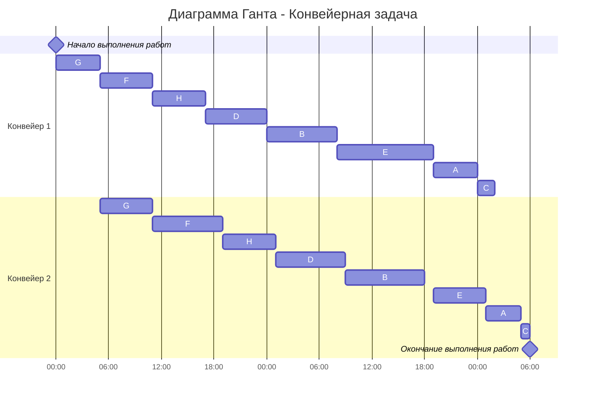

# Вариант 5
-----
# Задача о распределении инвестиций между проектами

|$|A|B|C|D|
| -: | :-: | :-: | :-: | :-: |
|30|6|8|4|7|
|60|8|9|5|8|
|90|11|11|8|12|
|120|12|14|11|15|
|150|14|15|13|16|

-----
## 1\. Определяем максимальную прибыль для пары A и B
### Инвестиции 30

|A|B|A + B|
| :-: | :-: | :-: |
|0|1|8|
|1|0|6|

**Максимум: 8 (0/1)**
### Инвестиции 60

|A|B|A + B|
| :-: | :-: | :-: |
|0|2|9|
|1|1|14|
|2|0|8|

**Максимум: 14 (1/1)**

### Инвестиции 90

|A|B|A + B|
| :-: | :-: | :-: |
|0|3|11|
|1|2|15|
|2|1|16|
|3|0|11|

**Максимум: 16 (2/1)**
### Инвестиции 120

|A|B|A + B|
| :-: | :-: | :-: |
|0|4|14|
|1|3|17|
|2|2|17|
|3|1|19|
|4|0|12|

**Максимум: 19 (3/1)**
### Инвестиции 150

|A|B|A + B|
| :-: | :-: | :-: |
|0|5|15|
|1|4|20|
|2|3|19|
|3|2|20|
|4|1|20|
|5|0|14|

**Максимум: 20 (1/4)**
### Заносим в таблицу:

|$|A/B|AB/C|ABC/D|
| :-: | :-: | :-: | :-: |
|30|8 (0/1)|||
|60|14 (1/1)|||
|90|16 (2/1)|||
|120|19 (3/1)|||
|150|20 (1/4)|||
-----
## 2\. Определяем максимальную прибыль для пары AB и C
### Инвестиции 30

|AB|C|AB + C|
| :-: | :-: | :-: |
|0|1|4|
|1|0|8|

**Максимум: 8 (1/0)**
### Инвестиции 60

|AB|C|AB + C|
| :-: | :-: | :-: |
|0|2|5|
|1|1|12|
|2|0|14|

**Максимум: 14 (2/0)**
### Инвестиции 90

|AB|C|AB + C|
| :-: | :-: | :-: |
|0|3|8|
|1|2|13|
|2|1|18|
|3|0|16|

**Максимум: 18 (2/1)**
### Инвестиции 120

|AB|C|AB + C|
| :-: | :-: | :-: |
|0|4|11|
|1|3|16|
|2|2|19|
|3|1|20|
|4|0|19|

**Максимум: 20 (3/1)**
### Инвестиции 150

|AB|C|AB + C|
| :-: | :-: | :-: |
|0|5|13|
|1|4|19|
|2|3|22|
|3|2|21|
|4|1|23|
|5|0|20|

**Максимум: 23 (4/1)**
### Вносим в таблицу:

|$|A/B|AB/C|ABC/D|
| :-: | :-: | :-: | :-: |
|30|8 (0/1)|8 (1/0)||
|60|14 (1/1)|14 (2/0)||
|90|16 (2/1)|18 (2/1)||
|120|19 (3/1)|20 (3/1)||
|150|20 (1/4)|23 (4/1)||
-----
## 3\. Добавляем проект D (ABC / D)
Полные расчёты не нужны, так как в последнем шаге выбираются только максимумы.
### Инвестиции 150

|ABC|D|ABC + D|
| :-: | :-: | :-: |
|0|5|16|
|1|4|23|
|2|3|26|
|3|2|26|
|4|1|27|
|5|0|23|

**Максимум = 27 (4/1)**
### Итоговая таблица

|$|A/B|AB/C|ABC/D|
| :-: | :-: | :-: | :-: |
|30|8 (0/1)|8 (1/0)|—|
|60|14 (1/1)|14 (2/0)|—|
|90|16 (2/1)|18 (2/1)|—|
|120|19 (3/1)|20 (3/1)|—|
|150|20 (1/4)|23 (4/1)|27 (4/1)|
## Ответ
**Максимальная прибыль = 27.**

**Оптимальное распределение инвестиций:**

- A = 60
- B = 30
- C = 30
- D = 30

# Конвейерная задача

| Работа               | A   | B   | С   | D   | E   | F   | G   | H   |
|----------------------|-----|-----|-----|-----|-----|-----|-----|-----| 
| Длительность 1 этапа | 5   | 8   | 2   | 7   | 11  | 6   | 5   | 6   | 
| Длительность 2 этапа | 4   | 9   | 1   | 8   | 6   | 8   | 6   | 6   | 

## 1 шаг (Разбить работы на 2 группы):

1 группа (1 этап ≤ 2 этап): D, F, G, H  
2 группа (1 этап > 2 этап): A, B, C, E

## 2 шаг (Отсортировать работы внутри групп):

1 группа: G → F → H → D (по возрастанию длительности 1 этапа)  
2 группа: B → E → A → C (по убыванию длительности 2 этапа)

## 3 шаг (Назначить приоритеты):

G(1) → F(2) → H(3) → D(4) → B(5) → E(6) → A(7) → C(8)  

## Диаграмма Ганта

## Ответ

Кратчайшее расписание длится 54 часа