## Вариант 4:

### Задача о распределении инвестиций между проектами

| $   | A   | B   | C   | D   | E   |
| --- | --- | --- | --- | --- | --- |
| 100 | 3   | 5   | 4   | 7   | 8   |
| 200 | 7   | 11  | 8   | 9   | 12  |
| 300 | 9   | 12  | 14  | 10  | 13  |
| 400 | 14  | 16  | 15  | 14  | 14  |
| 500 | 20  | 18  | 19  | 17  | 15  |

Решаем задачу динамическим программированием: последовательно добавляем проекты и для каждой общей суммы инвестиций выбираем максимальную прибыль.

#### Будем заполнять поэтапно эту таблицу:

| $   | A : B | AB : C | ABC : D | ABCD : E |
| --- | ----- | ------ | ------- | -------- |
| 100 |       |        |         |          |
| 200 |       |        |         |          |
| 300 |       |        |         |          |
| 400 |       |        |         |          |
| 500 |       |        |         |          |

#### 1. Считаем максимальную прибыль между проектами A и B

1). Инвестиции в 100$:

|  A  |  B  | A + B |
| :-: | :-: | :---: |
|  0  |  1  |  $5$  |
|  1  |  0  |  $3$  |

_Максимальная прибыль проектов A и B при инвестициях 100$ = 5 (0/1)_

2). Инвестиции в 200$:

|  A  |  B  |    A + B    |
| :-: | :-: | :---------: |
|  0  |  2  |    $11$     |
|  1  |  1  | $3 + 5 = 8$ |
|  2  |  0  |     $7$     |

_Максимальная прибыль проектов A и B при инвестициях 200$ = 11 (0/2)_

3). Инвестиции в 300$:

|  A  |  B  |     A + B     |
| :-: | :-: | :-----------: |
|  0  |  3  |     $12$      |
|  1  |  2  | $3 + 11 = 14$ |
|  2  |  1  | $7 + 5 = 12$  |
|  3  |  0  |      $9$      |

_Максимальная прибыль проектов A и B при инвестициях 300$ = 14 (1/2)_

4). Инвестиции в 400$:

|  A  |  B  |     A + B     |
| :-: | :-: | :-----------: |
|  0  |  4  |     $16$      |
|  1  |  3  | $3 + 12 = 15$ |
|  2  |  2  | $7 + 11 = 18$ |
|  3  |  1  | $9 + 5 = 14$  |
|  4  |  0  |     $14$      |

_Максимальная прибыль проектов A и B при инвестициях 400$ = 18 (2/2)_

5). Инвестиции в 500$:

|  A  |  B  |     A + B     |
| :-: | :-: | :-----------: |
|  0  |  5  |     $18$      |
|  1  |  4  | $3 + 16 = 19$ |
|  2  |  3  | $7 + 12 = 19$ |
|  3  |  2  | $9 + 11 = 20$ |
|  4  |  1  | $14 + 5 = 19$ |
|  5  |  0  |     $20$      |

_Максимальная прибыль проектов A и B при инвестициях 500$ = 20 (5/0)_

#### Заносим данные в таблицу:

| $   | A : B      | AB : C | ABC : D | ABCD : E |
| --- | ---------- | ------ | ------- | -------- |
| 100 | $5 (0/1)$  |        |         |          |
| 200 | $11 (0/2)$ |        |         |          |
| 300 | $14 (1/2)$ |        |         |          |
| 400 | $18 (2/2)$ |        |         |          |
| 500 | $20 (5/0)$ |        |         |          |

#### 2. Считаем максимальную прибыль между проектами AB и C

1). Инвестиции в 100$:

| AB  |  C  | AB + C |
| :-: | :-: | :----: |
|  0  |  1  |  $4$   |
|  1  |  0  |  $5$   |

_Максимальная прибыль проектов AB и C при инвестициях 100$ = 5 (1/0)_

2). Инвестиции в 200$:

| AB  |  C  |   AB + C    |
| :-: | :-: | :---------: |
|  0  |  2  |     $8$     |
|  1  |  1  | $5 + 4 = 9$ |
|  2  |  0  |    $11$     |

_Максимальная прибыль проектов AB и C при инвестициях 200$ = 11 (2/0)_

3). Инвестиции в 300$:

| AB  |  C  |    AB + C     |
| :-: | :-: | :-----------: |
|  0  |  3  |     $14$      |
|  1  |  2  | $5 + 8 = 13$  |
|  2  |  1  | $11 + 4 = 15$ |
|  3  |  0  |     $14$      |

_Максимальная прибыль проектов AB и C при инвестициях 300$ = 15 (2/1)_

4). Инвестиции в 400$:

| AB  |  C  |    AB + C     |
| :-: | :-: | :-----------: |
|  0  |  4  |     $15$      |
|  1  |  3  | $5 + 14 = 19$ |
|  2  |  2  | $11 + 8 = 19$ |
|  3  |  1  | $14 + 4 = 18$ |
|  4  |  0  |     $18$      |

_Максимальная прибыль проектов AB и C при инвестициях 400$ = 19 (2/2)_

5). Инвестиции в 500$:

| AB  |  C  |     AB + C     |
| :-: | :-: | :------------: |
|  0  |  5  |      $19$      |
|  1  |  4  | $5 + 15 = 20$  |
|  2  |  3  | $11 + 14 = 25$ |
|  3  |  2  | $14 + 8 = 22$  |
|  4  |  1  | $18 + 4 = 22$  |
|  5  |  0  |      $20$      |

_Максимальная прибыль проектов AB и C при инвестициях 500$ = 25 (2/3)_

#### Заносим данные в таблицу:

| $   | A : B      | AB : C     | ABC : D | ABCD : E |
| --- | ---------- | ---------- | ------- | -------- |
| 100 | $5 (0/1)$  | $5 (1/0)$  |         |          |
| 200 | $11 (0/2)$ | $11 (2/0)$ |         |          |
| 300 | $14 (1/2)$ | $15 (2/1)$ |         |          |
| 400 | $18 (2/2)$ | $19 (2/2)$ |         |          |
| 500 | $20 (5/0)$ | $25 (2/3)$ |         |          |

#### 3. Считаем максимальную прибыль между проектами ABC и D

1). Инвестиции в 100$:

| ABC |  D  | ABC + D |
| :-: | :-: | :-----: |
|  0  |  1  |   $7$   |
|  1  |  0  |   $5$   |

_Максимальная прибыль проектов ABC и D при инвестициях 100$ = 7 (0/1)_

2). Инвестиции в 200$:

| ABC |  D  |   ABC + D    |
| :-: | :-: | :----------: |
|  0  |  2  |     $9$      |
|  1  |  1  | $5 + 7 = 12$ |
|  2  |  0  |     $11$     |

_Максимальная прибыль проектов ABC и D при инвестициях 200$ = 12 (1/1)_

3). Инвестиции в 300$:

| ABC |  D  |    ABC + D    |
| :-: | :-: | :-----------: |
|  0  |  3  |     $10$      |
|  1  |  2  | $5 + 9 = 14$  |
|  2  |  1  | $11 + 7 = 18$ |
|  3  |  0  |     $15$      |

_Максимальная прибыль проектов ABC и D при инвестициях 300$ = 18 (2/1)_

4). Инвестиции в 400$:

| ABC |  D  |    ABC + D    |
| :-: | :-: | :-----------: |
|  0  |  4  |     $14$      |
|  1  |  3  | $5 + 10 = 15$ |
|  2  |  2  | $11 + 9 = 20$ |
|  3  |  1  | $15 + 7 = 22$ |
|  4  |  0  |     $19$      |

_Максимальная прибыль проектов ABC и D при инвестициях 400$ = 22 (3/1)_

5). Инвестиции в 500$:

| ABC |  D  |    ABC + D     |
| :-: | :-: | :------------: |
|  0  |  5  |      $17$      |
|  1  |  4  | $5 + 14 = 19$  |
|  2  |  3  | $11 + 10 = 21$ |
|  3  |  2  | $15 + 9 = 24$  |
|  4  |  1  | $19 + 7 = 26$  |
|  5  |  0  |      $25$      |

_Максимальная прибыль проектов ABC и D при инвестициях 500$ = 26 (4/1)_

#### Заносим данные в таблицу:

| $   | A : B      | AB : C     | ABC : D    | ABCD : E |
| --- | ---------- | ---------- | ---------- | -------- |
| 100 | $5 (0/1)$  | $5 (1/0)$  | $7 (0/1)$  |          |
| 200 | $11 (0/2)$ | $11 (2/0)$ | $12 (1/1)$ |          |
| 300 | $14 (1/2)$ | $15 (2/1)$ | $18 (2/1)$ |          |
| 400 | $18 (2/2)$ | $19 (2/2)$ | $22 (3/1)$ |          |
| 500 | $20 (5/0)$ | $25 (2/3)$ | $26 (4/1)$ |          |

#### 4. Считаем максимальную прибыль между проектами ABCD и E

_Вся предыдущая таблица динамики уже содержит в себе все переборы, и на последней строке последнего столбца будет стоять результат, который получен с учётом всех возможных комбинаций инвестиций по всем проектам._

_То есть последняя строка последнего столбца — это уже максимум из всех максимумов, поэтому считаем только ее_

Инвестиции в 500$:

| ABCD |  E  |    ABCD + E    |
| :--: | :-: | :------------: |
|  0   |  5  |      $15$      |
|  1   |  4  | $7 + 14 = 21$  |
|  2   |  3  | $12 + 13 = 25$ |
|  3   |  2  | $18 + 12 = 30$ |
|  4   |  1  | $22 + 8 = 30$  |
|  5   |  0  |      $26$      |

_Максимальная прибыль проектов ABCD и E при инвестициях 500$ = 30 (4/1), что в свою очередь и является максимальной возможной прибылью от вложения 500$ в 5 проектов_

#### Заносим финальные данные в таблицу и считаем распределение вложений по проектам

| $   | A : B      | AB : C     | ABC : D    | ABCD : E     |
| --- | ---------- | ---------- | ---------- | ------------ |
| 100 | $5 (0/1)$  | $5 (1/0)$  | $7 (0/1)$  |              |
| 200 | $11 (0/2)$ | $11 (2/0)$ | $12 (1/1)$ |              |
| 300 | $14 (1/2)$ | $15 (2/1)$ | $18 (2/1)$ |              |
| 400 | $18 (2/2)$ | $19 (2/2)$ | $22 (3/1)$ |              |
| 500 | $20 (5/0)$ | $25 (2/3)$ | $26 (4/1)$ | **30 (4/1)** |

500$ ABCDE = 400$ ABCD + **100$ E**

400$ ABCD = 300$ ABC + **100$ D**

300$ ABC = 200% AB + **100$ C**

200$ AB = **0$ A** + **200$ B**

### Ответ: Максимально возможная прибыль от вложения 500$ в 5 проектов равна 30. Добиться такой прибыли можно вложив в: A - 0$, B - 200$, C - 100$, D - 100$, E - 100$

---

### Конвейерная задача

Имеется 9 независимых заданий. Длительность заданий (по этапам):
(5, 6), (7, 6), (2, 2), (3, 2), (6, 5), (8, 10), (7, 5), (8, 10), (7, 8)

_Для удобства поименуем задачи:_
| | A | B | C | D | E | F | G | H | I |
|:---:|:---:|:---:|:---:|:---:|:---:|:---:|:---:|:---:|:---:|
| 1 этап | 5 | 7 | 2 | 3 | 6 | 8 | 7 | 8 | 7 |
| 2 этап | 6 | 6 | 2 | 2 | 5 | 10 | 5 | 10 | 8 |

Для решения используем алгоритм Джонсона

#### 1. Разбиваем задания на две группы

_1 группа: задания, в которых первый этап короче второго_\
_2 группа: задания, в которых второй этап короче первого_

| 1 группа | 2 группа |
| :------: | :------: |
|    A     |    B     |
|    C     |    D     |
|    F     |    E     |
|    H     |    G     |
|    I     |          |

#### 2. Сортируем задания

_1 группа: по возрастанию длительности первого этапа_\
_2 группа: по убыванию длительности второго этапы_

| 1 группа | 2 группа |
| :------: | :------: |
|    C     |    B     |
|    A     |    E     |
|    I     |    G     |
|    F     |    D     |
|    H     |          |

#### 3. Оптимальный порядок выполнения задач

**C - A - I - F - H - B - E - G - D**

#### 4. Строим диаграмму Ганта

_Правило: сначала для каждого задания выполняется I этап, потом II этап._

```mermaid
gantt
    title Диаграмма Ганта
    dateFormat HH:mm
    axisFormat %H:%M

    section Этап 1
    C :c1, 00:00, 2h
    A :a1, after c1, 5h
    I :i1, after a1, 7h
    F :f1, after i1, 8h
    H :h1, after f1, 8h
    B :b1, after h1, 7h
    E :e1, after b1, 6h
    G :g1, after e1, 7h
    D :d1, after g1, 3h

    section Этап 2
    C :c2, after c1, 2h
    A :a2, after a1 a2, 6h
    I :i2, after i1 a2, 8h
    F :f2, after f1 i2, 10h
    H :h2, after h1 f2, 10h
    B :b2, after b1 h2, 6h
    E :e2, after e1 b2, 5h
    G :g2, after g1 e2, 5h
    D :d2, after d1 g2, 2h
```

### Ответ: минимальная длительность расписания составляет 60, само расписание представлено выше в виде диаграммы Ганта.
