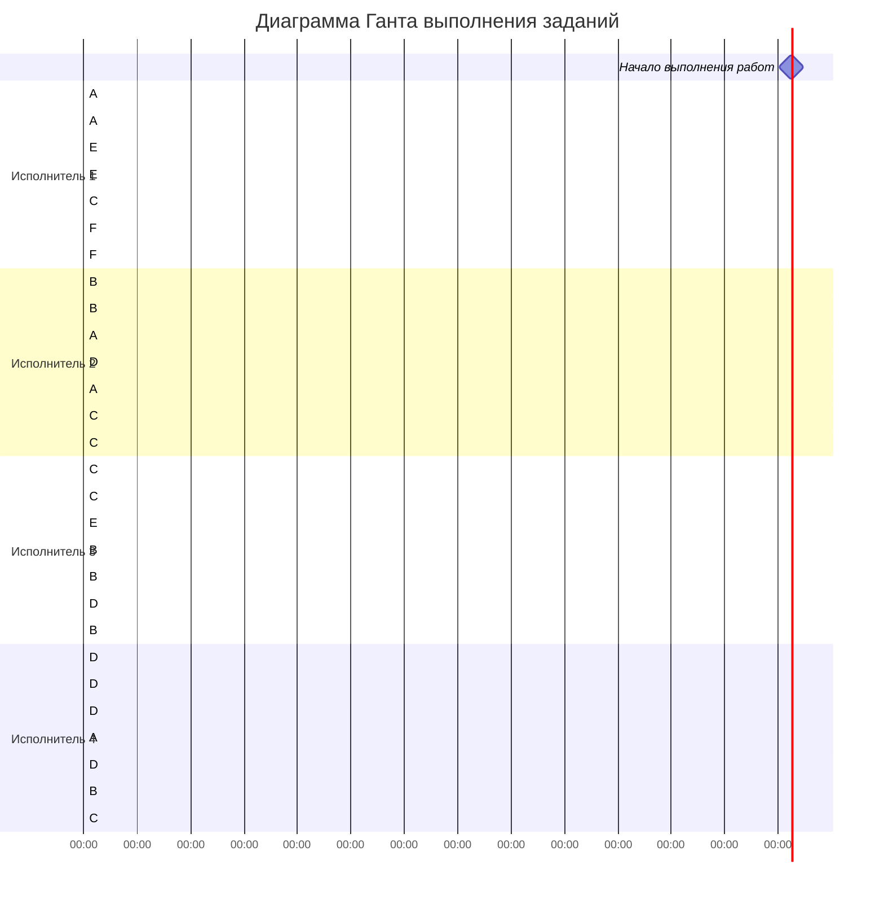

# Решение задачи о разделении процессоров
# Выполнили: Дудырева Маргарита, Иванова Милена, Валеева Карина, РИС 24-5

## Условия задачи

**Задания и их длительность:**
- A: 42
- B: 36
- C: 28
- D: 24
- E: 20
- F: 10

**Исполнители и их производительность:**
- Исполнитель 1: p = 4
- Исполнитель 2: p = 3
- Исполнитель 3: p = 2
- Исполнитель 4: p = 1

## Шаг 1: Расчет минимального времени расписания

Общий объем работ:
V = 42 + 36 + 28 + 24 + 20 + 10 = 160

Сумма производительностей:
P = 4 + 3 + 2 + 1 = 10

Минимальное время расписания:
T_min = 160 / 10 = 16

## Шаг 2: Построение расписания

### Алгоритм построения:
1. Сортируем задания по убыванию оставшегося объема работ
2. Сортируем исполнителей по убыванию производительности
3. Назначаем наиболее производительных исполнителей на задания с наибольшим объемом работ
4. Выполняем до одного из событий:
   - Завершение задания
   - Выравнивание приоритетов заданий
5. Повторяем процесс

### Расписание выполнения:

| Интервал времени | Исполнитель 1 (p=4) | Исполнитель 2 (p=3) | Исполнитель 3 (p=2) | Исполнитель 4 (p=1) |
|------------------|---------------------|---------------------|---------------------|---------------------|
| 0-4              | A                   | B                   | C                   | D                   |
| 4-6              | A                   | B                   | E                   | D                   |
| 6-8              | E                   | A                   | B                   | D                   |
| 8-10             | C                   | D                   | B                   | A                   |
| 10-13            | E                   | A                   | B                   | D                   |
| 13-15            | F                   | C                   | D                   | B                   |
| 15-16            | F                   | A                   | B                   | C                   |

## Шаг 3: Расчет выполнения заданий

### Прогресс выполнения:
1. **0-4 единицы времени:**
   - A: 42 → 26 (выполнено 16)
   - B: 36 → 24 (выполнено 12)
   - C: 28 → 20 (выполнено 8)
   - D: 24 → 20 (выполнено 4)
   - E: 20, F: 10 (не выполнялись)

2. **4-6 единицы времени:**
   - A: 26 → 18 (выполнено 8)
   - B: 24 → 18 (выполнено 6)
   - E: 20 → 12 (выполнено 8)
   - D: 20 → 18 (выполнено 2)

3. **6-8 единицы времени:**
   - E: 12 → 4 (выполнено 8)
   - A: 18 → 12 (выполнено 6)
   - B: 18 → 14 (выполнено 4)
   - D: 18 → 16 (выполнено 2)

4. **8-10 единицы времени:**
   - C: 20 → 12 (выполнено 8)
   - D: 16 → 10 (выполнено 6)
   - B: 14 → 10 (выполнено 4)
   - A: 12 → 10 (выполнено 2)

5. **10-13 единицы времени:**
   - E: 4 → 0 (завершено)
   - A: 10 → 1 (выполнено 9)
   - B: 10 → 4 (выполнено 6)
   - D: 10 → 7 (выполнено 3)

6. **13-15 единицы времени:**
   - F: 10 → 2 (выполнено 8)
   - C: 12 → 6 (выполнено 6)
   - D: 7 → 3 (выполнено 4)
   - B: 4 → 2 (выполнено 2)

7. **15-16 единицы времени:**
   - F: 2 → 0 (завершено)
   - A: 1 → 0 (завершено)
   - B: 2 → 0 (завершено)
   - C: 6 → 4 (выполнено 2)
   - D: 3 → 1 (выполнено 2)

## Шаг 4: Проверка выполнения

**Общий выполненный объем:**
- A: 42
- B: 36  
- C: 28
- D: 24
- E: 20
- F: 10
**Итого: 160**

**Использованные ресурсы:**
- Исполнитель 1: 16 × 4 = 64
- Исполнитель 2: 16 × 3 = 48
- Исполнитель 3: 16 × 2 = 32
- Исполнитель 4: 16 × 1 = 16
**Итого: 160**

## Шаг 5: Диаграмма Ганта

## Ответ

**Длительность полученного расписания:** 16 единиц времени

**Оптимальное расписание построено по стратегии разделения процессоров:**
- Наиболее производительные исполнители назначаются на задания с наибольшим объемом работ
- При изменении приоритетов заданий происходит перераспределение исполнителей
- Все исполнители работают без простоев в течение всего времени выполнения