```mermaid
gantt
    title Диаграмма Ганта по таблице заданий
    dateFormat HH
    axisFormat %H

    Начало выполнения работ : milestone, m1, 00, 0h

    section Исполнитель 1
    A :a1, 00, 3h
    B :a4, after a1, 1h
    C :a5, after a4, 1h
    E :a6, after a5, 1h
    D :a7, after a6, 1h

    section Исполнитель 2
    B :b1, 00, 1h
    C :b2, after b1, 1h
    D :b3, after b2, 1h
    A :b4, after b3, 1h
    B :b5, after b4, 1h
    C :b6, after b5, 1h
    E :b7, after b6, 1h

    section Исполнитель 3
    C :c1, 00, 1h
    B :c2, after c1, 1h
    E :c3, after c2, 1h
    D :c4, after c3, 1h
    A :c5, after c4, 1h
    B :c6, after c5, 1h
    C :c7, after c6, 1h

    Окончание выполнения работ : milestone, m2, 07, 0h
```

# Задание №5 вариант 3 NEXUS
# Оптимальное расписание. Стратегия разделения процессоров (пятая модельная задача)

### Вариант 3:

| Задания      |  A  |  B  |  C  |  D  |  E  |
|:-------------|:---:|:---:|:---:|:---:|:---:|
| Длительность | 20  |  15 |  15 |  10 | 10  |

| Исполнители           |  1  |  2  |  3  |
|:----------------------|:---:|:---:|:---:|
| Производительность(p) |  5  |  3  |  2  |

### Этап 1 - расчет минимального времени выполнения

Рассчитаем минимального времени выполнения расписания для 3 исполнителей и 5 работ по формуле:

$$  
T_{min} = \frac {20 + 15 + 15 + 10 + 10}{5 + 3 + 2} = 7
$$  

### Этап 2 - распределение приоритетов

Пользуясь правилом, которое обязывает выделять максимальную мощность на самого приоритетного исполнителя и так далее по возрастанию, в самом начале исполнитель 1  с максимальной производительностью 5 будет выполнять работу A, исполнитель 2 (с производительностью 3) будет выполнять работу B, исполнитель 3 (с производительностью 2) будет выполнять работу C.

Чтобы рассчитать, когда у работ сравняются приоритеты, сравним работы по условию A=B, B=C, C=D, D=E. Для этого составим линейные уравнения и найдём время, когда работы сравняются по приоритетам. 

Так как у нас равны по условию B и С, D и E (15 и 10 соответсвенно), при решении нам необходимо делить время, которые тратят исполнители на выполнение задач поровну между ними.

Проверка уравнений
---
1. A=B  
   $20-5*t = 15 - (3+2)/2 * t $
   (мы берем (3+2)/2 т.к. должны распределить во исполнителям задачи в таком порятке: исполнитель 1 выполняет задачу A, исполнитель 2 выполняет задачу B, исполнитель 3 выполняет задачу C, но C и B равны соответсвенно иполнители должны поравну распределится при выполнении процессов, назначаем столько исполнителей, сколько можем)
   20 - 15 = 5t - 2,5t
   5 = 2,5t
   t =2 
---

2. B=C (доказывать не надо так как B=C)  
   15 - 3t = 15 - 2t      
   t=0 
---
3. C=D   
   15 - (3+2)/2 * t  = 10    
   15 - 10 = 2,5t  
   5 = 2,5t  
   t=2 
---
4. D=E (доказывать не надо так как D=E)  
   

### Этап 3 - расчет ёмкостей работ в прерывании 

Подставим получившееся время в уравнение каждой из работ, чтобы понять емкости каждой работы в момент времени t=2.  
Для A: 20 - 5 * t = 20 - 5 * 2 = 10  
Для B: 15 - 2,5 * t = 15 - 2,5 * 2 = 10    
Для C: 15 - 2,5 * t = 15 - 2,5 * 2 = 10  
D = 10   
E = 10  

В момент времеи t=2
| Задания      |  A  |  B  |  C  |  D  |  E  |
|:-------------|:---:|:---:|:---:|:---:|:---:|
| Длительность | 10  |  10 |  10 |  10 | 10  |
---
Итак, остаток всех работ в момент t = 2 составляет 10, что точно соответствует возможностям исполнителей за оставшиеся 5 единиц времени.

Следовательно, после t = 2 делим все работы на всех исполнителей: время работы исполнителей делим на равные временные отрезки, количество которых равно количеству работ.

При распределении работ с равным приоритетом между исполнителями необходимо учитывать, чтобы одну работу одновременно не выполняли несколько исполнителей, только 1. Поэтому мы распределяем их между исполнителями по циклической схеме, чтобы не было пересечений. Каждый исполнитель должен работать над каждой из пяти работ ровно по 1 единице времени в течение оставшихся 5 ед.вр.

Итоговое распределение:
| Задания       | 1 | 2 | 3 | 4 | 5 | 6 | 7 |
|---------------|---|---|---|---|---|---|---|
| Исполнитель 1 | A | A | A | B | C | E | D |
| Исполнитель 2 | B | C | D | A | B | C | E |
| Исполнитель 3 | C | B | E | D | A | B | C |

---

