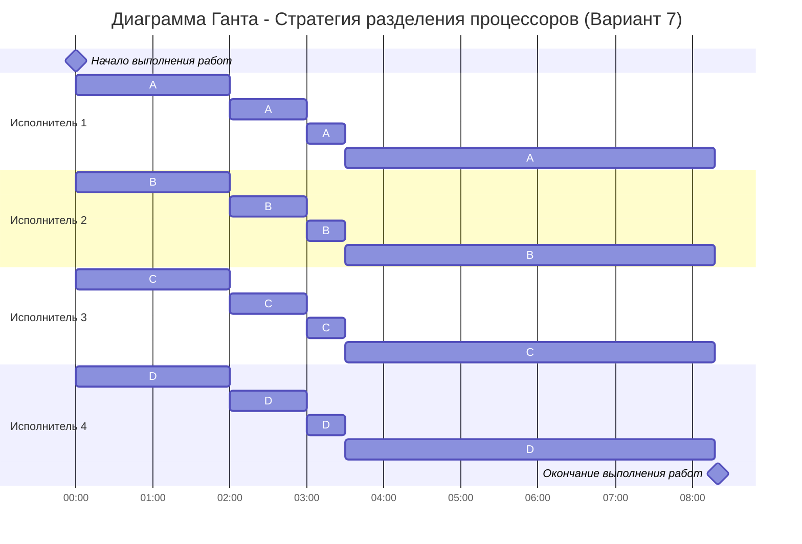

# Задание №5. Вариант №7
**Выполнили:** Окулов Матвей, Игонин Алексей. 

**Команда:** Команда Seeyahh 

---

## Вариант 7:

| Задания      |  A  |  B  |  C  |  D  |  E  |  F  |
|:-------------|:---:|:---:|:---:|:---:|:---:|:---:|
| Длительность | 42  | 36  | 28  | 24  | 20  | 16  |

| Исполнители           |  1  |  2  |  3  |  4  |
|:----------------------|:---:|:---:|:---:|:---:|
| Производительность (p)|  8  |  6  |  4  |  2  |

---

## I этап — расчёт минимальной длительности расписания

Суммарная трудоёмкость всех работ:

$$
42 + 36 + 28 + 24 + 20 + 16 = 166
$$

Суммарная производительность исполнителей:

$$
8 + 6 + 4 + 2 = 20
$$

Минимальная длительность расписания:

$$
T_{min} = \frac{166}{20} = 8{,}3
$$

Минимальное время расписания означает, что все исполнители должны быть загружены без простоев на протяжении примерно **8,3 единицы времени**.

---

## II этап — распределение приоритетов

### Начальное распределение (t = 0)

Согласно правилу приоритетов, самые производительные исполнители назначаются на самые трудоёмкие работы:

- Исполнитель 1 (p = 8) → **A**
- Исполнитель 2 (p = 6) → **B**
- Исполнитель 3 (p = 4) → **C**
- Исполнитель 4 (p = 2) → **D**

Работы **E** и **F** на первом этапе не выполняются.

---

### Определение момента выравнивания приоритетов

Сравним соседние работы:

1. **A = B**  
$$
42 - 8t = 36 - 6t \Rightarrow 6 = 2t \Rightarrow t = 3
$$

2. **B = C**  
$$
36 - 6t = 28 - 4t \Rightarrow 8 = 2t \Rightarrow t = 4
$$

3. **C = D**  
$$
28 - 4t = 24 - 2t \Rightarrow 4 = 2t \Rightarrow t = 2
$$

4. **D = E**  
$$
24 - 2t = 20 \Rightarrow 4 = 2t \Rightarrow t = 2
$$

**Вывод:** первое событие выравнивания — **t = 2**, когда приоритеты C = D = E.

---

## III этап — расчёт ёмкостей работ в момент прерывания

Подставим $$ t = 2 $$

- A: $ 42 - 8 \cdot 2 = 26 $
- B: $ 36 - 6 \cdot 2 = 24 $
- C: $ 28 - 4 \cdot 2 = 20 $
- D: $ 24 - 2 \cdot 2 = 20 $
- E: $ 20 $
- F: $ 16 $

Таким образом, в момент времени **t = 2** приоритеты работ **C, D и E** становятся равными.  

## IV этап — перераспределение исполнителей после момента t = 2

В момент времени t = 2 приоритеты работ имеют следующий вид:

- A = 26  
- B = 24  
- C = D = E = 20  
- F = 16  

Работы A и B имеют наибольшие приоритеты. Работы C, D и E имеют одинаковый приоритет и образуют группу.

Согласно правилу распределения приоритетов:
- исполнитель 1 (p = 8) продолжает выполнять работу A;
- исполнитель 2 (p = 6) продолжает выполнять работу B;
- исполнители 3 (p = 4) и 4 (p = 2) объединяются и назначаются на группу работ C, D и E.

Суммарная производительность группы исполнителей в группе CDE (по 20):

$$
p_{гр} = \frac{(4 + 2)}{3} = 2
$$

Работа F в данный момент не выполняется.

---

## V этап — определение следующего момента перераспределения

После момента t = 2 ёмкости работ изменяются по следующим уравнениям:

## 1. Проверка выравнивания A и B

Ёмкости:  
  - A: 26 − 8·t  
  - B: 24 − 6·t  

Уравнение:

$$
26 - 8 t = 24 - 6 t \Rightarrow 2 = 2 t \Rightarrow t = 1
$$

**Следующий момент выравнивания A и B:** через 1 единицу времени → t = 2 + 1 = 3

---

## 2. Проверка выравнивания B и группы CDE

- Ёмкости:  
  - B: 24 − 6·t 
  - CDE: 20 − 2·t 

Уравнение:

$$
24 - 6 t = 20 - 2 t  
4 = 4 t \Rightarrow t = 1
$$

**Следующий момент выравнивания B и CDE:** также через 1 единицу времени → t = 3

---

## VI этап — расчёт ёмкостей работ в момент t = 3

Подставим $ t = 1 $ в уравнения после предыдущего перераспределения:

- A: $ 26 - 8 \cdot 1 = 18 $
- B: $ 24 - 6 \cdot 1 = 18 $
- C: $ 20 - 2 \cdot 1 = 18 $
- D: $ 20 - 2 \cdot 1 = 18 $
- E: $ 20 - 2 \cdot 1 = 18 $
- F: $ 16 $

В момент времени t = 3 работы A, B, C, D и E сравнялись по приоритетам.

---

## VII этап — перераспределение в момент t = 3

Приоритеты работ:

- A = B = C = D = E = 18  
- F = 16  

Работы A, B, C, D и E образуют группу с одинаковым приоритетом.

Согласно правилу распределения приоритетов:
- все четыре исполнителя назначаются на группу работ A, B, C, D и E;
- работа F в данный момент не выполняется.

---

## VIII этап — момент полного выравнивания приоритетов

Производительность группы исполнителей:

$$
p = 8 + 6 + 4 + 2 = 20
$$

Количество работ в группе — 5, следовательно производительность одной работы:

$$
p_i = \frac{20}{5} = 4
$$

Изменение ёмкостей работ группы:

$$
18 - 4t
$$

Для работы F:
$$
16
$$

Определим момент выравнивания приоритетов:

$$
18 - 4t = 16
$$

$$
4t = 2
$$

$$
t = 0{,}5
$$

В момент времени $ t = 3{,}5 $ приоритеты всех работ сравниваются.

---

## IX этап — полное разделение процессоров

После момента $ t = 3{,}5 $ все 6 работ объединяются в одну группу.

Производительность одной работы:

$$
p_i = \frac{20}{6}
$$

Выполнение продолжается до момента:

$$
T = 8{,}3
$$

ри распределении работ с равным приоритетом между исполнителями важно следить, чтобы одну работу одновременно выполнял только один исполнитель. Поэтому распределяем их по циклической схеме, чтобы не было пересечений. Каждый исполнитель должен работать над каждой из 6 работ одинаковое время в течение оставшихся **8,3 - 3,5 = 4,8** единиц времени.

- Исполнитель 1: A - B - C - D - E - F

- Исполнитель 2: B - C - D - E - F - A

- Исполнитель 3: C - D - E - F - A - B

- Исполнитель 4: D - E - F - A - B - C

---
