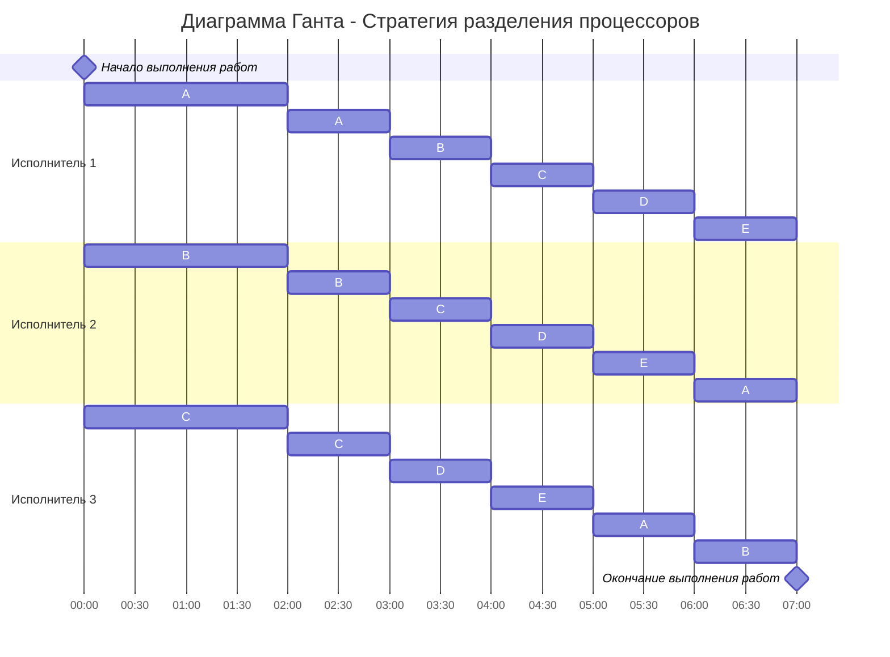

# Задание №5 вариант 2 Lollygag
# Оптимальное расписание. Стратегия разделения процессоров (пятая модельная задача)

### Вариант 2:

| Задания      |  A  |  B  |  C  |  D  |  E  |
|:-------------|:---:|:---:|:---:|:---:|:---:|
| Длительность | 24  |  20 |  16 |  12 | 12  |

| Исполнители           |  1  |  2  |  3  |
|:----------------------|:---:|:---:|:---:|
| Производительность(p) |  6  |  4  |  2  |

### I этап - расчет минимальной длительности расписания

Рассчитаем длительность оптимального расписания для 3 исполнителей и 5 работ по формуле:

$$  
T_{min} = \frac {24 + 20 + 16 + 12 + 12}{6 + 4 + 2} = 7
$$  

Минимальное время расписания предполагает, что в течении 7 мин все исполнители будут работать непрерывно (без простоев).

### II этап - распределение приоритетов

Для дальнейших вычислений будем пользоваться следующими правилами:
1. На работу с самым высоким приоритетом (может быть одна работа или несколько работ с одинаковым приоритетом), назначаем одного или несколько самых производительных исполнителей. Если остались свободные исполнители, назначаем их на работы со следующим приоритетом.
2. Исполнители выполняют работы до тех пор, пока не наступит одно из событий:
- какая-либо работа будет завершена и освободится исполнитель,
- сравняются приоритеты у каких-то работ, если до того эти приоритеты были разные, то есть с изменением приоритетов необходимо переназначить исполнителей на работы согласно пункту 1.

Пользуясь правилом 1, в самом начале исполнитель 1 (с производительностью 6) будет выполнять работу A, исполнитель 2 (с производительностью 4) будет выполнять работу B, исполнитель 3 (с производительностью 2) будет выполнять работу C.

Чтобы рассчитать, когда у работ сравняются приоритеты, сравним соседние работы. Для этого составим линейные уравнения и найдём время, когда работы сравняются по приоритетам. 

1. A=B  
   24 - 6t = 20 - 4t  
   24 - 20 = 6t - 4t  
   4=2t  
   t=2  

2. B=C   
   20 - 4t = 16 - 2t  
   20 - 16 = 4t - 2t  
   4=2t  
   t=2 

2. C=D   
   16 - 2t = 12    
   16 - 12 = 2t  
   4=2t  
   t=2 

### III этап - расчет ёмкостей работ в прерывании 

Подставим получившееся время в уравнение каждой из работ, чтобы понять емкости каждой работы в момент времени t=2.  
Для A: 24 - 6*2 = 12  
Для B: 20 - 4*2 = 12    
Для C: 16 - 2*2 = 12  
D = 12   
E = 12  

Мы получили, что работы A и B, B и C, C и D сравняются по приоритетам в момент времени t=2. Кроме того, ёмкости работ D и E изначально равны по 12 и они еще не выполнялись. Следовательно, после t=2 делим все работы на всех исполнителей: время работы исполнителей делим на равные временные отрезки, количество которых равно количеству работ.

При распределении работ с равным приоритетом между исполнителями важно следить за тем, чтобы одну работу одновременно не выполняли несколько исполнителей, только 1. Поэтому мы распределяем их между исполнителями по циклической схеме, чтобы не было пересечений. Каждый исполнитель должен работать над каждой из пяти работ ровно по 1 минуте в течение оставшихся 5 минут.

Циклическое распределение:

Исполнитель 1: A - B - C - D - E

Исполнитель 2: B - C - D - E - A

Исполнитель 3: C - D - E - A - B

