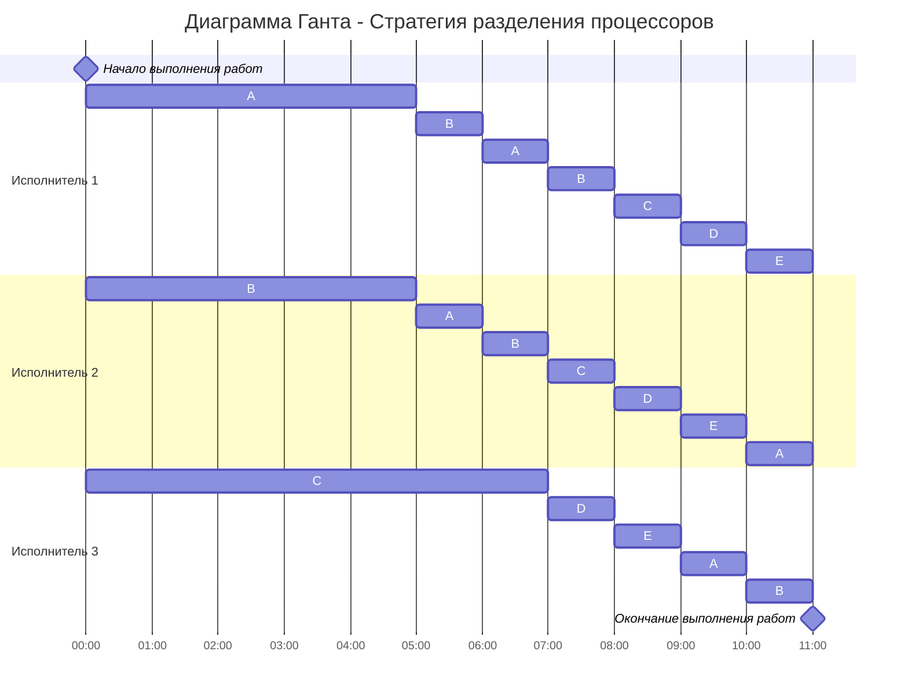

# Вариант 6

| Задания      |  A  |  B  |  C  |  D  |  E  |
|:-------------|:---:|:---:|:---:|:---:|:---:|
| Объем        | 41  |  25 |  15 |  9  |  9  |

| Исполнители           |  1  |  2  |  3  |
|:----------------------|:---:|:---:|:---:|
| Производительность |  6  |  2  |  1  |

## Найдем минимальную длительность расписания

$$
\frac{44 + 25 + 15 + 9 + 9}{6 + 2 + 1} = 11
$$

## Момент времени t = 0
Задания с большим объемом имеют больший приоритет, на задания с большим приоритетом назначаются самые производительные исполнители. Задания с одинаковыми приоритетами объединяются.

---

$A \to P_1$

$B \to P_2$

$C \to P_3$

---

$A: 41 - 6t$

$B: 25 - 2t$

$C: 15 - t$

$DE: 9$

---

Определим, через сколько времени у каких-либо заданий сравняется объем:

---

$A = B$

$41 - 6t = 25 - 2t$

$t = 4$

---

$B = C$

$25 - 2t = 15 - t$

$t = 10$

---

$C = DE$

$15 - t = 9$

$t = 6$

---

Быстрее всего сравняются задания A и B, в t = 4 нужно перераспределение

---

## Момент времени t = 4

| Задания      |  A  |  B  |  C  |  D  |  E  |
|:-------------|:---:|:---:|:---:|:---:|:---:|
| Объем        | 17  |  17 |  11 |  9  |  9  |

---

$AB \to P_1, P_2$

$C \to P_3$

$AB: 17 - \frac{6 + 2}{2}t = 17 - 4t$

$C: 11 - t$

$DE: 9$

---

$AB = C$

$17 - 4t = 11 - t$

$t = 2$

---

$C = DE$

$11 - t = 9$

$t = 2$

---

Через 2 единицы времени (в t = 6) объемы всех работ сравняются

---

## Момент времени t = 6

| Задания      |  A  |  B  |  C  |  D  |  E  |
|:-------------|:---:|:---:|:---:|:---:|:---:|
| Объем        | 9   |  9  |  9  |  9  |  9  |

---

$ABCDE \to P_1, P_2, P_3$

---

## Диаграмма Ганта

