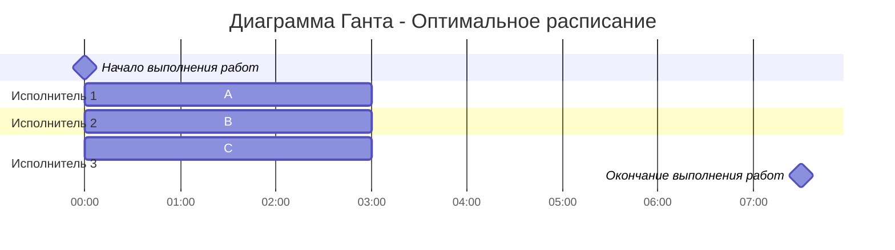
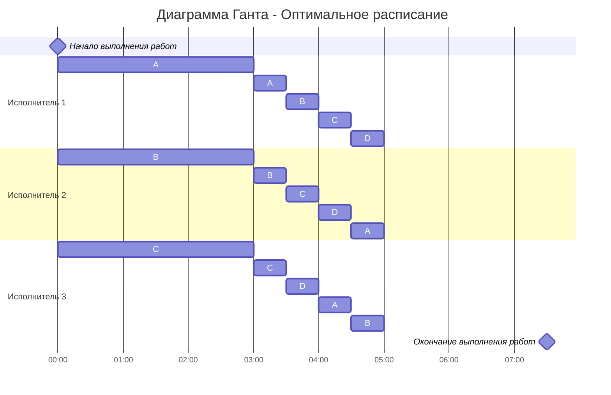
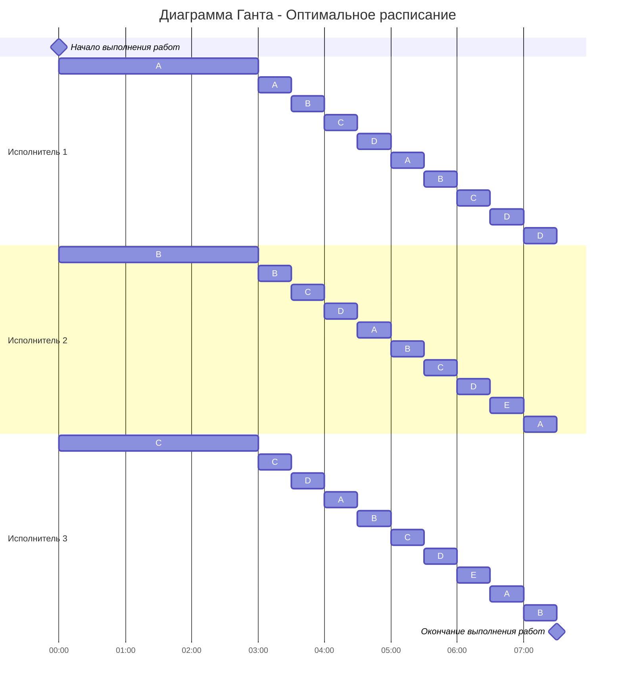

### Вариант 5:

| Задания      |  A  |  B  |  C  |  D  |  E  |
| :----------- | :-: | :-: | :-: | :-: | :-: |
| Длительность | 30  | 24  | 18  | 12  |  6  |

| Исполнители           |  1  |  2  |  3  |
| :-------------------- | :-: | :-: | :-: |
| Производительность(p) |  6  |  4  |  2  |

---

## Для решения задачи используем стратегию разделения процессов

### 1. Найдём минимальную длительность расписания

Используем формулу:

$$
T_{min} = \frac {V_1 + V_2 + ... + V_n}{p_1 + p_2 + ... + p_k}
$$

Подставляем значения из таблиц

$$
T_{min} =\frac{30 + 24 + 18 + 12 + 6}{6 + 4 + 2} = \frac{90}{12} = 7{,}5
$$

Длительность минимального расписания равна 7,5

### 2. Расставляем приоритеты на момент времени t = 0

Основная идея алгоритма:

1. Расставляем приоритеты задачам (чем больше длительность выполнения задачи, тем выше приоритет)
2. Задачу с высоким приоритетом выполняет исполнитель с высокой производительностью
3. ВАЖНО: на приоритетную задачу(и) назначаем столько исполнителей сколько можем

---

Пользуясь идее выше расставляем приоритеты и на самые приоритетные задачи назначаем максимально возможное количество исполнителей

| Задания      |   A   |   B   |   C   |  D  |  E  |
| :----------- | :---: | :---: | :---: | :-: | :-: |
| Длительность |  30   |  24   |  18   | 12  |  6  |
| Приоритеты   |   1   |   2   |   3   |  4  |  5  |
| Исполнители  | $P_1$ | $P_2$ | $P_3$ |  -  |  -  |

### 3. Находим момент времени, когда соседние задачи сравняются по длительности

$A = B$

$30 - 6t = 24 - 4t$

$t = 3$

---

$B = C$

$24 - 4t = 18 - 2t$

$t = 3$

---

$C = D$

$18 - 2t = 12$

$t = 3$

Быстрее всего объёмы A, B и C сравняются при **t = 3**, требуется перераспределение.

#### Промежуточное расписание в виде диаграммы Ганта

---

### 4. Повторяем алгоритм заново для момента времени t = 3

| Задания    |  A  |  B  |  C  |  D  |  E  |
| :--------- | :-: | :-: | :-: | :-: | :-: |
| Объем      | 12  | 12  | 12  | 12  |  6  |
| Приоритеты |  1  |  1  |  1  |  1  |  2  |

$$ABCD \to P_1, P_2, P_3$$

Высчитываем общую производительность трех исполнителей, для этого суммируем их производительности и делим на количество задач:

$$
\frac{6 + 4 + 2}{4} = 3
$$

### 5. Находим момент времени, когда соседние задачи сравняются по длительности

$ABCD = E$

$12 - 3t = 6$

$t = 2$

Через 2 единицы времени (в **t = 5**) все объёмы сравняются.

#### Промежуточное расписание в виде диаграммы Ганта

Для того чтобы отразить, что четыре задачи выполняли три исполнители делим промежуток времени от 3 до 5 на четыре равные части (каждый исполнитель будет тратить на одну задачу 0.5) и назначаем исполнителям задачи по порядки с циклическим сдвигом, т.е.:

Исполнитель 1: A - B - C - D

Исполнитель 2: B - C - D - A

Исполнитель 3: C - D - A - B

---

## 6. Повторяем алгоритм заново для момента времени t = 5

| Задания    |  A  |  B  |  C  |  D  |  E  |
| :--------- | :-: | :-: | :-: | :-: | :-: |
| Объем      |  6  |  6  |  6  |  6  |  6  |
| Приоритеты |  1  |  1  |  1  |  1  |  1  |

Задачи имею одинаковую длительно и следовательно одинаковый приоритет. Назначаем на задачи максимально возможное количество исполнителей.

$ABCDE \to P_1, P_2, P_3$

Высчитываем общую производительность трех исполнителей, для этого суммируем их производительности и делим на количество задач:

$$
\frac{6 + 4 + 2}{5} = 2,4
$$

Для того чтобы отразить, что пять задач выполняли три исполнители делим промежуток времени от 5 до 7.5 на пять равных частей (каждый исполнитель будет тратить на одну задачу 0.5) и назначаем исполнителям задачи по порядки с циклическим сдвигом, т.е.:

Исполнитель 1: A - B - C - D - E

Исполнитель 2: B - C - D - E - A

Исполнитель 3: C - D - E - A - B

---

## Ответ: Итоговая диаграмма Ганта

