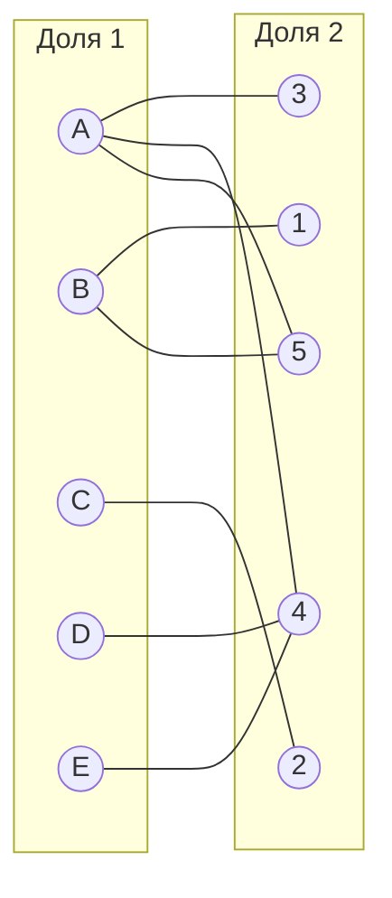
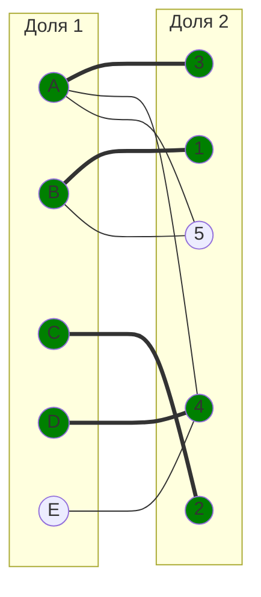
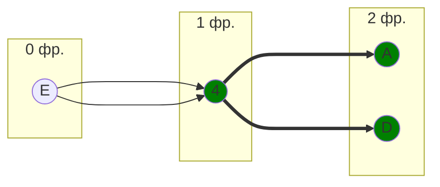
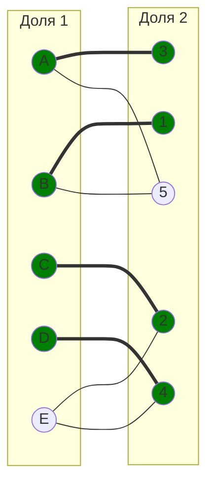
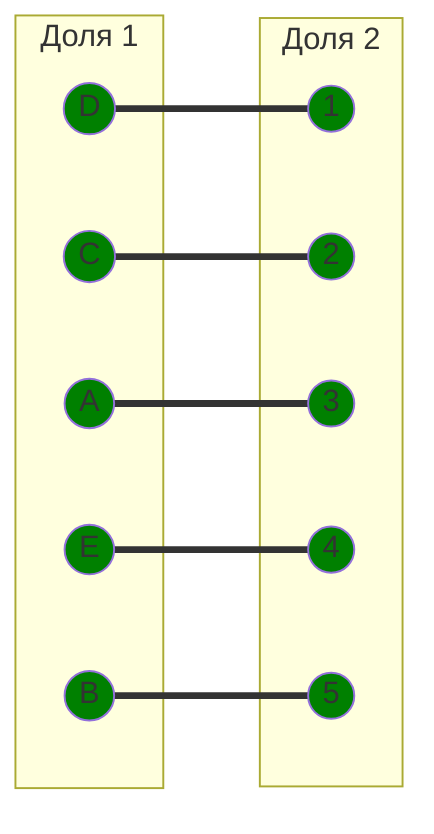

# Задание №8

## Вариант 3

## Решение:
Дана матрица затрат для задач A, B, C, D, E и исполнителей 1, 2, 3, 4, 5:

|       | **1** | **2** | **3** | **4** | **5** |
|-------|:-----:|:-----:|:-----:|:-----:|:-----:|
| **A** |  10   |  10   |   6   |   6   |   7   |
| **B** |   8   |  13   |  14   |  12   |   9   |
| **C** |   9   |   5   |  10   |  12   |   7   |
| **D** |   6   |  11   |  10   |   5   |  14   |
| **E** |  14   |   6   |   8   |   5   |  12   |

### 1) Редукция по строкам  
Вычтем из каждой строки её минимальный элемент:

- A: min = 6 - [4, 4, 0, 0, 1]  
- B: min = 8 - [0, 5, 6, 4, 1]  
- C: min = 5 - [4, 0, 5, 7, 2]  
- D: min = 5 - [1, 6, 5, 0, 9]  
- E: min = 5 - [9, 1, 3, 0, 7]

Получаем:

|       | **1** | **2** | **3** | **4** | **5** |
|-------|:-----:|:-----:|:-----:|:-----:|:-----:|
| **A** |   4   |   4   |   0   |   0   |   1   |
| **B** |   0   |   5   |   6   |   4   |   1   |
| **C** |   4   |   0   |   5   |   7   |   2   |
| **D** |   1   |   6   |   5   |   0   |   9   |
| **E** |   9   |   1   |   3   |   0   |   7   |

### 2) Редукция по столбцам  
Вычтем из каждого столбца его минимальный элемент:

- Столбец 1: min = 0  
- Столбец 2: min = 0  
- Столбец 3: min = 0  
- Столбец 4: min = 0  
- Столбец 5: min = 1 - вычитаем 1 из всех элементов столбца 5

Получаем редуцированную матрицу:

|       | **1** | **2** | **3** | **4** | **5** |
|-------|:-----:|:-----:|:-----:|:-----:|:-----:|
| **A** |   4   |   4   |   0   |   0   |   0   |
| **B** |   0   |   5   |   6   |   4   |   0   |
| **C** |   4   |   0   |   5   |   7   |   1   |
| **D** |   1   |   6   |   5   |   0   |   8   |
| **E** |   9   |   1   |   3   |   0   |   6   |

### 3) Построение двудольного графа нулевых элементов

В качестве начального паросочетания выберем произвольные рёбра: [A,3], [B,1], [C,2], [D,4]. Теперь попробуем расширить его до совершенного паросочетания, используя метод построения чередующихся деревьев.

Построим дерево, начиная с непокрытой вершины E из левой доли.

Обозначим как X все вершины левой доли, которые вошли в построенное дерево, а во множество Y - все вершины правой доли из этого дерева.

$$
X = \{E, A, D\}
$$

$$
Y = \{4\}
$$

Редуцируем строки:

|   | 1 | 2 | 3  | 4  | 5  |
|---|---|---|----|----|----|
| A | 3 | 3 | -1 | -1 | -1 |
| B | 0 | 5 | 6  | 4  | 0  |
| C | 4 | 0 | 5  | 7  | 1  |
| D | 0 | 5 | 4  | -1 | 7  |
| E | 8 | 0 | 2  | -1 | 5  |

Теперь прибавим 1 к столбцу 4 (единственному в Y):

|   | 1 | 2 | 3  | 4 | 5  |
|---|---|---|----|---|----|
| A | 3 | 3 | -1 | 0 | -1 |
| B | 0 | 5 | 6  | 5 | 0  |
| C | 4 | 0 | 5  | 8 | 1  |
| D | 0 | 5 | 4  | 0 | 7  |
| E | 8 | 0 | 2  | 0 | 5  |

Чтобы избежать отрицательных значений, добавим 1 ко всей матрице.

Получаем:

|   | 1 | 2 | 3 | 4 | 5 |
|---|---|---|---|---|---|
| A | 4 | 4 | 0 | 0 | 0 |
| B | 0 | 5 | 6 | 4 | 0 |
| C | 4 | 0 | 5 | 7 | 1 |
| D | 0 | 5 | 4 | 0 | 7 |
| E | 8 | 0 | 2 | 0 | 5 |

Получаем новые рёбра:  
- A - 5 
- E - 2

Найдём минимальный элемент среди всех клеток матрицы, соответствующих строкам из $X$ ($E, A, D$) и столбцам, не вошедшим в $Y$ ($1, 2, 3, 5$). Этот минимальный элемент равен $1$, он находится в строке $A$, столбце $5$ и в строке $E$, столбце $2$.

Проведём пересчёт матрицы: вычтем найденное минимальное значение ($1$) из всех строк, входящих в $X$, и прибавим его ко всем столбцам, входящим в $Y$.

Вершина E теперь может быть соединена с 2, но 2 уже занята C. Однако A может быть переназначена на 5, освобождая 3. Выбираем другое сочетание.

Выбераем новое паросочетание:

Оптимальный выбор:

- A - 3
- B - 5
- C - 2
- D - 1
- E - 4

Все нули, все разные столбцы.

Полученное расписание является совершенным. Выпишем полученные назначения и их стоимости из исходной матрицы. Из этого получаем:

- A3 - 6
- B5 - 9
- C2 - 5
- D1 - 6
- E4 - 5

Сумма затрат = 6 + 9 + 5 + 6 + 5 = 31

**Ответ:**

Итоговая минимальная стоимость затрат составляет **31**, при назначениях:

- задача A, исполнитель 3;
- задача B, исполнитель 5;
- задача C, исполнитель 2;
- задача D, исполнитель 1;
- задача E, исполнитель 4.
