# Вариант 1 - DIVI
# 1. Максимальное паросочетание
Начальные условия:
Исходный двудольный граф:

Начальное паросочетание: [A,5], [E,2] (выделены зеленым)
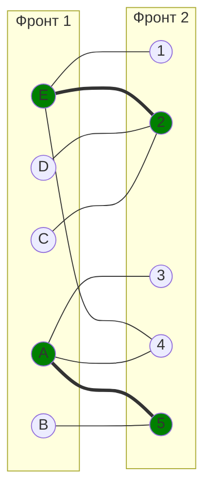

# Шаг 1: Поиск чередующейся цепи
Ищем вершину из доли 1, не покрытую текущим паросочетанием:

Непокрытые вершины в доли 1: B, C, D

Начинаем с вершины B:
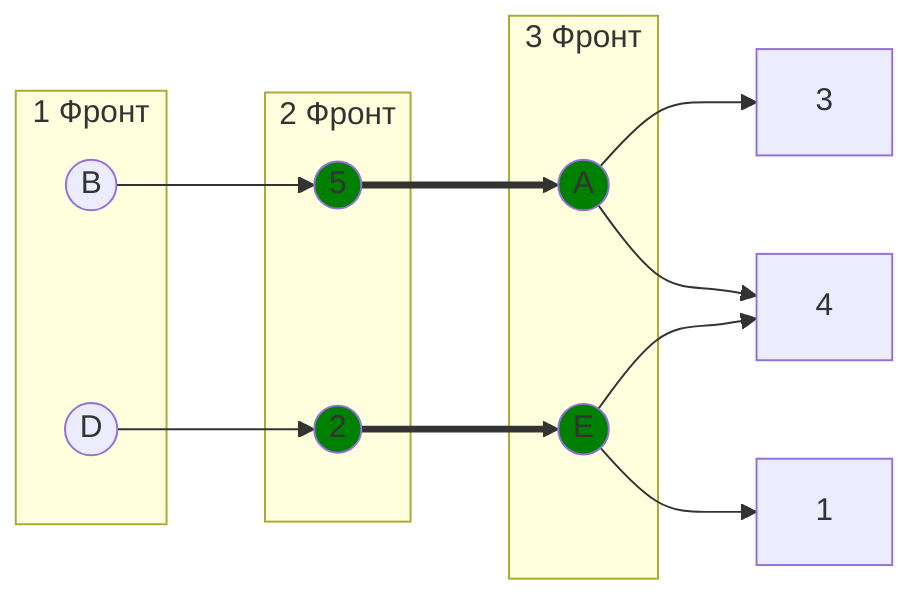
Чередующаяся цепь: B-5-A-3

Ребра B-5, A-3 не в паросочетании

Ребро 5-A в паросочетании

Перекрашиваем ребра: 

Ребра B-5, A-3 в паросочетании
Ребро 5-A не в паросочетании

После перекрашивания паросочетания: [B,5], [A,3], [E,2]  (выделены зеленым)
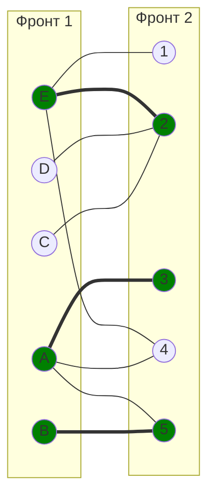

# Шаг 2: Поиск чередующейся цепи относительно паросочетания [B,5], [A,3], [E,2]
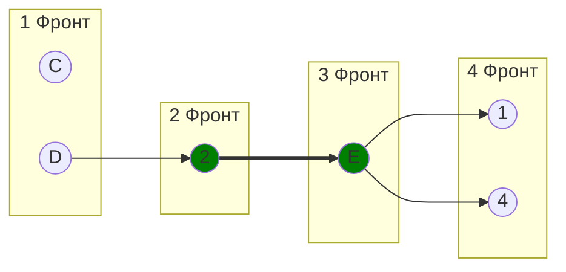
Чередующаяся цепь: C-2-E-1

Ребра C-2, E-1 не в паросочетании

Ребро 2-E в паросочетании

Перекрашиваем ребра: 

Ребра C-2, E-1 в паросочетании
Ребро 2-E не в паросочетании

После перекрашивания паросочетания: [E,1], [C,2], [A,3] [B,5] (выделены зеленым)
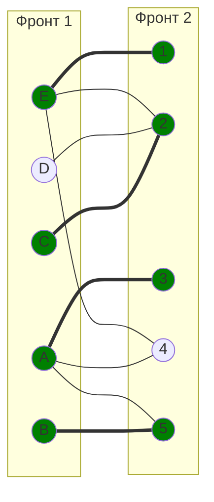

# Шаг 3: Поиск чередующейся цепи относительно паросочетания [E,1], [C,2], [A,3] [B,5]
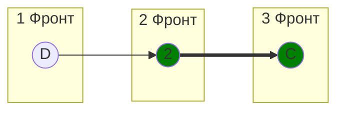
Чередующаяся цепи нет, так как на 4 фронт нет непокрытых вершин, значит, что найденое паросочетание максимальное

# Результат для части 1:
Максимальное паросочетание: [E,1], [C,2], [A,3] [B,5]
Количество ребер: 4 (из 5 возможных)
Непокрытая вершина: D (из доли 1)

# 2. Совершенное паросочетание
Начальные условия:
Исходный двудольный граф:

Доля 1: A, B, C, D, E

Доля 2: 1, 2, 3, 4, 5

Начальное паросочетание: [C,3], [B,4], [E,5] (выделены зеленым)
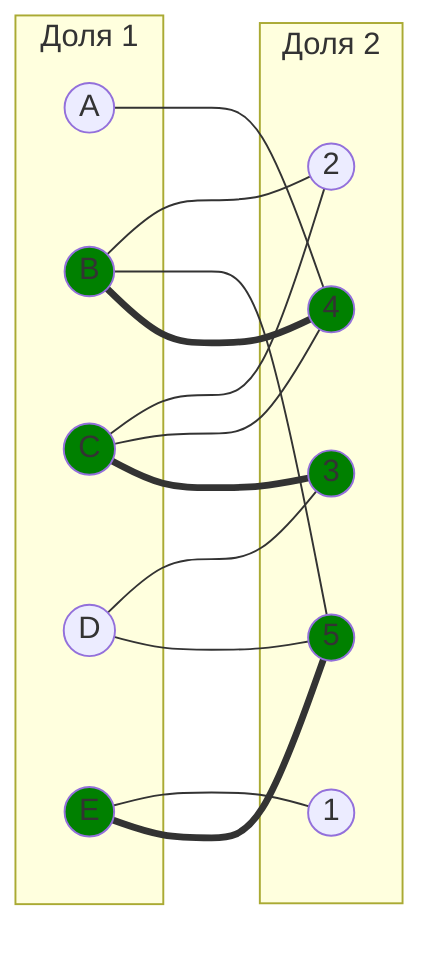
# Шаг 1: Поиск чередующейся цепи
Ищем вершину из доли 1, не покрытую текущим паросочетанием:

Непокрытые вершины в доли 1: A, D

Начинаем с вершины A:
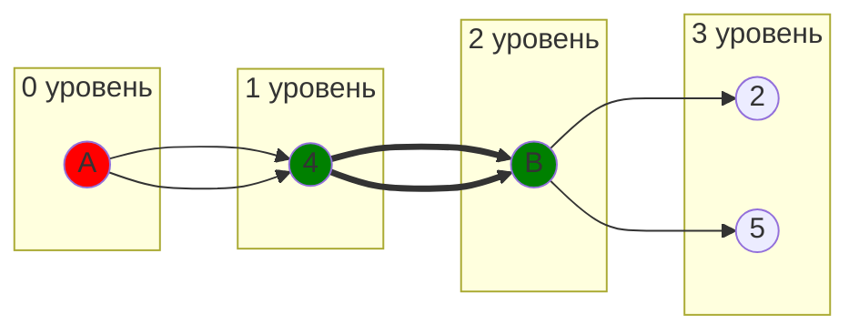
Цепь: A-4-B-2

Ребро A-4 не в паросочетании 

Ребро 4-B в паросочетании 

Ребро B-2 не в паросочетании 

Цепь заканчивается в непокрытой вершине (2) - чередующаяся цепь!

# Шаг 2: Увеличение паросочетания
Инвертируем ребра в цепи A-4-B-2:

Удаляем: [B,4] (было в паросочетании)

Добавляем: [A,4], [B,2] (не было в паросочетании)

Новое паросочетание: [A,4], [B,2], [C,3], [E,5]
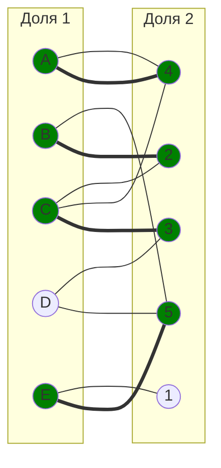

# Шаг 3: Продолжаем поиск
Непокрытые вершины в доли 1: D
Начинаем с вершины D:
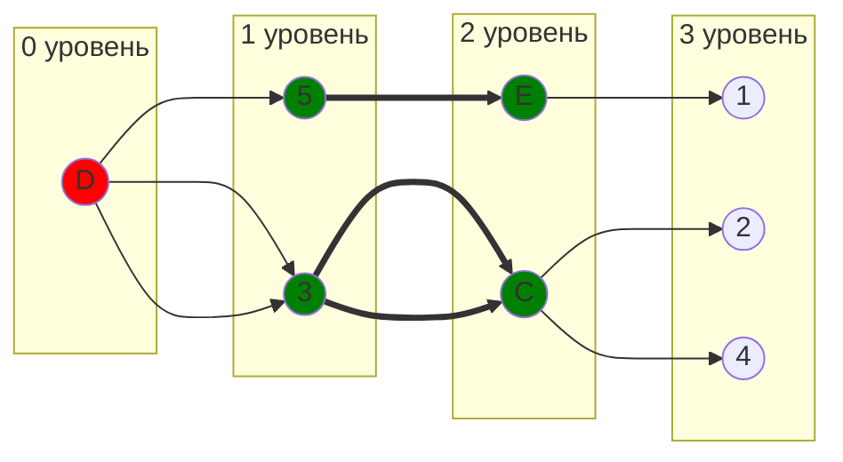

Цепь: D-5-E-1

Ребро D-5 не в паросочетании 

Ребро 5-E в паросочетании 

Ребро E-1 не в паросочетании 

Цепь заканчивается в непокрытой вершине (1) - чередующаяся цепь!

# Шаг 4: Увеличение паросочетания
Инвертируем ребра в цепи D-5-E-1:

Удаляем: [E,5] (было в паросочетании)

Добавляем: [D,5], [E,1] (не было в паросочетании)

Новое паросочетание: [A,4], [B,2], [C,3], [D,5], [E,1]
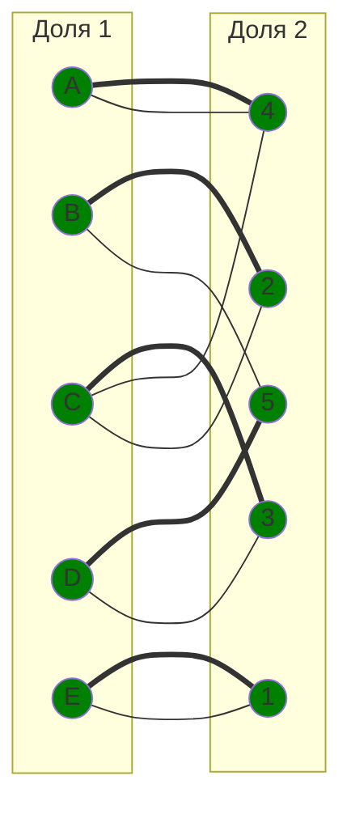
# Результат для части 2:
Совершенное паросочетание: [A,4], [B,2], [C,3], [D,5], [E,1]
Количество ребер: 5 (все вершины покрыты)
Особенность: Все вершины обеих долей покрыты паросочетанием

# Итоговый ответ:
## Максимальное паросочетание: [A,3], [B,5], [C,2], [E,1] (4 ребра)

## Совершенное паросочетание: [A,4], [B,2], [C,3], [D,5], [E,1] (5 ребер, покрыты все вершины)

# Обоснование: 
Для решения задач №1 и №2 мы выбрали алгоритм нахождения максимального паросочетания в двудольном графе с использованием чередующихся цепей.

Теорема Бержа звучит так: Паросочетание в двудольном графе является максимальным тогда и только тогда, когда в этом графе нет цепей, чередующихся относительно паросочетания.

Согласно алгоритму, сначала мы выбираем паросочетание произвольно (начальное условие). А поиск продолжается путем построения увеличивающих цепей, каждая из которых позволяет нарастить текущее паросочетание до тех пор, пока такие цепи существуют в графе.

