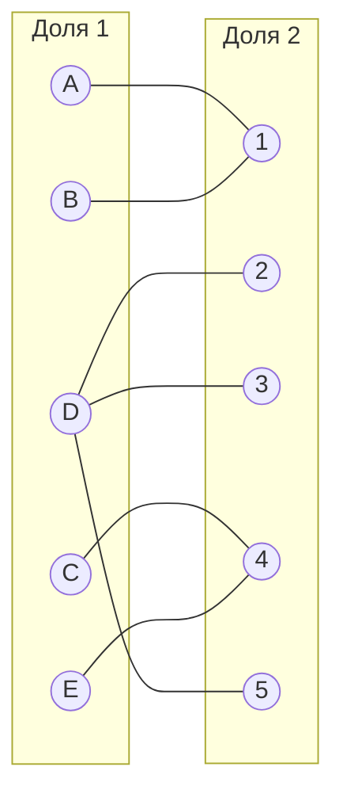
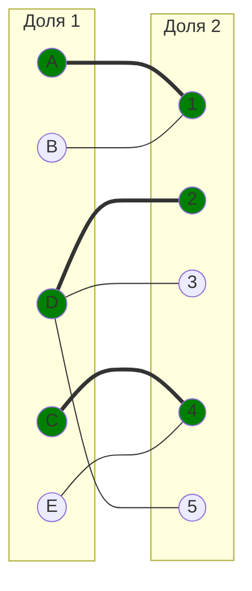
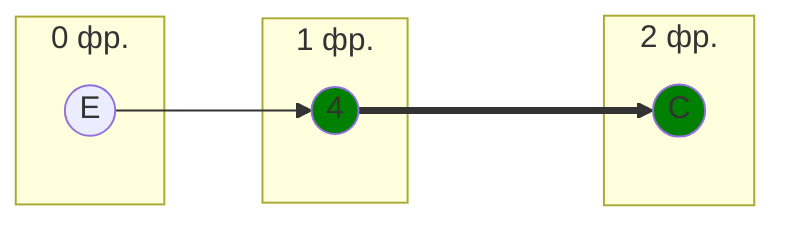
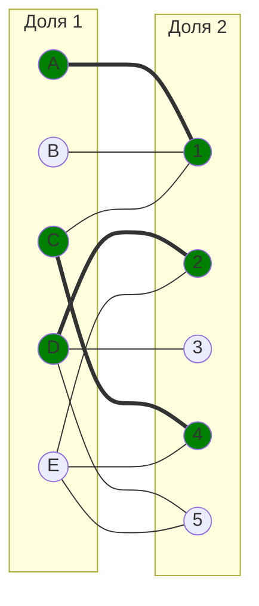
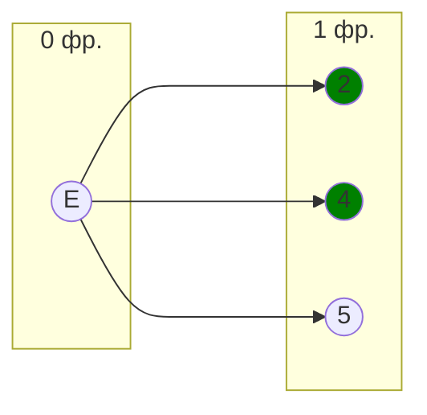
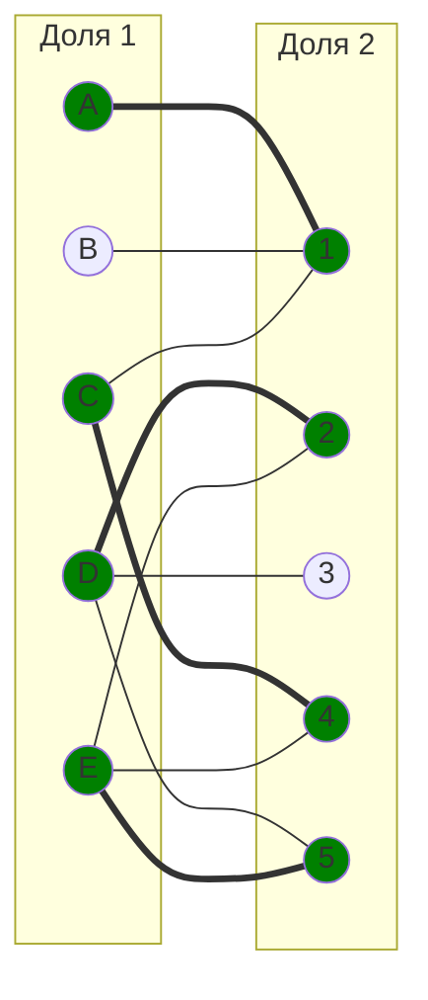
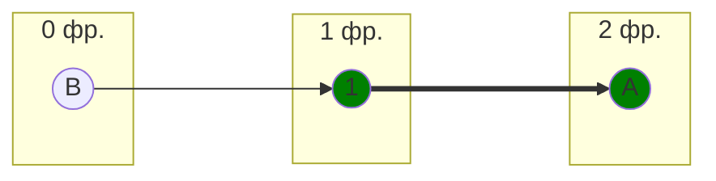
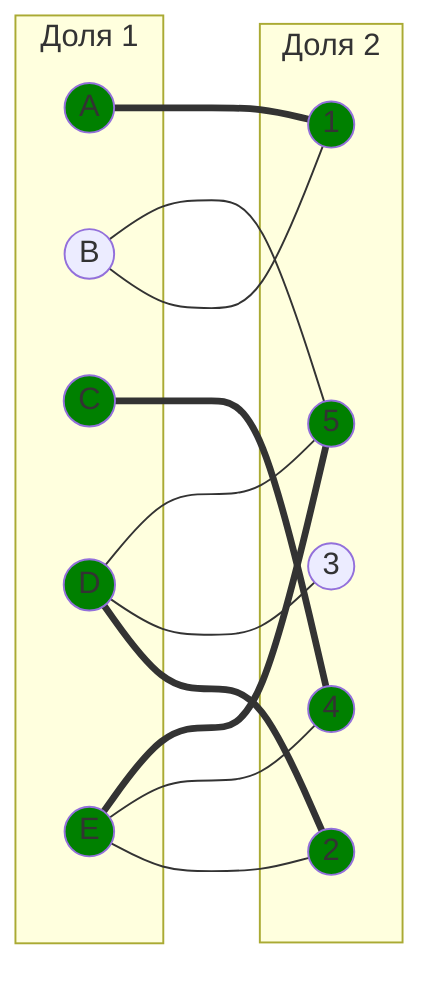
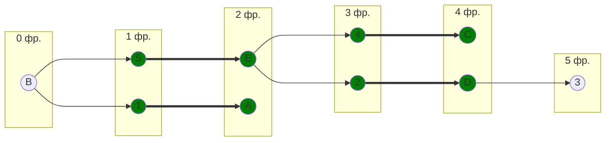
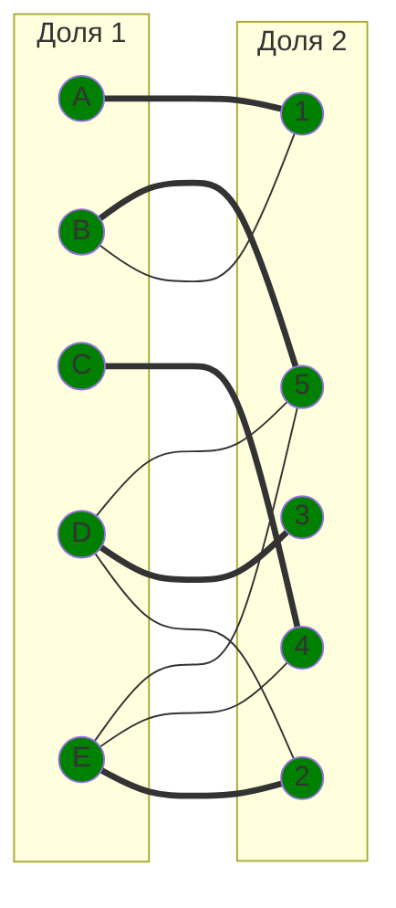

# Вариант 2

Для выполнения задания необходимо: 
1. Решить задачу о назначении с использованием Венгерского алгоритма **строго** так, как было разобрано на занятиях.
2. Оформить решение задачи по шагам с подробными комментариями, таблицами и диаграммами.
3. В ответе указать минимальную сумму затрат на выполнение всех заданий.
4. В ответе вывести найденные назначения

## Задача о назначении
### Постановка задачи:
1. Дан полный двудольный граф, в котором каждое ребро имеет определенную стоимость. Вершины первой доли представляют задачи, вершины второй доли исполнителей. Стоимость ребра определяет затраты при выполнении соответствующей задачи соответствующим исполнителем. 
2. Затраты неотрицательны и представлены в виде матрицы затрат, в которой на пересечении i-й строки и j-го столбца указаны затраты j-го исполнителя на выполнение i-го задания.
3. Необходимо назначить исполнителей на задачи таким образом, чтобы общая стоимость затрат была минимальной.
4. Задача сводится к нахождению совершенного паросочетания с минимальной суммарной стоимостью в двудольном графе.

### Решение
#### Матрица затрат:
|       | **1** | **2** | **3** | **4** | **5** |
|-------|:-----:|:-----:|:-----:|:-----:|:-----:|
| **A** |   7   |  14   |  15   |   8   |   9   |
| **B** |   5   |  13   |   9   |   6   |   6   |
| **C** |   6   |  15   |  14   |   5   |   9   |
| **D** |  13   |   9   |   8   |  10   |   7   |
| **E** |  12   |   8   |  13   |   5   |   6   |

1. Проведем редукцию матрицы затрат. Вычтем из каждой строки минимальное значение, представленное в этой строке.

|       | **1** | **2** | **3** | **4** | **5** | **Min** |
|-------|:-----:|:-----:|:-----:|:-----:|:-----:| :-----: |
| **A** |   0   |  7   |  8   |   1   |   2   | -7 |
| **B** |   0   |  8   |   4   |   1   |   1   | -5 |
| **C** |   1   |  10   |  9   |   0   |   4   | -5 |
| **D** |  6   |   2   |   1   |  3   |   0   | -7 |
| **E** |  7   |   3   |  8   |   0   |   1   | -5 |

После чего вычтем из каждого столбца минимальное значение, представленное в этом столбце.

|       | **1** | **2** | **3** | **4** | **5** |
|-------|:-----:|:-----:|:-----:|:-----:|:-----:|
| **A** |   0   |  5   |  7   |   1   |   2   |
| **B** |   0   |  6   |   3   |   1   |   1   |
| **C** |   1   |  8   |  8   |   0   |   4   |
| **D** |  6   |   0   |   0   |  3   |   0   |
| **E** |  7   |   1   |  7   |   0   |   1   |
| **Min** |  0   |   2   |  1   |   0   |   0   |

Получим редуцированную матрицу, где нули обозначают наименее затратные варианты назначений.

|       | **1** | **2** | **3** | **4** | **5** |
|-------|:-----:|:-----:|:-----:|:-----:|:-----:|
| **A** |   0   |  5   |  7   |   1   |   2   |
| **B** |   0   |  6   |   3   |   1   |   1   |
| **C** |   1   |  8   |  8   |   0   |   4   |
| **D** |  6   |   0   |   0   |  3   |   0   |
| **E** |  7   |   1   |  7   |   0   |   1   |

1. Построим двудольный граф, вынесем на него те ребра, для которых в редуцированной матрице указаны нули.

Выберем произвольное паросочетание $[A, 1]$, $[C, 4]$, $[D, 2]$ и попытаемся построить совершенное паросочетание с помощью чередующихся деревьев.

У нас осталось 2 непокрытые вершины B и E. Попытаемся построить дерево из одной произвольнолй вершины, например E.

В построенном дереве нет цепей, чередующееся относительно текущего паросочетания, ветка закончилась в покрытой вершине, то есть в указанном графе нет совершенного паросочетания.

1. Проведем повторную редукцию матрицы затрат.

Во множество X выпишем все покрытые построенным деревом вершины первой доли графа, во множество Y все покрытые построенным деревом вершины из второй доли графа.

$$
X = \{E, C\}
$$

$$
Y = \{4 \}
$$

Необходимо найти минимальный элемент из строк, включенных во множество X и столбцов, не включенных во множество Y. В нашем случае это будут строки E, C и столбцы 1, 2, 3, 5. Минимальный элемент 1, расположен в строке C и столбце 1, в строке E и столбце 2, в строке E и столбце 5. В 4 столбце к строкам A, B и D необходимо прибавить 1.

Вычтем найденное значение из строк множества X и прибавим к столбцам множества Y:

|       | **1** | **2** | **3** | **4** | **5** |      |
|-------|:-----:|:-----:|:-----:|:-----:|:-----:|:-----:|
| **A** |   0   |  5   |  7   |   2   |   2   |      |
| **B** |   0   |  6   |   3   |   2   |   1   |      |
| **C** |   0   |  7   |  7   |   0   |   3   |   -1   |
| **D** |  6   |   0   |   0   |  4   |   0   |      |
| **E** |  6   |   0   |  6   |   0   |   0   |   -1   |
|       |     |      |     |   +1   |      |      |

У нас появилось 3 новых ребра C1, E2, E5.

Попытаемся построить дерево из одной произвольнолй вершины, например E.

Найдена чередующаяся цепь E5. Необходимо выполнить перекрашивание цепи и выделить новые паросочетания.

У нас остается 1 непокрытая вершина B. 

В построенном дереве нет цепей, чередующееся относительно текущего паросочетания, ветка закончилась в покрытой вершине, то есть в указанном графе нет совершенного паросочетания.

1. Проведем повторную редукцию матрицы затрат.

Во множество X выпишем все покрытые построенным деревом вершины первой доли графа, во множество Y все покрытые построенным деревом вершины из второй доли графа.

$$
X = \{A, B\}
$$

$$
Y = \{1 \}
$$

Необходимо найти минимальный элемент из строк, включенных во множество X и столбцов, не включенных во множество Y. В нашем случае это будут строки B, A и столбцы 2, 3, 4, 5. Минимальный элемент 1, расположен в строке B и столбце 5. В 1 столбце к строкам C, D и E необходимо прибавить 1.

Вычтем найденное значение из строк множества X и прибавим к столбцам множества Y:

|       | **1** | **2** | **3** | **4** | **5** |      |
|-------|:-----:|:-----:|:-----:|:-----:|:-----:|:-----:|
| **A** |   0   |  4   |  6   |   1   |   1   |   -1   |
| **B** |   0   |  5   |   2   |   1   |   0   |   -1   |
| **C** |   1   |  7   |  7   |   0   |   3   |      |
| **D** |  7   |   0   |   0   |  4   |   0   |      |
| **E** |  7   |   0   |  6   |   0   |   0   |      |
|       |  +1  |      |     |      |      |      |

У нас появилось новое ребро B5.

Мы получили чередующуюся цепь B5 - E2 - D3. Выполняем перекрашивание цепи и выделяем новое паросочетание.

Полученное расписание является совершенным. Выпишем полученные назначения и их стоимости из исходной матрицы:
- A1 - 7
- B5 - 6
- C4 - 5
- D3 - 8
- E2 - 8

Общая стоимость затрат = 7 + 6 + 5 + 8 + 8 = 34.

## Ответ
Минимальная стоимость затрат 34, при следующих назначениях:
- задача A, исполнитель 1,
- задача B, исполнитель 5,
- задача C, исполнитель 4,
- задача D, исполнитель 3,
- задача E, исполнитель 2.