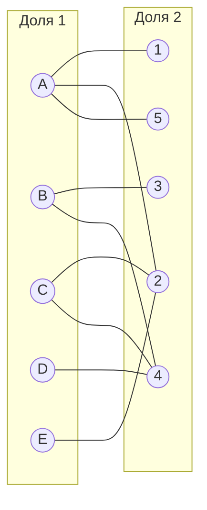
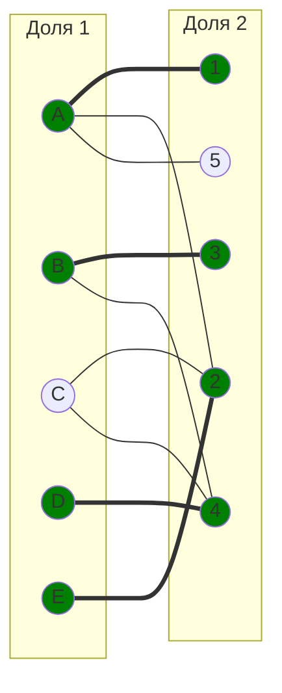
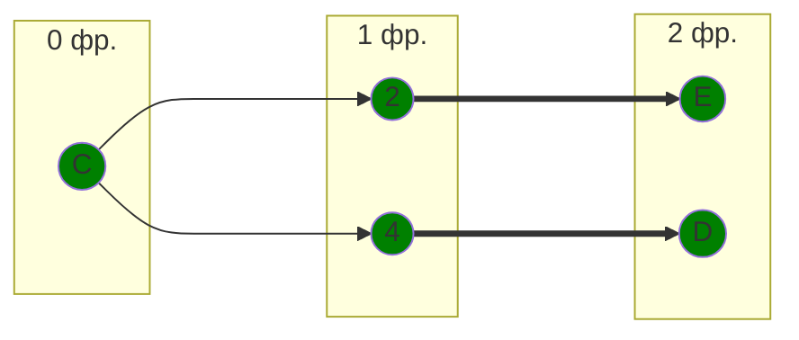
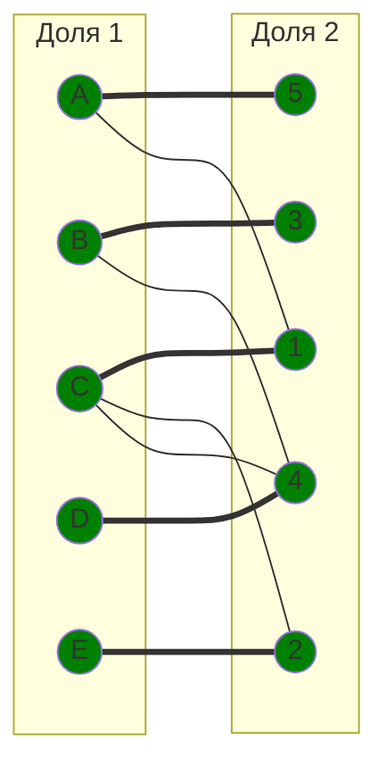
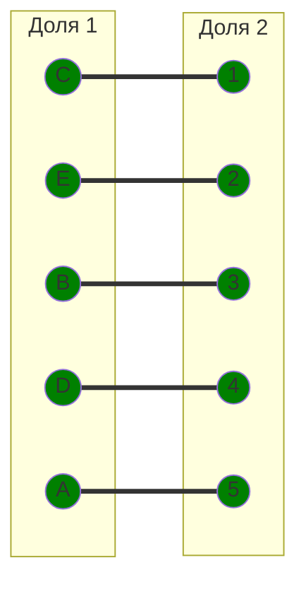

# Задание №8

## Команда: Seeyahh
Выполнили: Окулов Матвей, Игонин Алексей

## Вариант 7

## Решение:
Дана матрица затрат для задач A, B, C, D, E и исполнителей 1, 2, 3, 4, 5:

|       | **1** | **2** | **3** | **4** | **5** |
|-------|:-----:|:-----:|:-----:|:-----:|:-----:|
| **A** |   9   |   7   |  12   |   8   |   7   |
| **B** |  12   |  15   |  10   |   8   |  14   |
| **C** |   8   |   5   |  10   |   5   |   8   |
| **D** |  11   |  10   |  14   |   6   |  11   |
| **E** |  12   |   7   |  12   |  12   |  12   |

1) Редукция матрицы затрат по строкам. Вычтем из всех значений строки минимум (минимальное значение во всей строке).

*(Минимумы: A=7, B=8, C=5, D=6, E=7)*

|       | **1** | **2** | **3** | **4** | **5** |
|-------|:-----:|:-----:|:-----:|:-----:|:-----:|
| **A** |   2   |   0   |   5   |   1   |   0   |
| **B** |   4   |   7   |   2   |   0   |   6   |
| **C** |   3   |   0   |   5   |   0   |   3   |
| **D** |   5   |   4   |   8   |   0   |   5   |
| **E** |   5   |   0   |   5   |   5   |   5   |

2) Редукция матрицы затрат по столбцам. Вычтем из всех значений стобца минимум (минимальное значение столбца)

*(Минимумы: 1=2, 2=0, 3=2, 4=0, 5=0)*

|       | **1** | **2** | **3** | **4** | **5** |
|-------|:-----:|:-----:|:-----:|:-----:|:-----:|
| **A** |   0   |   0   |   3   |   1   |   0   |
| **B** |   2   |   7   |   0   |   0   |   6   |
| **C** |   1   |   0   |   3   |   0   |   3   |
| **D** |   3   |   4   |   6   |   0   |   5   |
| **E** |   3   |   0   |   3   |   5   |   5   |

Если в столбцах были нули, редукция не изменит значения

Получим редуцированную матрицу, в которой нули являются самыми малыми по затратам возможными назначениями.

3) Построим **двудольный граф**, перенеся на него только ребра, соответсивующие наименьшим затратам в редуцированной матрице.

Начальное паросочетание — **произвольные рёбра**: [A,1], [B,3], [D,4], [E,2]. Теперь попробуем расширить его до совершенного паросочетания, используя **метод построения чередующихся деревьев**.

Построим дерево, начиная с **непокрытой вершины** C из левой доли.

Множества X и Y

X — вершины левой доли в построенном дереве, Y  — все вершины правой доли из этого дерева.

$$
X = \{C, E, D\}
$$

$$
Y = \{2, 4\}
$$

Найдём **минимальный элемент** среди всех клеток матрицы, соответствующих строкам из X {C, E, D} и столбцам, не вошедшим в Y {1, 3, 5}. Этот минимальный элемент равен 1, он находится в строке C, столбце 1.

Проведём пересчёт матрицы: вычтем найденное минимальное значение (1) из всех строк, входящих в X, и прибавим его ко всем столбцам, входящим в Y.

Редуцируем строки:

|       | **1** | **2** | **3** | **4** | **5** |
|-------|:-----:|:-----:|:-----:|:-----:|:-----:|
| **A** |   0   |   1   |   3   |   2   |   0   |
| **B** |   2   |   8   |   0   |   1   |   6   |
| **C** |   0   |   0   |   2   |   0   |   2   |
| **D** |   2   |   4   |   5   |   0   |   4   |
| **E** |   2   |   0   |   2   |   5   |   4   |

Получаем новое ребро C -> 1. Так как 1 было занято A, а A имеет свободное ребро A -> 5 (сохранился 0), получаем увеличивающую цепь C -> 1 -> A -> 5.

**Итоговое паросочетание:** 

Так как покрыты все вершины, расписание является **совершенным**. 

Стоимости назначений:
- A-5 — 7
- B-3 — 10
- C-1 — 8
- D-4 — 6
- E-2 — 7

Сумма затрат:

 7 + 10 + 8 + 6 + 7 = 38

## Ответ:
**Итоговая минимальная стоимость затрат составляет 38**

Назначение:
- задача C, исполнитель 1;
- задача E, исполнитель 2;
- задача B, исполнитель 3;
- задача D, исполнитель 4;
- задача A, исполнитель 5.