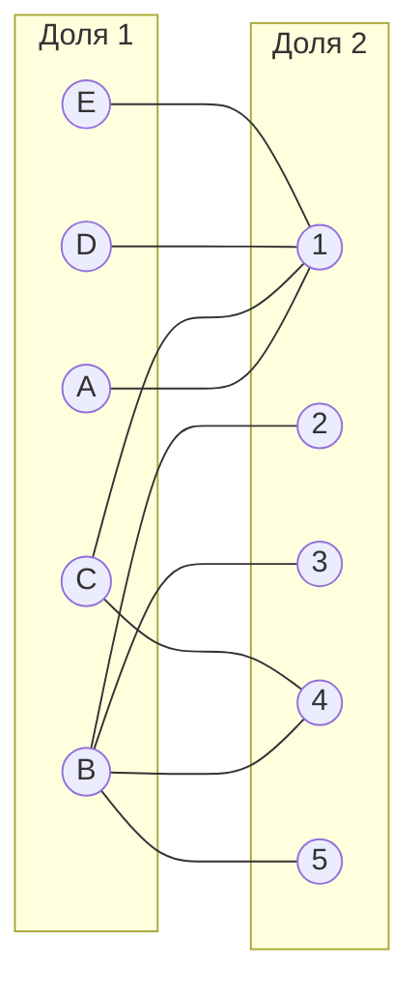
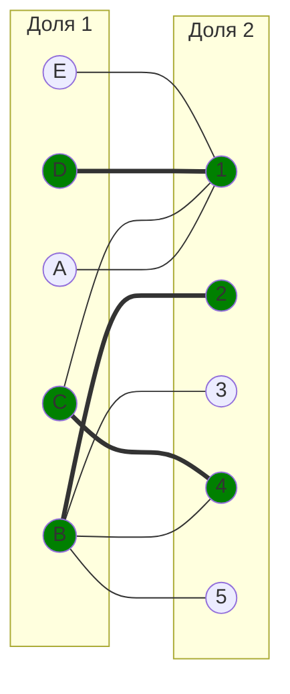
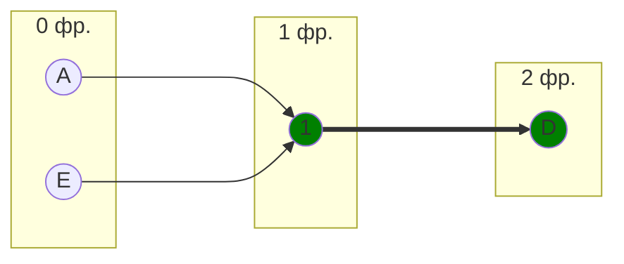
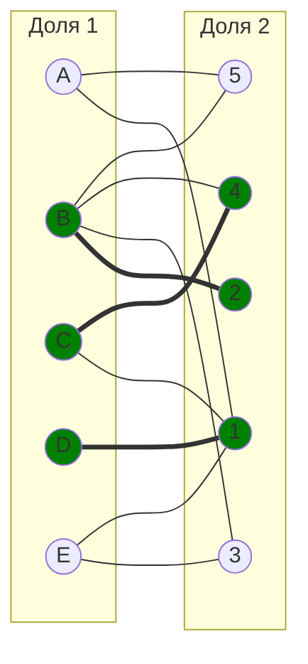
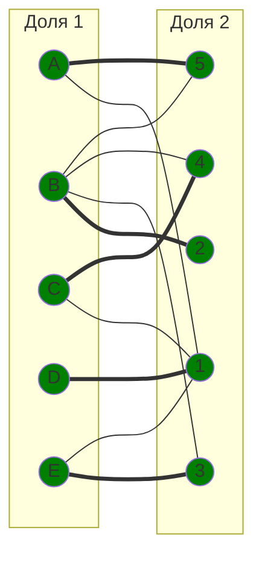
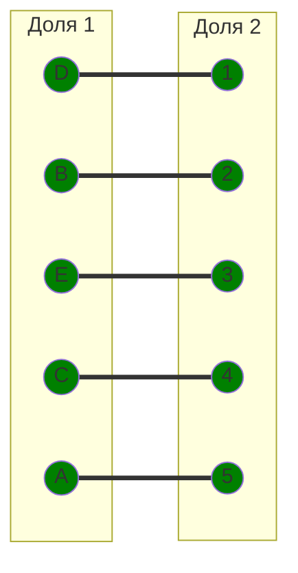

# Задание №8

## Вариант 5

## Решение:
Дана матрица затрат для задач A, B, C, D, E и исполнителей 1, 2, 3, 4, 5:
|       | **1** | **2** | **3** | **4** | **5** |
|-------|:-----:|:-----:|:-----:|:-----:|:-----:|
| **A** |   6   |  10   |  14   |  11   |   7   |
| **B** |  18   |  11   |  11   |  11   |  11   |
| **C** |   5   |  19   |  14   |   5   |   8   |
| **D** |   8   |  15   |  16   |  17   |  20   |
| **E** |   8   |  10   |   9   |  13   |  15   |

1) Проведем редукцию матрицы затрат по строкам. Вычтем из каждой строки минимальное значение этой строки.

|       | **1** | **2** | **3** | **4** | **5** |
|-------|:-----:|:-----:|:-----:|:-----:|:-----:|
| **A** |   0   |   4   |   8   |   5   |   1   |
| **B** |   7   |   0   |   0   |   0   |   0   |
| **C** |   0   |   14  |   9   |   0   |   3   |
| **D** |   0   |   7   |   8   |   9   |  12   |
| **E** |   0   |   2   |   1   |   5   |   7   |

2) После этого проведем редукцию матрицы затрат по столбцам. Вычтем из каждого столбца минимальное значение этого столбца.

|       | **1** | **2** | **3** | **4** | **5** |
|-------|:-----:|:-----:|:-----:|:-----:|:-----:|
| **A** |   0   |   4   |   8   |   5   |   1   |
| **B** |   7   |   0   |   0   |   0   |   0   |
| **C** |   0   |  14   |   9   |   0   |   3   |
| **D** |   0   |   7   |   8   |   9   |  12   |
| **E** |   0   |   2   |   1   |   5   |   7   |

Для тех столбцов где были нули редукция не изменит значений.

Получим **редуцированную матрицу**, в которой нулевые элементы соответствуют наименее затратным возможным назначениям.

3) Построим **двудольный граф**, перенеся на него только те рёбра, которые в редуцированной матрице имеют **нулевой вес**.

В качестве начального паросочетания выберем **произвольные рёбра**: [B,2], [C,4], [D,1]. Теперь попробуем расширить его до совершенного паросочетания, используя **метод построения чередующихся деревьев**.

Построим дерево, начиная с **непокрытых вершин** A и Е из левой доли.

Обозначим как X все вершины левой доли, которые вошли в построенное дерево, а во множество Y все вершины правой доли из этого дерева.
$$
X = \{A, D, E\}
$$

$$
Y = \{1 \}
$$

Найдём **минимальный элемент** среди всех клеток матрицы, соответствующих строкам из X {A, D, E} и столбцам, не вошедшим в Y {2, 3, 4, 5}. Этот минимальный элемент равен 1, он находится в строке A, столбце 5.

Проведём пересчёт матрицы: вычтем найденное минимальное значение (1) из всех строк, входящих в X, и прибавим его ко всем столбцам, входящим в Y.

Редуцируем строки

|       | **1** | **2** | **3** | **4** | **5** |
|-------|:-----:|:-----:|:-----:|:-----:|:-----:|
| **A** |   0   |   3   |   7   |   4   |   0   |
| **B** |   8   |   0   |   0   |   0   |   0   |
| **C** |   1   |  14   |   9   |   0   |   3   |
| **D** |   0   |   6   |   7   |   8   |  11   |
| **E** |   0   |   1   |   0   |   4   |   6   |

получаем новые ребра А -> 5 и Е -> 3

Вершины новых ребер не включены в паросочетание, поэтому мы можем добавить эти ребра в паросочетание

**Итоговое паросочетание:** 

Полученное расписание является **совершенным**. Если выпишем полученные назначения и их стоимости из исходной матрицы то получим:
- A5 - 7
- B2 - 11
- C4 - 5
- D1 - 8
- E3 - 9

Сумма затрат = 7 + 11 + 5 + 8 + 9 = 40

## Ответ:
**Итоговая минимальная стоимость затрат** составляет 40, при назначениях:
- задача D, исполнитель 1;
- задача B, исполнитель 2;
- задача E, исполнитель 3;
- задача C, исполнитель 4;
- задача A, исполнитель 5.