# Задание №8

## Вариант 5

## Решение:
Дана матрица затрат для задач A, B, C, D, E и исполнителей 1, 2, 3, 4, 5:
|       | **1** | **2** | **3** | **4** | **5** |
|-------|:-----:|:-----:|:-----:|:-----:|:-----:|
| **A** |   9   |   9   |   7   |  12   |  16   |
| **B** |  12   |  15   |  15   |  10   |   9   |
| **C** |  11   |  14   |   9   |   6   |   4   |
| **D** |  11   |  10   |   7   |  15   |   5   |
| **E** |  14   |  14   |  10   |   8   |  13   |

1) Проведем редукцию матрицы затрат по строкам. Вычтем из каждой строки минимальное значение этой строки.

|       | **1** | **2** | **3** | **4** | **5** |
|-------|:-----:|:-----:|:-----:|:-----:|:-----:|
| **A** |   2   |   2   |   0   |   5   |   9   |
| **B** |   3   |   6   |   6   |   1   |   0   |
| **C** |   7   |   10  |   5   |   2   |   0   |
| **D** |   6   |   5   |   2   |  10   |   0   |
| **E** |   6   |   6   |   2   |   0   |   5   |

2) После этого проведем редукцию матрицы затрат по столбцам. Вычтем из каждого столбца минимальное значение этого столбца.

|       | **1** | **2** | **3** | **4** | **5** |
|-------|:-----:|:-----:|:-----:|:-----:|:-----:|
| **A** |   0   |   0   |   0   |   5   |   9   |
| **B** |   1   |   4   |   6   |   1   |   0   |
| **C** |   5   |   8   |   5   |   2   |   0   |
| **D** |   4   |   3   |   2   |  10   |   0   |
| **E** |   4   |   4   |   2   |   0   |   5   |

Для тех столбцов где были нули редукция не изменит значений.

Получим **редуцированную матрицу**, в которой нулевые элементы соответствуют наименее затратным возможным назначениям.

3) Построим **двудольный граф**, перенеся на него только те рёбра, которые в редуцированной матрице имеют **нулевой вес**.

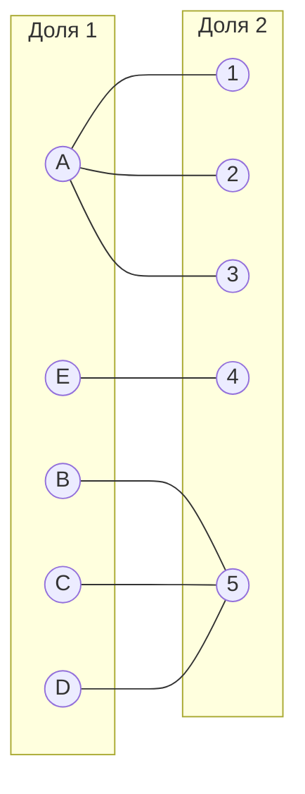
4. В качестве начального паросочетания выберем **произвольные рёбра**: [A,1], [E,4], [B,5]. Теперь попробуем расширить его до совершенного паросочетания, используя **метод построения чередующихся деревьев**.

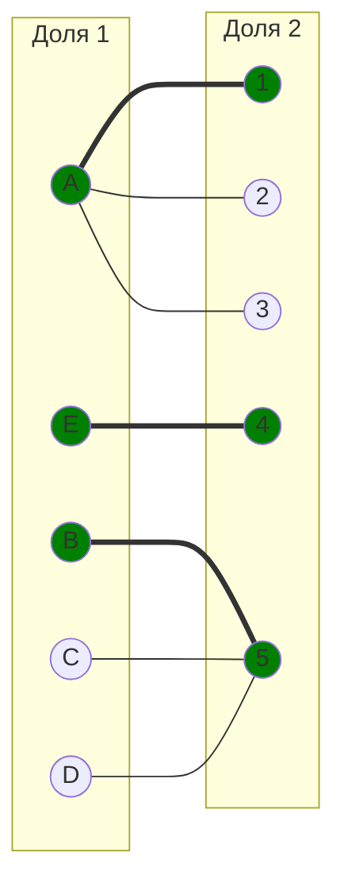

5. Построим дерево, начиная с **непокрытой вершины** C из левой доли.

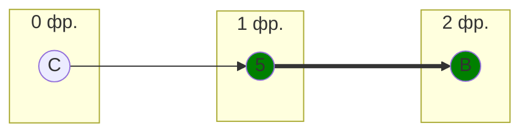
6. Обозначим как X все вершины левой доли, которые вошли в построенное дерево, а во множество Y все вершины правой доли из этого дерева.
$$
X = \{B, C\}
$$

$$
Y = \{5 \}
$$

Найдём **минимальный элемент** среди всех клеток матрицы, соответствующих строкам из X {B, C} и столбцам, не вошедшим в Y {1, 2, 3, 4}. Этот минимальный элемент равен 1, он находится в строке B, столбце 1.

Проведём пересчёт матрицы: вычтем найденное минимальное значение (1) из всех строк, входящих в X, и прибавим его ко всем столбцам, входящим в Y.

Редуцируем по строкам

|       | **1** | **2** | **3** | **4** | **5** |
|-------|:-----:|:-----:|:-----:|:-----:|:-----:|
| **A** |   0   |   0   |   0   |   5   |   9   |
| **B** |   0   |   3   |   5   |   0   |   -1   |
| **C** |   4   |   7   |   4   |   1   |   -1   |
| **D** |   4   |   3   |   2   |  10   |   0   |
| **E** |   4   |   4   |   2   |   0   |   5   |

Добавляем 1 в столбец 5

|       | **1** | **2** | **3** | **4** | **5** |
|-------|:-----:|:-----:|:-----:|:-----:|:-----:|
| **A** |   0   |   0   |   0   |   5   |  10   |
| **B** |   0   |   3   |   5   |   0   |   0   |
| **C** |   4   |   7   |   4   |   1   |   0   |
| **D** |   4   |   3   |   2   |  10   |   1   |
| **E** |   4   |   4   |   2   |   0   |   6   |

7. Получаем новые ребра B -> 1 и B -> 4, ребро D -> 5 исчезает, корректируем граф

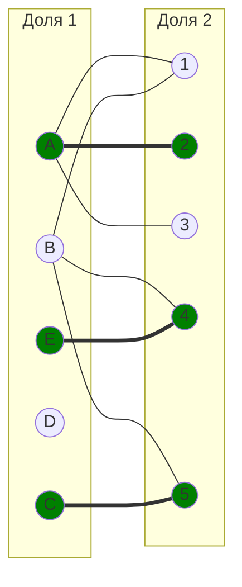

8. Строим дерево из непокрытой вершины С из левой доли 

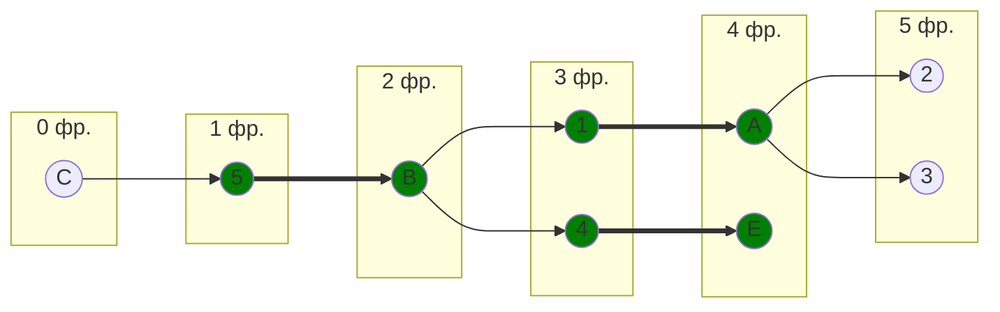

9. В дереве есть чередующаяся цепь (C - 5 = B - 1 = A - 2), ее перекрашиваем и корректируем паросочетание

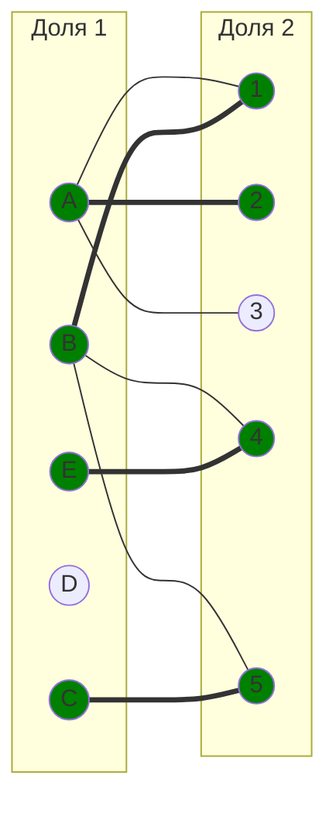
10. Строим дерево из оставшейся вершины D

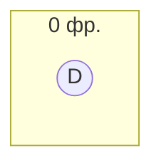

11. Обозначим как X все вершины левой доли, которые вошли в построенное дерево, а во множество Y все вершины правой доли из этого дерева.
$$
X = \{D\}
$$

$$
Y = \{ \}
$$

Найдём **минимальный элемент** среди всех клеток матрицы, соответствующих строкам из X {D} и столбцам, не вошедшим в Y {1, 2, 3, 4, 5}. Этот минимальный элемент равен 1, он находится в строке D, столбце 5.

12. Проведём пересчёт матрицы: вычтем найденное минимальное значение (1) из всех строк, входящих в X, и прибавим его ко всем столбцам, входящим в Y.

Редуцируем по строке

|       | **1** | **2** | **3** | **4** | **5** |
|-------|:-----:|:-----:|:-----:|:-----:|:-----:|
| **A** |   0   |   0   |   0   |   5   |  10   |
| **B** |   0   |   3   |   5   |   0   |   0   |
| **C** |   4   |   7   |   4   |   1   |   0   |
| **D** |   3   |   2   |   1   |   9   |   0   |
| **E** |   4   |   4   |   2   |   0   |   6   |

13. Появилось ребро D - 5, корректируем граф

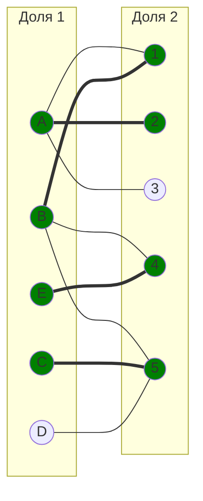

14. Строим дерево из оставшейся вершины D

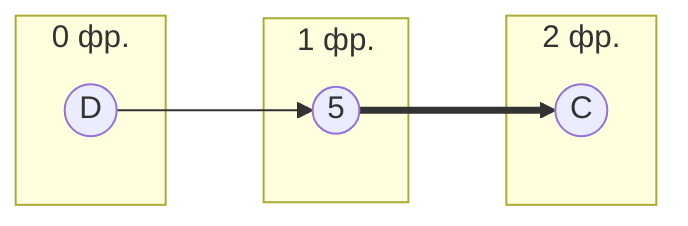

15. Обозначим как X все вершины левой доли, которые вошли в построенное дерево, а во множество Y все вершины правой доли из этого дерева.
$$
X = \{C, D\}
$$

$$
Y = \{5 \}
$$

Найдём **минимальный элемент** среди всех клеток матрицы, соответствующих строкам из X {C, D} и столбцам, не вошедшим в Y {1, 2, 3, 4}. Этот минимальный элемент равен 1, он находится в строке D, столбце 3.

Проведём пересчёт матрицы: вычтем найденное минимальное значение (1) из всех строк, входящих в X, и прибавим его ко всем столбцам, входящим в Y.

Редуцируем по строкам

|       | **1** | **2** | **3** | **4** | **5** |
|-------|:-----:|:-----:|:-----:|:-----:|:-----:|
| **A** |   0   |   0   |   0   |   5   |  10   |
| **B** |   0   |   3   |   5   |   0   |   0   |
| **C** |   3   |   6   |   3   |   0   |   -1   |
| **D** |   2   |   1   |   0   |   8   |   -1   |
| **E** |   4   |   4   |   2   |   0   |   6   |

Добавляем 1 в столбец 5

|       | **1** | **2** | **3** | **4** | **5** |
|-------|:-----:|:-----:|:-----:|:-----:|:-----:|
| **A** |   0   |   0   |   0   |   5   |  11   |
| **B** |   0   |   3   |   5   |   0   |   1   |
| **C** |   3   |   6   |   3   |   0   |   0   |
| **D** |   2   |   1   |   0   |   8   |   0   |
| **E** |   4   |   4   |   2   |   0   |   7   |

16. Добавились ребра C-4 и D-3, исчезло ребро B-5, корректируем граф

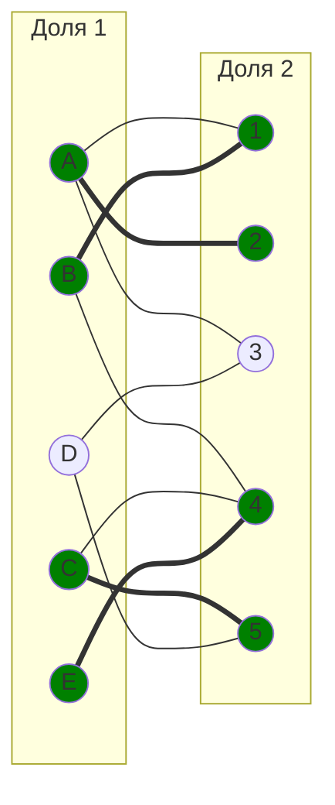

17. Строим дерево из оставшейся вершины D

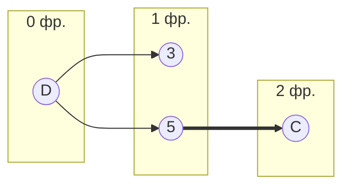

18. В дереве есть чередующаяся цепь D - 3, ее перекрашиваем, корректируем паросочетание

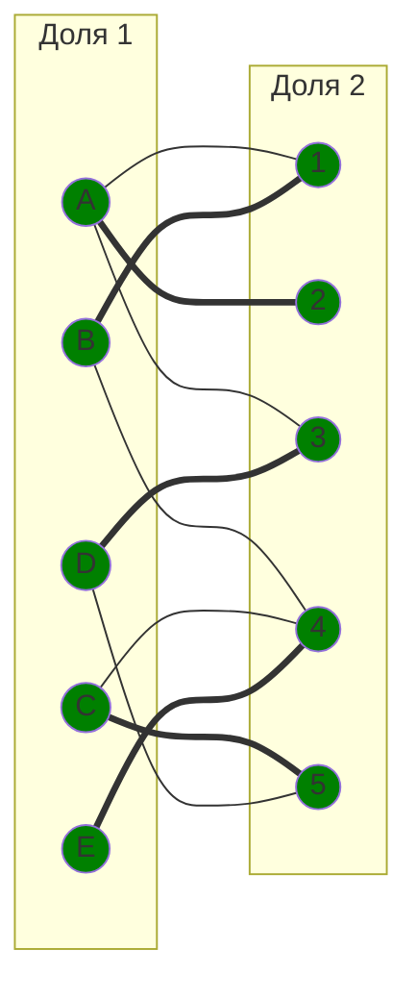
19. Все вершины покрыты, мы пришли к ответу:

**Итоговое паросочетание:** 

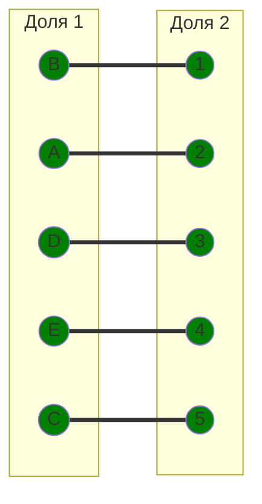
Полученное расписание является **совершенным**. Если выпишем полученные назначения и их стоимости из исходной матрицы то получим:
- A2 - 9
- B1 - 12
- C5 - 4
- D3 - 7
- E4 - 8

Сумма затрат = 9 + 12 + 4 + 7 + 8 = 40

## Ответ:
**Итоговая минимальная стоимость затрат** составляет 40, при назначениях:
- задача B, исполнитель 1;
- задача A, исполнитель 2;
- задача D, исполнитель 3;
- задача E, исполнитель 4;
- задача C, исполнитель 5.