# Вариант 8

Дана матрица затрат для задач A, B, C, D, E и исполнителей 1, 2, 3, 4, 5:

|       | **1** | **2** | **3** | **4** | **5** |
|-------|:-----:|:-----:|:-----:|:-----:|:-----:|
| **A** |   9   |  10   |  12   |  10   |   6   |
| **B** |  10   |  10   |  11   |   9   |   7   |
| **C** |  11   |  14   |  12   |  10   |   5   |
| **D** |   6   |   6   |  13   |  11   |  13   |
| **E** |  11   |  11   |  12   |  10   |   5   |

1. Проведем редукцию матрицы затрат. Вычтем из каждой строки минимальное значение, представленное в этой строке.

|       | **1** | **2** | **3** | **4** | **5** |         |
|-------|:-----:|:-----:|:-----:|:-----:|:-----:|:-------:|
| **A** |   9   |  10   |  12   |  10   |   6   |   -6    |
| **B** |  10   |  10   |  11   |   9   |   7   |   -7    |
| **C** |  11   |  14   |  12   |  10   |   5   |   -5    |
| **D** |   6   |   6   |  13   |  11   |  13   |   -6    |
| **E** |  11   |  11   |  12   |  10   |   5   |   -5    |

После чего вычтем из каждого столбца минимальное значение, представленное в этом столбце.

|       | **1** | **2** | **3** | **4** | **5** |
|-------|:-----:|:-----:|:-----:|:-----:|:-----:|
| **A** |   3   |   4   |   6   |   4   |   0   |
| **B** |   3   |   3   |   4   |   2   |   0   |
| **C** |   6   |   9   |   7   |   5   |   0   |
| **D** |   0   |   0   |   7   |   5   |   7   |
| **E** |   6   |   6   |   7   |   5   |   0   |
|       |   0   |   0   |  -4   |  -2   |   0   |

Получим редуцированную матрицу, где нули обозначают наименее затратные варианты назначений.

|       | **1** | **2** | **3** | **4** | **5** |
|-------|:-----:|:-----:|:-----:|:-----:|:-----:|
| **A** |   3   |   4   |   2   |   2   |   0   |
| **B** |   3   |   3   |   0   |   0   |   0   |
| **C** |   6   |   9   |   3   |   3   |   0   |
| **D** |   0   |   0   |   3   |   3   |   7   |
| **E** |   6   |   6   |   3   |   3   |   0   |

2. Построим двудольный граф, вынесем на него те ребра, для которых в редуцированной матрице указаны нули.

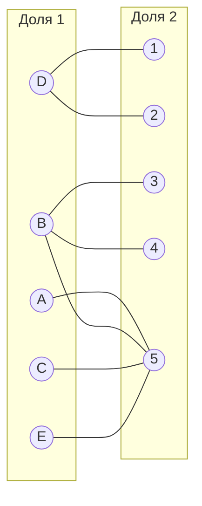

Выберем произвольное паросочетание $[B, 3]$, $[D, 1]$, $[E, 5]$ и попытаемся построить совершенное паросочетание с помощью чередующихся деревьев.

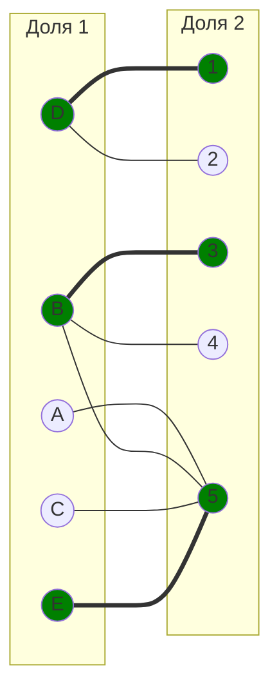

Попытаемся построить дерево из непокрытой вершины A.

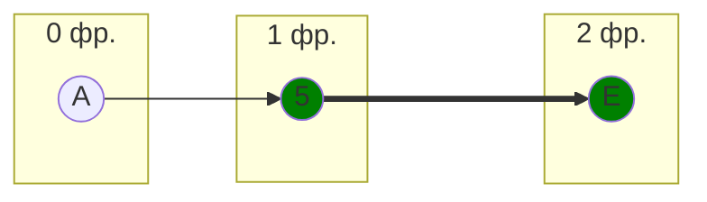

(Дерево из вершины C будет аналогичным и закончится в вершине E)

В построенном дереве нет цепей, чередующихся относительно текущего паросочетания, ветка закончилась в покрытой вершине, то есть в указанном графе нет совершенного паросочетания.

3. Проведем повторную редукцию матрицы затрат.

Во множество X выпишем все **покрытые построенным деревом** вершины первой доли графа, во множество Y все **покрытые построенным деревом** вершины из второй доли графа.

$$
X = \{A, E\}
$$

$$
Y = \{5 \}
$$

Необходимо найти минимальный элемент из строк, включенных во множество X и столбцов, не включенных во множество Y. В нашем случае это будут строки A, E и столбцы 1, 2, 3, 4. Минимальный элемент 2, расположен в строке A и столбце 3. 

Вычтем найденное значение из строк множества X и прибавим к столбцам множества Y:

|       | **1** | **2** | **3** | **4** | **5** |       |
|-------|:-----:|:-----:|:-----:|:-----:|:-----:|:-----:|
| **A** |   1   |   2   |   0   |   0   |   0   |  -2   |
| **B** |   3   |   3   |   0   |   0   |   2   |       |
| **C** |   6   |   9   |   3   |   3   |   2   |       |
| **D** |   0   |   0   |   3   |   3   |   9   |       |
| **E** |   4   |   4   |   1   |   1   |   0   |  -2   |
|       |       |       |       |       |  +2   |       |

В ячейках A3, A4 появились новые нулевые значения, добавим соответствующие ребра в двудольный граф.

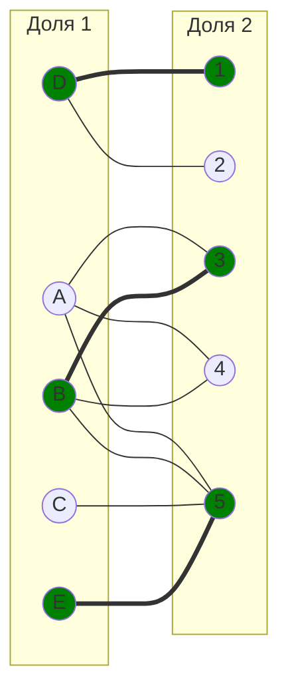

Добавим ребро A4 в начальное паросочетание:

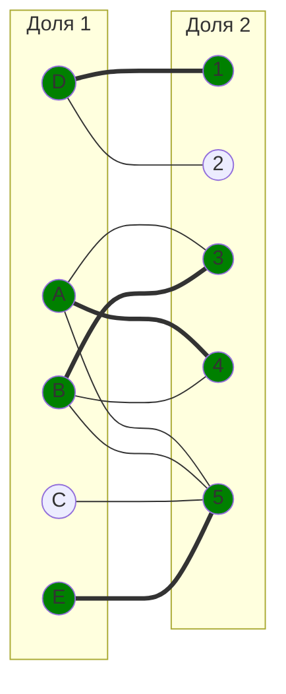

4. Попытаемся построить совершенное паросочетание с помощью чередующихся деревьев.

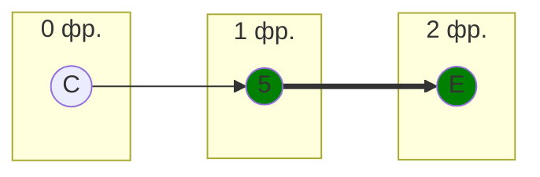
В построенном дереве нет цепей, чередующихся относительно текущего паросочетания, ветка закончилась в покрытой вершине, то есть в указанном графе нет совершенного паросочетания.

5. Проведем повторную редукцию матрицы затрат.

Во множество X выпишем все **покрытые построенным деревом** вершины первой доли графа, во множество Y все **покрытые построенным деревом** вершины из второй доли графа.

$$
X = \{C, E\}
$$

$$
Y = \{5 \}
$$

Необходимо найти минимальный элемент из строк, включенных во множество X и столбцов, не включенных во множество Y. В нашем случае это будут строки C, E и столбцы 1, 2, 3, 4. Минимальный элемент 1, расположен в строке E и столбце 3. 

Вычтем найденное значение из строк множества X и прибавим к столбцам множества Y:

|       | **1** | **2** | **3** | **4** | **5** |       |
|-------|:-----:|:-----:|:-----:|:-----:|:-----:|:-----:|
| **A** |   1   |   2   |   0   |   0   |   1   |       |
| **B** |   3   |   3   |   0   |   0   |   3   |       |
| **C** |   5   |   8   |   2   |   2   |   2   |  -1   |
| **D** |   0   |   0   |   3   |   3   |  10   |       |
| **E** |   3   |   3   |   0   |   0   |   0   |  -1   |
|       |       |       |       |       |  +1   |       |

В ячейках E3, E4 появились новые нулевые значения, добавим соответствующие ребра в двудольный граф.

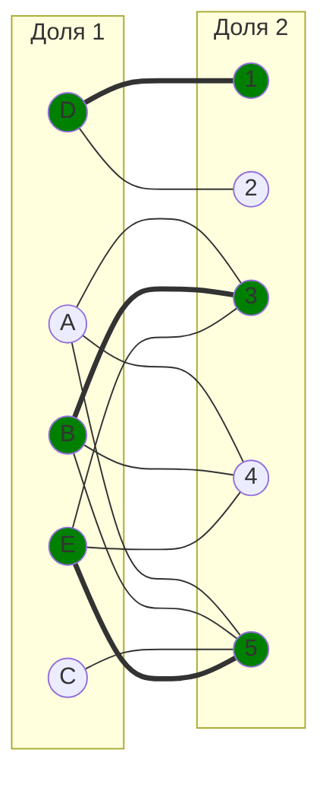

6. Попытаемся построить совершенное паросочетание с помощью чередующихся деревьев.

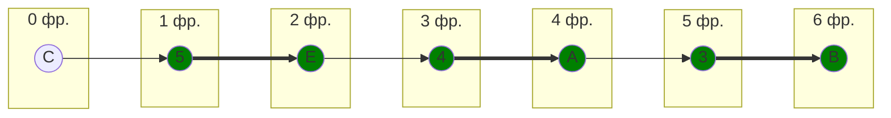

В построенном дереве нет цепей, чередующихся относительно текущего паросочетания, ветка закончилась в покрытой вершине, то есть в указанном графе нет совершенного паросочетания.

7. Проведем повторную редукцию матрицы затрат.

Во множество X выпишем все **покрытые построенным деревом** вершины первой доли графа, во множество Y все **покрытые построенным деревом** вершины из второй доли графа.

$$
X = \{A, B, C, E\}
$$

$$
Y = \{3, 4, 5 \}
$$

Необходимо найти минимальный элемент из строк, включенных во множество X и столбцов, не включенных во множество Y. В нашем случае это будут строки A, B, C, E и столбцы 1, 2. Минимальный элемент 1, расположен в строке A и столбце 1. 

Вычтем найденное значение из строк множества X и прибавим к столбцам множества Y:

|       | **1** | **2** | **3** | **4** | **5** |       |
|-------|:-----:|:-----:|:-----:|:-----:|:-----:|:-----:|
| **A** |   0   |   1   |   0   |   0   |   1   |  -1   |
| **B** |   2   |   2   |   0   |   0   |   3   |  -1   |
| **C** |   4   |   7   |   2   |   2   |   2   |  -1   |
| **D** |   0   |   0   |   4   |   4   |  11   |       |
| **E** |   2   |   2   |   0   |   0   |   0   |  -1   |
|       |       |       |  +1   |  +1   |  +1   |       |

В ячейке A1 появилось новое нулевое значение, добавим соответствующее ребро в двудольный граф.

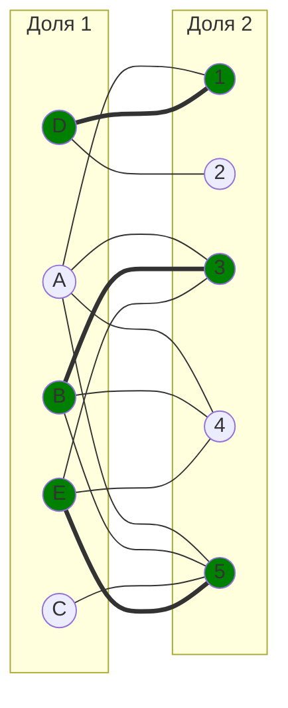

8. Попытаемся построить совершенное паросочетание с помощью чередующихся деревьев.

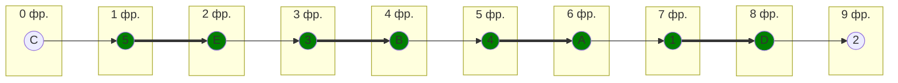

Построенное дерево содержит чередующуюся, относительно текущего паросочетания, цепь C5 - 5E - E3 - 3B - B4 - 4A - A1 - 1D - D2, цепь начинается и заканчивается в непокрытых вершинах, все ребра в цепи чередуются по вхождению в текущее паросочетание.

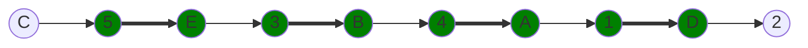

"Перекрасим" найденную цепь и проверим полученное паросочетание.

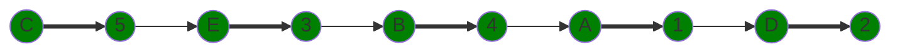

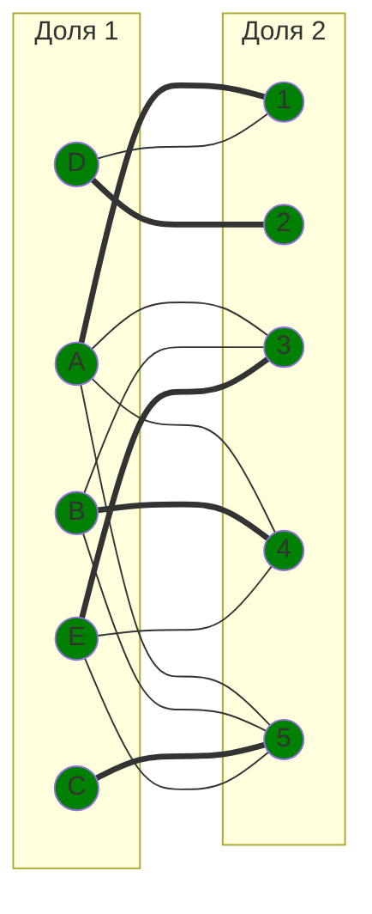

Полученное расписание является совершенным. Выпишем полученные назначения и их стоимости из исходной матрицы:
- C5 - 5
- E3 - 12
- B4 - 9
- A1 - 9
- D2 - 6

Общая стоимость затрат = 5 + 12 + 9 + 9 + 6 = 41.

## Ответ
Минимальная стоимость затрат 41, при следующих назначениях:
- задача C, исполнитель 5,
- задача E, исполнитель 3,
- задача B, исполнитель 4,
- задача A, исполнитель 1,
- задача D, исполнитель 2.

