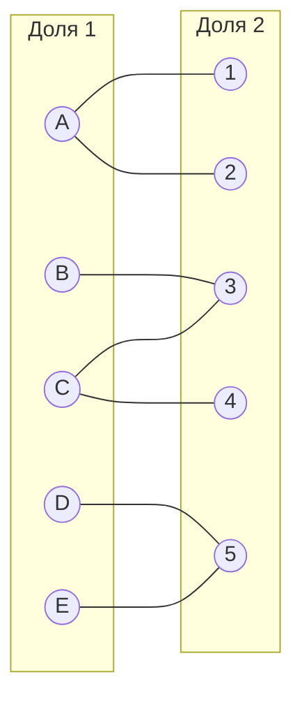
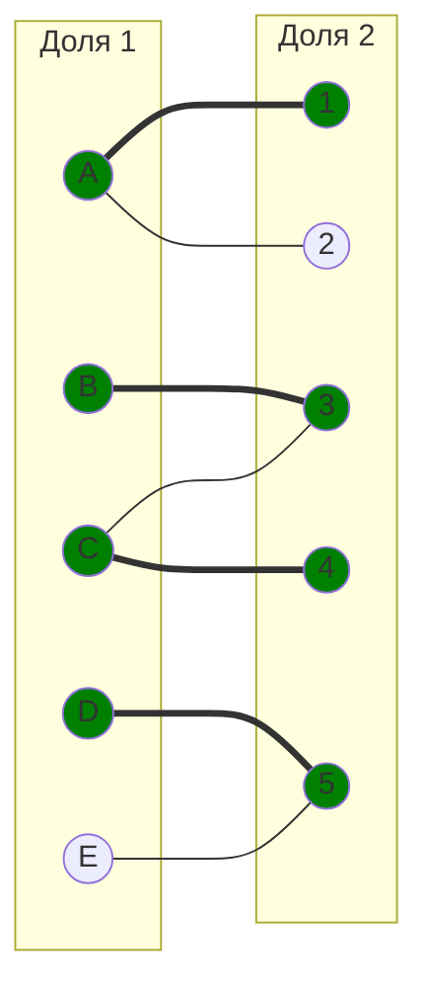
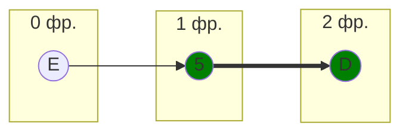
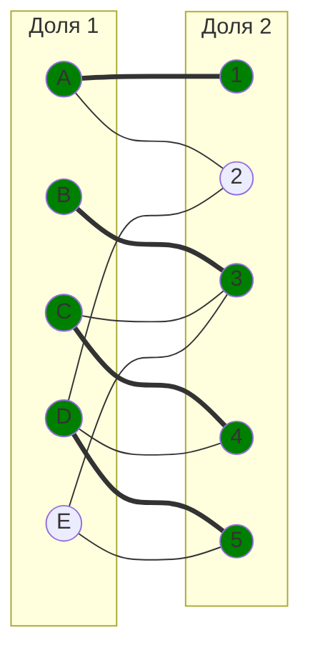
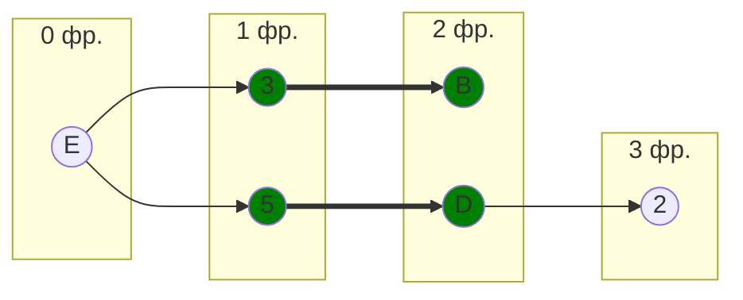
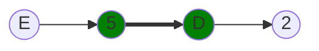
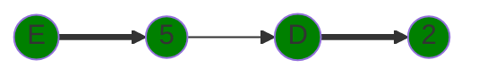
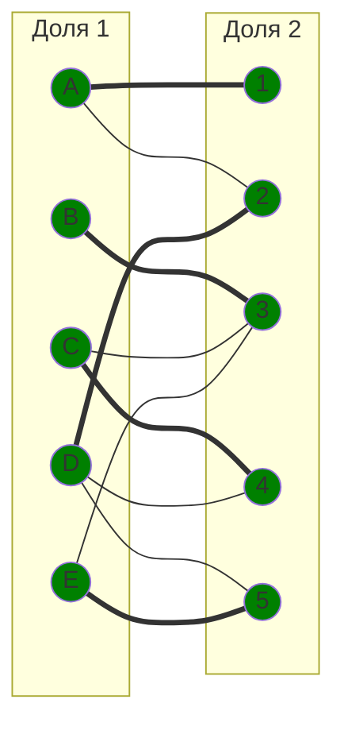

## Вариант 4:

### Матрица затрат:

|       | **1** | **2** | **3** | **4** | **5** |
| ----- | :---: | :---: | :---: | :---: | :---: |
| **A** |   7   |   6   |  13   |   8   |  13   |
| **B** |  13   |  14   |   6   |  13   |  12   |
| **C** |   8   |   9   |   6   |   7   |   7   |
| **D** |   9   |   7   |   9   |   8   |   5   |
| **E** |   9   |  14   |   7   |   9   |   5   |

### 1. Проведем редукцию матрицы затрат. Вычтем из каждой строки минимальное значение, представленное в этой строке.

|       | **1** | **2** | **3** | **4** | **5** | **min** |
| ----- | :---: | :---: | :---: | :---: | :---: | :-----: |
| **A** |   1   |   0   |   7   |   2   |   7   | **-6**  |
| **B** |   7   |   8   |   0   |   7   |   6   | **-6**  |
| **C** |   2   |   3   |   0   |   1   |   1   | **-6**  |
| **D** |   4   |   2   |   4   |   3   |   0   | **-5**  |
| **E** |   4   |   9   |   2   |   4   |   0   | **-5**  |

#### После чего вычтем из каждого столбца минимальное значение, представленное в этом столбце.

|         | **1**  | **2** | **3** | **4**  | **5** | **min** |
| ------- | :----: | :---: | :---: | :----: | :---: | :-----: |
| **A**   |   0    |   0   |   7   |   1    |   7   |  **6**  |
| **B**   |   6    |   8   |   0   |   6    |   6   |  **6**  |
| **C**   |   1    |   3   |   0   |   0    |   1   |  **6**  |
| **D**   |   3    |   2   |   4   |   2    |   0   |  **5**  |
| **E**   |   3    |   9   |   2   |   3    |   0   |  **5**  |
| **min** | **-1** | **0** | **0** | **-1** | **0** |  **5**  |

#### Получим редуцированную матрицу, где нули обозначают наименее затратные варианты назначений.

|       | **1** | **2** | **3** | **4** | **5** |
| ----- | :---: | :---: | :---: | :---: | :---: |
| **A** | **0** | **0** |   7   |   1   |   7   |
| **B** |   6   |   8   | **0** |   6   |   6   |
| **C** |   1   |   3   | **0** | **0** |   1   |
| **D** |   3   |   2   |   4   |   2   | **0** |
| **E** |   3   |   9   |   2   |   3   | **0** |

### 2. Построим двудольный граф, вынесем на него те ребра, для которых в редуцированной матрице указаны нули.

#### Выберем произвольное паросочетание $[A, 1]$, $[B, 3]$, $[C, 4]$, $[D, 5]$ и попытаемся построить совершенное паросочетание с помощью чередующихся деревьев.

Попытаемся построить дерево из оставшейся непокрытой вершины E.

#### В построенном дереве нет цепей, чередующееся относительно текущего паросочетания, ветка закончилась в покрытой вершине, значит надо делать повторную редукцию.

### 3. Проведем повторную редукцию матрицы затрат.

Во множество X выпишем все **покрытые построенным деревом** вершины первой доли графа, во множество Y все **покрытые построенным деревом** вершины из второй доли графа.

$$
X = \{D, E\}
$$

$$
Y = \{5 \}
$$

Необходимо найти минимальный элемент из строк, включенных во множество X и столбцов, не включенных во множество Y. В нашем случае это будут строки D, E и столбeц 5. Минимальный элемент 2.

Вычтем найденное значение из строк множества X и прибавим к столбцам множества Y:

|       | **1** | **2** | **3** | **4** | **5**  |        |
| ----- | :---: | :---: | :---: | :---: | :----: | :----: |
| **A** | **0** | **0** |   7   |   1   |   9    |        |
| **B** |   6   |   8   | **0** |   6   |   8    |        |
| **C** |   1   |   3   | **0** | **0** |   3    |        |
| **D** |   1   | **0** |   2   | **0** | **0**  | **-2** |
| **E** |   1   |   7   | **0** |   1   | **0**  | **-2** |
|       |       |       |       |       | **+2** |        |

#### В ячейках D2, D4 и E3 появились новые нулевые значения, добавим соответствующие ребра в двудольный граф.

### 4. Попытаемся построить совершенное паросочетание с помощью чередующихся деревьев.

Построенное дерево содержит чередующуюся, относительно текущего паросочетания, цепь E5 - 5D - D2, цепь начинается и заканчивается в непокрытых вершинах, все ребра в цепи чередуются по вхождению в текущее паросочетание.

"Перекрасим" найденную цепь и проверим полученное паросочетание.

#### Полученное расписание является совершенным. Выпишем полученные назначения и их стоимости из исходной матрицы:

$$A1 - 7$$
$$B3 - 6$$
$$C4 - 7$$
$$D2 - 7$$
$$E5 - 5$$

#### Общая стоимость затрат = 7 + 6 + 7 + 7 + 5 = 32.

## Ответ

Минимальная стоимость затрат 32, при следующих назначениях:

- задача A, исполнитель 1,
- задача B, исполнитель 3,
- задача C, исполнитель 4,
- задача D, исполнитель 2,
- задача E, исполнитель 5.
