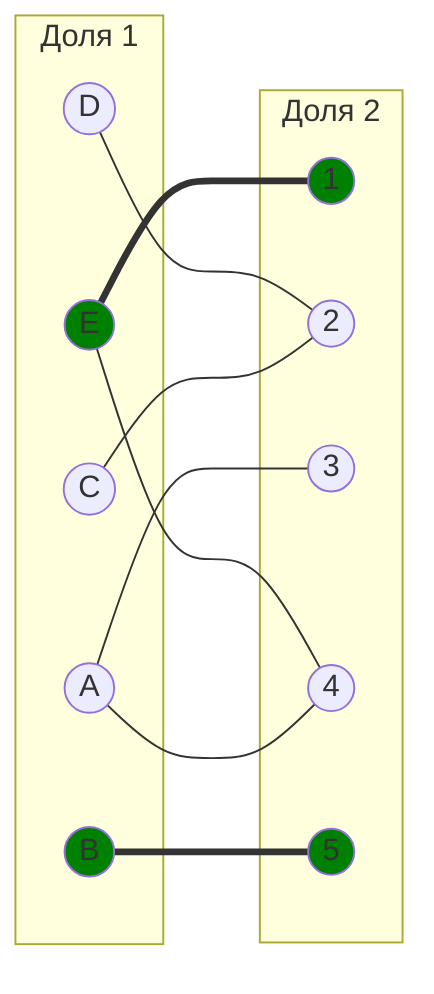
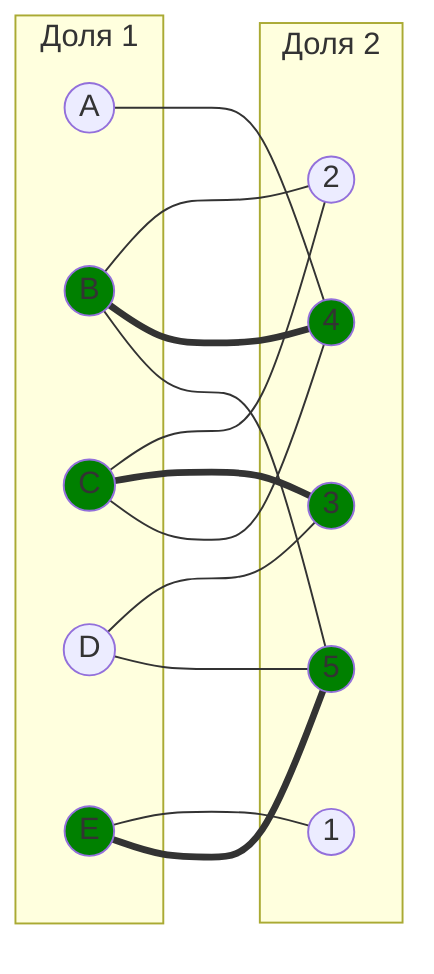

# Паросочетания. Венгерский алгоритм.

## Вариант 1. Максимальное и совершенное паросочетание.
Для выполнения задания необходимо найти совершенное и максимальное паросочетание в указанном двудольном графе, начав оиск с указаного начального паросочетания. Необходимо для решения задач нужно выбрать подходящий алгоритм (из рассмотренных на занятии), обосновать свой выбор и строго следовать выбранному алгоритму.

**Решение должно содержать номер варианта и подробное пошаговое описание.**

## Варианты 2-8. Задача о назначении. Венгерский алгоритм
Для выполнения задания необходимо: 
1. Решить задачу о назначении с использованием Венгерского алгоритма **строго** так, как было разобрано на занятиях.
2. Оформить решение задачи по шагам с подробными комментариями, таблицами и диаграммами.
3. В ответе указать минимальную сумму затрат на выполнение всех заданий.
4. В ответе вывести найденные назначения

**Решение должно содержать номер варианта и подробное пошаговое описание.**

### Вариант 1:

1. Найдите максимальное паросочетание в двудольном графе. Для поиска используйте цепи, чередующиеся относительно паросочетания. В качестве начального паросочетания используйте: $[A, 5]$, $[E, 2]$. Строго следуйте алгоритму, рассмотренному на занятиях.

2. Найдите совершенное паросочетание в двудольном графе. Для поиска используйте цепи, чередующиеся относительно паросочетания. В качестве начального паросочетания используйте: $[C, 3]$, $[B, 4]$, $[E, 5]$. Строго следуйте алгоритму, рассмотренному на занятиях.

### Вариант 2:
#### Матрица затрат:

|       | **1** | **2** | **3** | **4** | **5** |
|-------|:-----:|:-----:|:-----:|:-----:|:-----:|
| **A** |   7   |  14   |  15   |   8   |   9   |
| **B** |   5   |  13   |   9   |   6   |   6   |
| **C** |   6   |  15   |  14   |   5   |   9   |
| **D** |  13   |   9   |   8   |  10   |   7   |
| **E** |  12   |   8   |  13   |   5   |   6   |

### Вариант 3:
#### Матрица затрат:

|       | **1** | **2** | **3** | **4** | **5** |
|-------|:-----:|:-----:|:-----:|:-----:|:-----:|
| **A** |  10   |  10   |   6   |   6   |   7   |
| **B** |   8   |  13   |  14   |  12   |   9   |
| **C** |   9   |   5   |  10   |  12   |   7   |
| **D** |   6   |  11   |  10   |   5   |  14   |
| **E** |  14   |   6   |   8   |   5   |  12   |

### Вариант 4:
#### Матрица затрат:

|       | **1** | **2** | **3** | **4** | **5** |
|-------|:-----:|:-----:|:-----:|:-----:|:-----:|
| **A** |   7   |   6   |  13   |   8   |  13   |
| **B** |  13   |  14   |   6   |  13   |  12   |
| **C** |   8   |   9   |   6   |   7   |   7   |
| **D** |   9   |   7   |   9   |   8   |   5   |
| **E** |   9   |  14   |   7   |   9   |   5   |

### Вариант 5:
#### Матрица затрат:

|       | **1** | **2** | **3** | **4** | **5** |
|-------|:-----:|:-----:|:-----:|:-----:|:-----:|
| **A** |   9   |   9   |   7   |  12   |  16   |
| **B** |  12   |  15   |  15   |  10   |   9   |
| **C** |  11   |  14   |   9   |   6   |   4   |
| **D** |  11   |  10   |   7   |  15   |   5   |
| **E** |  14   |  14   |  10   |   8   |  13   |

### Вариант 6:
#### Матрица затрат:

|       | **1** | **2** | **3** | **4** | **5** |
|-------|:-----:|:-----:|:-----:|:-----:|:-----:|
| **A** |  12   |   7   |   7   |  12   |  15   |
| **B** |   7   |  12   |   5   |  11   |  11   |
| **C** |  11   |   5   |  14   |  14   |  15   |
| **D** |   8   |   8   |  13   |  15   |  13   |
| **E** |   6   |   5   |  12   |   6   |  14   |

### Вариант 7:
#### Матрица затрат:

|       | **1** | **2** | **3** | **4** | **5** |
|-------|:-----:|:-----:|:-----:|:-----:|:-----:|
| **A** |   9   |   7   |  12   |   8   |   7   |
| **B** |  12   |  15   |  10   |   8   |  14   |
| **C** |   8   |   5   |  10   |   5   |   8   |
| **D** |  11   |  10   |  14   |   6   |  11   |
| **E** |  12   |   7   |  12   |  12   |  12   |

### Вариант 8:
#### Матрица затрат:

|       | **1** | **2** | **3** | **4** | **5** |
|-------|:-----:|:-----:|:-----:|:-----:|:-----:|
| **A** |   9   |  10   |  12   |  10   |   6   |
| **B** |  10   |  10   |  11   |   9   |   7   |
| **C** |  11   |  14   |  12   |  10   |   5   |
| **D** |   6   |   6   |  13   |  11   |  13   |
| **E** |  11   |  11   |  12   |  10   |   5   |
